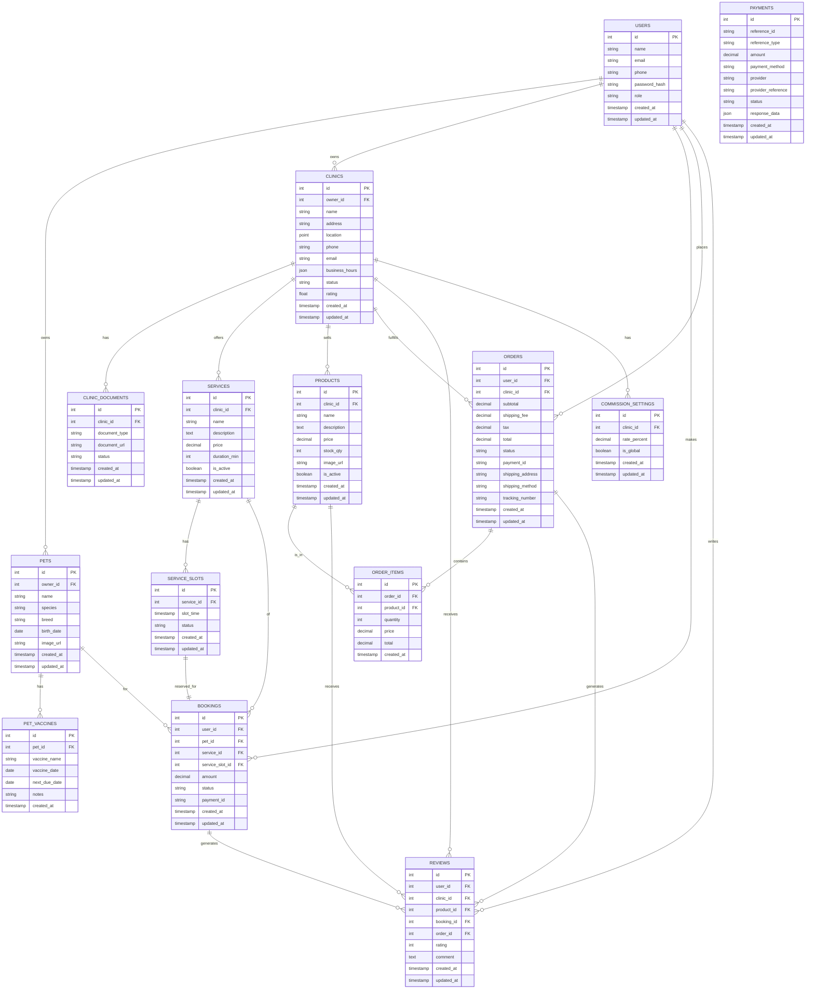

# Database Entity-Relationship Diagram (ERD)

## Entity Diagram

## Database Relations

1. **Users and Pets**:
   - One User can have multiple Pets (one-to-many)
   - Each Pet belongs to one User (many-to-one)

2. **Pets and Vaccines**:
   - One Pet can have multiple Vaccine records (one-to-many)

3. **Users and Clinics**:
   - A User (vendor) can own one or more Clinics (one-to-many)

4. **Clinics and Services**:
   - A Clinic can offer multiple Services (one-to-many)
   - Each Service belongs to one Clinic (many-to-one)

5. **Services and Slots**:
   - A Service can have multiple time Slots (one-to-many)

6. **Bookings**:
   - A User makes Bookings (one-to-many)
   - A Pet is the subject of Bookings (one-to-many)
   - A Service is booked (one-to-many)
   - A Service Slot is reserved for one Booking (one-to-one)

7. **Products**:
   - A Clinic sells multiple Products (one-to-many)

8. **Orders and Order Items**:
   - A User places Orders (one-to-many)
   - A Clinic fulfills Orders (one-to-many)
   - An Order contains multiple Order Items (one-to-many)
   - A Product appears in Order Items (one-to-many)

9. **Reviews**:
   - A User writes Reviews (one-to-many)
   - A Clinic receives Reviews (one-to-many)
   - A Product receives Reviews (one-to-many)
   - A Booking can generate a Review (one-to-many)
   - An Order can generate a Review (one-to-many)

10. **Commission Settings**:
    - A Clinic has Commission Settings (one-to-many)
    - Global commission rates apply to all Clinics

## Database Indexing Strategy

- Primary keys on all tables
- Foreign keys with indexes for relational lookups
- Composite indexes on frequently queried combinations:
  - (clinic_id, status) on BOOKINGS
  - (user_id, status) on ORDERS
  - (clinic_id, is_active) on PRODUCTS
  - (location) spatial index on CLINICS for geographic queries

## Data Storage Considerations

- Use PostgreSQL for transactional data
- Store large text fields, images, and documents in S3
- Cache frequently accessed data in Redis
- Consider using materialized views for complex reports
