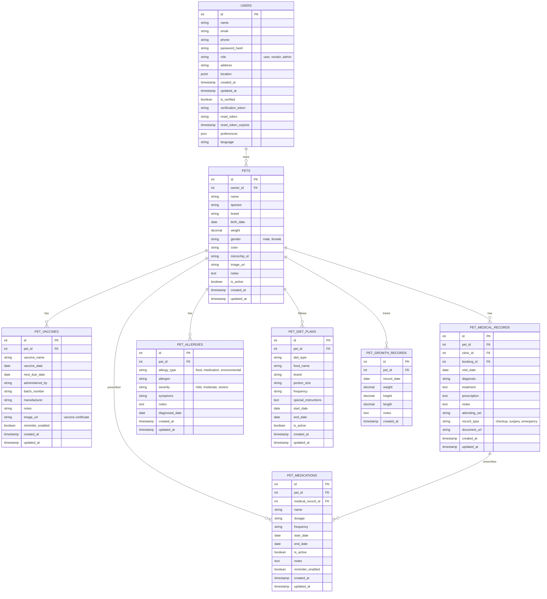
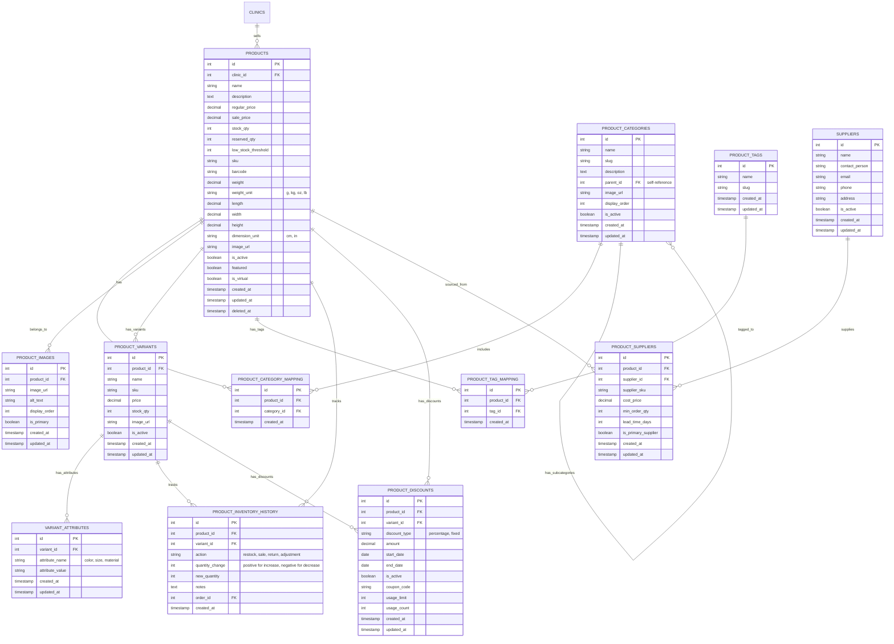
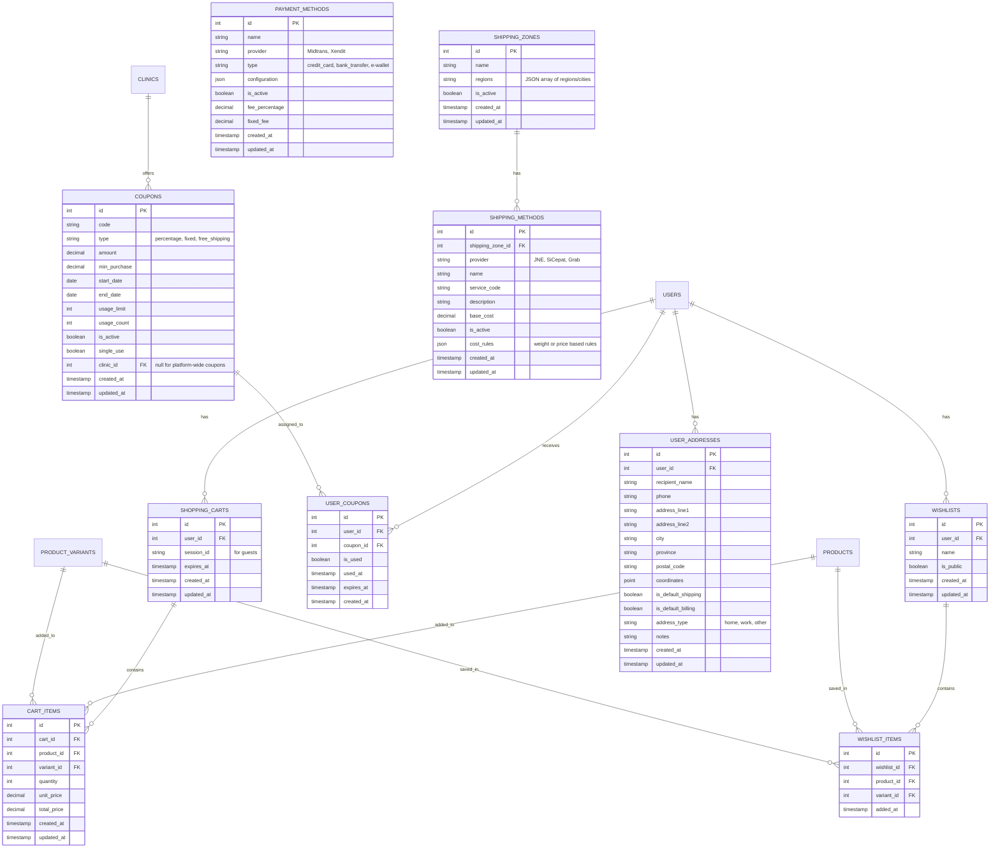
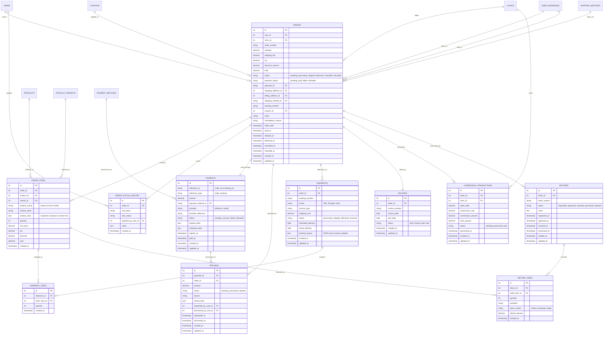
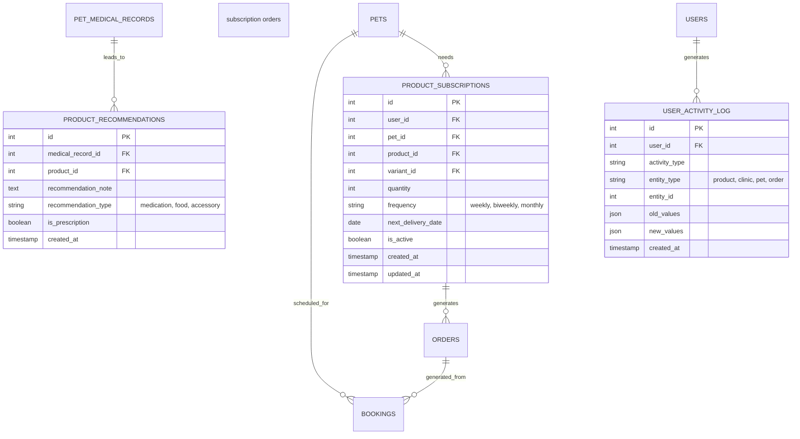

# Detailed Entity-Relationship Diagram (ERD) for Key Domains

This document provides detailed ERD diagrams for the following core domains:
1. Pet Management
2. Product Management
3. E-Commerce Management
4. Order Management

## 1. Pet Management Domain - Detailed ERD

## 2. Product Management Domain - Detailed ERD

## 3. E-Commerce Management Domain - Detailed ERD

## 4. Order Management Domain - Detailed ERD

## Cross-Domain Relationships

## Database Indexing Strategy Extensions

- **Pet Management Indexes**
  - (owner_id, is_active) on PETS
  - (pet_id, vaccine_name) on PET_VACCINES
  - (pet_id, visit_date) on PET_MEDICAL_RECORDS
  - (pet_id, allergy_type) on PET_ALLERGIES
  - (pet_id, is_active) on PET_MEDICATIONS

- **Product Management Indexes**
  - (clinic_id, is_active) on PRODUCTS
  - (name, clinic_id) on PRODUCTS for search
  - (sku) on PRODUCTS for unique lookups
  - (product_id, is_primary) on PRODUCT_IMAGES
  - Full-text search index on product name and description

- **E-Commerce Indexes**
  - (user_id, expires_at) on SHOPPING_CARTS
  - (cart_id, product_id, variant_id) on CART_ITEMS
  - (code) unique index on COUPONS
  - (user_id, is_default_shipping) on USER_ADDRESSES
  - (session_id) on SHOPPING_CARTS for guest cart management

- **Order Management Indexes**
  - (user_id, status) on ORDERS
  - (clinic_id, status) on ORDERS
  - (order_number) unique index on ORDERS
  - (payment_id) on ORDERS
  - (order_id, product_id) on ORDER_ITEMS
  - (reference_id, reference_type) on PAYMENTS
  - (tracking_number) on SHIPMENTS
  - (order_id, status) on RETURNS
  - (invoice_number) unique index on INVOICES
  
- **Temporal Indexes**
  - (created_at) on ORDERS for date range queries
  - (next_delivery_date) on PRODUCT_SUBSCRIPTIONS
  - (next_due_date) on PET_VACCINES for reminder queries
  - (expires_at) on SHOPPING_CARTS for cleanup operations

## Data Partitioning Strategy

- **Order History Partitioning**
  - Orders table partitioned by date range (monthly)
  - Older order data moved to archive tables after 6 months
  - Archive tables partitioned by year

- **Product Data Partitioning**
  - Products partitioned by clinic_id for multi-tenant isolation
  - Product reviews partitioned by date ranges

- **Logging Tables Partitioning**
  - USER_ACTIVITY_LOG partitioned by week
  - ORDER_STATUS_HISTORY partitioned by month

## Data Validation Rules

- **Pet Management Validation**
  - Pet ages must be valid (birth_date cannot be in future)
  - Weight must be positive number
  - Vaccine dates must be chronological (vaccine_date < next_due_date)

- **Product Management Validation**
  - Price must be non-negative
  - Stock quantity must be non-negative integer
  - SKU must be unique within a clinic
  - Images must have valid URLs and file types

- **E-Commerce Validation**
  - Cart item quantity must be positive integer
  - Coupon usage cannot exceed usage_limit
  - Shipping address must have required fields (recipient, address, city, postal code)

- **Order Management Validation**
  - Order status transitions must follow allowed state machine
  - Refund amount cannot exceed original payment
  - Return quantity cannot exceed ordered quantity
  - Commission calculations must match defined rates

## Data Migration and Historization

- **Historical Data Management**
  - All tables include created_at and updated_at timestamps
  - Key entities include soft delete pattern (deleted_at)
  - Order data immutable after certain status transitions
  - Product changes tracked in history tables
  - Pricing history maintained for auditing and analytics

- **Archiving Strategy**
  - Orders older than 1 year moved to archive storage
  - Pet medical records never deleted, only archived
  - Product data versioned for historical accuracy
  - Analytics data aggregated and summarized over time

## Integration Points with External Systems

- **Payment Gateway Integration**
  - Payment tables designed for Midtrans and Xendit APIs
  - Transaction IDs and references stored for reconciliation
  - Webhook data captured in response_data JSON field

- **Shipping Provider Integration**
  - Shipment tracking compatible with JNE, SiCepat, and Grab Delivery APIs
  - Service codes mapped to provider-specific services
  - Tracking updates stored as JSON array for history

- **Inventory Management**
  - Product inventory synced with external systems
  - Stock reservations tracked for pending orders
  - Low stock alerts and automatic reordering thresholds
