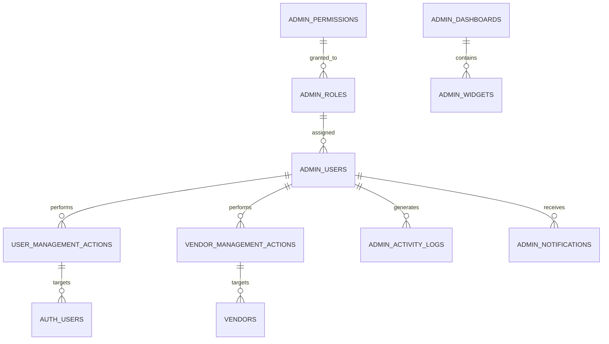

# Admin User and Vendor Management ERD
# 管理者ユーザーとベンダー管理ERD
# ERD Manajemen Admin, Pengguna, dan Vendor

**English**
This document provides a detailed Entity Relationship Diagram (ERD) for the Admin Dashboard functionalities related to user and vendor management within the PetPro platform.

**日本語**
このドキュメントでは、PetProプラットフォーム内のユーザーとベンダー管理に関する管理ダッシュボード機能の詳細なエンティティ関連図（ERD）を提供します。

**Bahasa Indonesia**
Dokumen ini menyediakan Diagram Hubungan Entitas (ERD) terperinci untuk fungsionalitas Dasbor Admin terkait manajemen pengguna dan vendor dalam platform PetPro.

## Level 1: Admin Management Domain Overview



## Level 2: Admin Management Detailed Data Model

```mermaid
erDiagram
    ADMIN_USERS {
        uuid id PK
        string username
        string email
        string password_hash
        string full_name
        string phone_number
        enum status
        boolean is_super_admin
        string profile_image
        string department
        string position
        json preferences
        timestamp last_login
        timestamp created_at
        timestamp updated_at
    }
    
    ADMIN_ROLES {
        uuid id PK
        string name
        string description
        json allowed_modules
        boolean is_system_role
        timestamp created_at
        timestamp updated_at
    }
    
    ADMIN_USER_ROLES {
        uuid id PK
        uuid admin_id FK
        uuid role_id FK
        timestamp created_at
    }
    
    ADMIN_PERMISSIONS {
        uuid id PK
        string name
        string resource
        string action
        string description
        timestamp created_at
    }
    
    ADMIN_ROLE_PERMISSIONS {
        uuid id PK
        uuid role_id FK
        uuid permission_id FK
        timestamp created_at
    }
    
    USER_MANAGEMENT_ACTIONS {
        uuid id PK
        uuid admin_id FK
        uuid target_user_id FK
        string action_type
        json previous_values
        json new_values
        text notes
        timestamp created_at
    }
    
    VENDOR_MANAGEMENT_ACTIONS {
        uuid id PK
        uuid admin_id FK
        uuid target_vendor_id FK
        string action_type
        json previous_values
        json new_values
        text notes
        timestamp created_at
    }
    
    ADMIN_ACTIVITY_LOGS {
        uuid id PK
        uuid admin_id FK
        string activity_type
        string resource_type
        string resource_id
        string action
        json details
        string ip_address
        string user_agent
        timestamp created_at
    }
    
    ADMIN_SESSIONS {
        uuid id PK
        uuid admin_id FK
        string token_hash
        string ip_address
        string user_agent
        string device_info
        timestamp expires_at
        timestamp last_activity
        timestamp created_at
    }
    
    ADMIN_NOTIFICATIONS {
        uuid id PK
        uuid admin_id FK
        string type
        string title
        text message
        json metadata
        boolean is_read
        timestamp read_at
        timestamp created_at
    }
    
    ADMIN_DASHBOARDS {
        uuid id PK
        uuid admin_id FK
        string name
        string description
        boolean is_default
        json layout
        timestamp created_at
        timestamp updated_at
    }
    
    ADMIN_WIDGETS {
        uuid id PK
        uuid dashboard_id FK
        string widget_type
        string title
        json configuration
        json position
        json size
        timestamp created_at
        timestamp updated_at
    }
    
    USER_FLAGS {
        uuid id PK
        uuid user_id FK
        string flag_type
        string flag_reason
        text notes
        uuid created_by
        timestamp expires_at
        boolean is_active
        timestamp created_at
        timestamp updated_at
    }
    
    VENDOR_VERIFICATION_REQUESTS {
        uuid id PK
        uuid vendor_id FK
        enum status
        json submitted_documents
        text rejection_reason
        uuid reviewed_by
        timestamp reviewed_at
        timestamp created_at
        timestamp updated_at
    }
    
    VENDOR_COMPLIANCE_CHECKS {
        uuid id PK
        uuid vendor_id FK
        string check_type
        enum result
        text notes
        json details
        uuid performed_by
        timestamp check_date
        timestamp created_at
        timestamp updated_at
    }
    
    ADMIN_USERS ||--o{ ADMIN_USER_ROLES : has
    ADMIN_ROLES ||--o{ ADMIN_USER_ROLES : assigned_to
    ADMIN_ROLES ||--o{ ADMIN_ROLE_PERMISSIONS : has
    ADMIN_PERMISSIONS ||--o{ ADMIN_ROLE_PERMISSIONS : granted_to
    ADMIN_USERS ||--o{ USER_MANAGEMENT_ACTIONS : performs
    ADMIN_USERS ||--o{ VENDOR_MANAGEMENT_ACTIONS : performs
    ADMIN_USERS ||--o{ ADMIN_ACTIVITY_LOGS : generates
    ADMIN_USERS ||--o{ ADMIN_SESSIONS : creates
    ADMIN_USERS ||--o{ ADMIN_NOTIFICATIONS : receives
    ADMIN_USERS ||--o{ ADMIN_DASHBOARDS : customizes
    ADMIN_DASHBOARDS ||--o{ ADMIN_WIDGETS : contains
    ADMIN_USERS ||--o{ USER_FLAGS : creates
    ADMIN_USERS ||--o{ VENDOR_VERIFICATION_REQUESTS : reviews
    ADMIN_USERS ||--o{ VENDOR_COMPLIANCE_CHECKS : performs
```



## Level 3: Admin Management Database Schema

### `admin_users` Table
```sql
CREATE TABLE admin_users (
    id UUID PRIMARY KEY DEFAULT gen_random_uuid(),
    username VARCHAR(50) NOT NULL UNIQUE,
    email VARCHAR(255) NOT NULL UNIQUE,
    password_hash VARCHAR(255) NOT NULL,
    full_name VARCHAR(255) NOT NULL,
    phone_number VARCHAR(20),
    status VARCHAR(20) DEFAULT 'active' CHECK (status IN ('active', 'inactive', 'suspended')),
    is_super_admin BOOLEAN DEFAULT FALSE,
    profile_image VARCHAR(255),
    department VARCHAR(100),
    position VARCHAR(100),
    preferences JSONB DEFAULT '{}',
    last_login TIMESTAMP WITH TIME ZONE,
    created_at TIMESTAMP WITH TIME ZONE DEFAULT CURRENT_TIMESTAMP,
    updated_at TIMESTAMP WITH TIME ZONE DEFAULT CURRENT_TIMESTAMP
);

CREATE INDEX idx_admin_users_email ON admin_users(email);
CREATE INDEX idx_admin_users_status ON admin_users(status);
```

### `admin_roles` Table
```sql
CREATE TABLE admin_roles (
    id UUID PRIMARY KEY DEFAULT gen_random_uuid(),
    name VARCHAR(100) NOT NULL UNIQUE,
    description TEXT,
    allowed_modules JSONB DEFAULT '[]',
    is_system_role BOOLEAN DEFAULT FALSE,
    created_at TIMESTAMP WITH TIME ZONE DEFAULT CURRENT_TIMESTAMP,
    updated_at TIMESTAMP WITH TIME ZONE DEFAULT CURRENT_TIMESTAMP
);

CREATE INDEX idx_admin_roles_name ON admin_roles(name);
```

### `admin_user_roles` Table
```sql
CREATE TABLE admin_user_roles (
    id UUID PRIMARY KEY DEFAULT gen_random_uuid(),
    admin_id UUID NOT NULL,
    role_id UUID NOT NULL,
    created_at TIMESTAMP WITH TIME ZONE DEFAULT CURRENT_TIMESTAMP,
    
    CONSTRAINT fk_admin FOREIGN KEY(admin_id) REFERENCES admin_users(id) ON DELETE CASCADE,
    CONSTRAINT fk_role FOREIGN KEY(role_id) REFERENCES admin_roles(id) ON DELETE CASCADE,
    CONSTRAINT unique_admin_role UNIQUE(admin_id, role_id)
);

CREATE INDEX idx_admin_user_roles_admin ON admin_user_roles(admin_id);
CREATE INDEX idx_admin_user_roles_role ON admin_user_roles(role_id);
```

### `admin_permissions` Table
```sql
CREATE TABLE admin_permissions (
    id UUID PRIMARY KEY DEFAULT gen_random_uuid(),
    name VARCHAR(100) NOT NULL UNIQUE,
    resource VARCHAR(100) NOT NULL,
    action VARCHAR(50) NOT NULL,
    description TEXT,
    created_at TIMESTAMP WITH TIME ZONE DEFAULT CURRENT_TIMESTAMP,
    
    CONSTRAINT unique_permission UNIQUE(resource, action)
);

CREATE INDEX idx_admin_permissions_resource_action ON admin_permissions(resource, action);
```

### `admin_role_permissions` Table
```sql
CREATE TABLE admin_role_permissions (
    id UUID PRIMARY KEY DEFAULT gen_random_uuid(),
    role_id UUID NOT NULL,
    permission_id UUID NOT NULL,
    created_at TIMESTAMP WITH TIME ZONE DEFAULT CURRENT_TIMESTAMP,
    
    CONSTRAINT fk_role FOREIGN KEY(role_id) REFERENCES admin_roles(id) ON DELETE CASCADE,
    CONSTRAINT fk_permission FOREIGN KEY(permission_id) REFERENCES admin_permissions(id) ON DELETE CASCADE,
    CONSTRAINT unique_role_permission UNIQUE(role_id, permission_id)
);

CREATE INDEX idx_admin_role_permissions_role ON admin_role_permissions(role_id);
CREATE INDEX idx_admin_role_permissions_permission ON admin_role_permissions(permission_id);
```

### `user_management_actions` Table
```sql
CREATE TABLE user_management_actions (
    id UUID PRIMARY KEY DEFAULT gen_random_uuid(),
    admin_id UUID NOT NULL,
    target_user_id UUID NOT NULL,
    action_type VARCHAR(50) NOT NULL,
    previous_values JSONB,
    new_values JSONB,
    notes TEXT,
    created_at TIMESTAMP WITH TIME ZONE DEFAULT CURRENT_TIMESTAMP,
    
    CONSTRAINT fk_admin FOREIGN KEY(admin_id) REFERENCES admin_users(id) ON DELETE CASCADE
);

CREATE INDEX idx_user_management_actions_admin ON user_management_actions(admin_id);
CREATE INDEX idx_user_management_actions_target ON user_management_actions(target_user_id);
CREATE INDEX idx_user_management_actions_type ON user_management_actions(action_type);
CREATE INDEX idx_user_management_actions_created ON user_management_actions(created_at);
```

### `vendor_management_actions` Table
```sql
CREATE TABLE vendor_management_actions (
    id UUID PRIMARY KEY DEFAULT gen_random_uuid(),
    admin_id UUID NOT NULL,
    target_vendor_id UUID NOT NULL,
    action_type VARCHAR(50) NOT NULL,
    previous_values JSONB,
    new_values JSONB,
    notes TEXT,
    created_at TIMESTAMP WITH TIME ZONE DEFAULT CURRENT_TIMESTAMP,
    
    CONSTRAINT fk_admin FOREIGN KEY(admin_id) REFERENCES admin_users(id) ON DELETE CASCADE
);

CREATE INDEX idx_vendor_management_actions_admin ON vendor_management_actions(admin_id);
CREATE INDEX idx_vendor_management_actions_target ON vendor_management_actions(target_vendor_id);
CREATE INDEX idx_vendor_management_actions_type ON vendor_management_actions(action_type);
CREATE INDEX idx_vendor_management_actions_created ON vendor_management_actions(created_at);
```

## Level 4: Admin Management Features and Integration

### 1. User Management Features

**English**
- User account creation, updates, and deactivation
- Role and permission assignment
- User verification and identity checks
- Account flagging for suspicious activities
- User history and activity logs viewing
- Bulk user operations and imports

**日本語**
- ユーザーアカウントの作成、更新、無効化
- ロールと権限の割り当て
- ユーザー確認とID確認
- 不審な活動のアカウントフラグ付け
- ユーザー履歴とアクティビティログの表示
- 一括ユーザー操作とインポート

**Bahasa Indonesia**
- Pembuatan, pembaruan, dan penonaktifan akun pengguna
- Penugasan peran dan izin
- Verifikasi pengguna dan pemeriksaan identitas
- Penandaan akun untuk aktivitas mencurigakan
- Melihat riwayat pengguna dan log aktivitas
- Operasi pengguna massal dan impor

### 2. Vendor Management Features

**English**
- Vendor application review and approval process
- Vendor profile and document verification
- Compliance and quality assurance checks
- Performance monitoring metrics
- Commission rate management
- Vendor suspension and reinstatement

**日本語**
- ベンダー申請のレビューと承認プロセス
- ベンダープロフィールと書類の確認
- コンプライアンスと品質保証チェック
- パフォーマンス監視メトリクス
- 手数料率管理
- ベンダーの停止と復帰

**Bahasa Indonesia**
- Proses peninjauan dan persetujuan aplikasi vendor
- Verifikasi profil dan dokumen vendor
- Pemeriksaan kepatuhan dan jaminan kualitas
- Metrik pemantauan kinerja
- Pengelolaan tarif komisi
- Penangguhan dan pemulihan vendor

### 3. Dashboard and Analytics

**English**
- Real-time user registration metrics
- Vendor performance analytics
- Verification process funnels
- User demographic reports
- Security and compliance dashboards
- Custom report generation

**日本語**
- リアルタイムユーザー登録メトリクス
- ベンダーパフォーマンス分析
- 検証プロセスファネル
- ユーザー人口統計レポート
- セキュリティとコンプライアンスダッシュボード
- カスタムレポート作成

**Bahasa Indonesia**
- Metrik pendaftaran pengguna real-time
- Analisis kinerja vendor
- Saluran proses verifikasi
- Laporan demografis pengguna
- Dasbor keamanan dan kepatuhan
- Pembuatan laporan kustom

### 4. Admin API Endpoints

| Method | Endpoint | Description | 説明 | Deskripsi |
|--------|----------|-------------|-----|-----------|
| GET | `/admin/users` | List all users with filtering and pagination | フィルタリングとページネーションを使用したすべてのユーザーのリスト | Daftar semua pengguna dengan filter dan paginasi |
| GET | `/admin/users/:id` | Get detailed user profile | 詳細なユーザープロファイルを取得 | Mendapatkan profil pengguna terperinci |
| PUT | `/admin/users/:id` | Update user details | ユーザー詳細を更新 | Memperbarui detail pengguna |
| POST | `/admin/users/:id/deactivate` | Deactivate user account | ユーザーアカウントを無効化 | Menonaktifkan akun pengguna |
| POST | `/admin/users/:id/roles` | Assign roles to user | ユーザーにロールを割り当て | Menetapkan peran kepada pengguna |
| GET | `/admin/vendors` | List all vendors with filtering and pagination | フィルタリングとページネーションを使用したすべてのベンダーのリスト | Daftar semua vendor dengan filter dan paginasi |
| GET | `/admin/vendors/:id` | Get detailed vendor profile | 詳細なベンダープロファイルを取得 | Mendapatkan profil vendor terperinci |
| PUT | `/admin/vendors/:id/status` | Update vendor status | ベンダーステータスを更新 | Memperbarui status vendor |
| GET | `/admin/verification-requests` | List vendor verification requests | ベンダー検証リクエストのリスト | Daftar permintaan verifikasi vendor |
| POST | `/admin/verification-requests/:id/approve` | Approve vendor verification | ベンダー検証を承認 | Menyetujui verifikasi vendor |
| POST | `/admin/verification-requests/:id/reject` | Reject vendor verification | ベンダー検証を拒否 | Menolak verifikasi vendor |
| GET | `/admin/activity-logs` | View admin activity logs | 管理者アクティビティログを表示 | Melihat log aktivitas admin |
| GET | `/admin/dashboard/metrics` | Get admin dashboard metrics | 管理ダッシュボードメトリクスを取得 | Mendapatkan metrik dasbor admin |

## Level 5: Admin Role-Based Access Control

### Default Admin Roles

**Super Admin**
- Complete system access
- User/vendor management
- System configuration
- Role management

**User Manager**
- User account management
- User verification
- Limited reporting access

**Vendor Manager**
- Vendor application review
- Vendor verification
- Commission management

**Support Admin**
- View user/vendor profiles
- Basic status updates
- Support issue resolution

**Report Viewer**
- Read-only access to reports
- Export capabilities
- No management actions

### Permission Matrix

| Permission | Super Admin | User Manager | Vendor Manager | Support Admin | Report Viewer |
|------------|------------|------------|--------------|--------------|--------------|
| Manage Users | ✓ | ✓ | - | View Only | - |
| Manage Vendors | ✓ | - | ✓ | View Only | - |
| Manage Roles | ✓ | - | - | - | - |
| Manage System Settings | ✓ | - | - | - | - |
| Approve Vendors | ✓ | - | ✓ | - | - |
| View Reports | ✓ | ✓ | ✓ | ✓ | ✓ |
| Export Data | ✓ | ✓ | ✓ | ✓ | ✓ |
| Reset User Passwords | ✓ | ✓ | - | ✓ | - |
| View Activity Logs | ✓ | ✓ | ✓ | ✓ | - |
