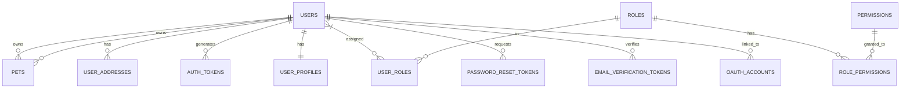

# Auth Service Entity Relationship Diagram
# 認証サービスエンティティ関連図

**English**
This document provides a detailed Entity Relationship Diagram (ERD) for the Auth microservice within the PetPro platform, focusing on identity management, access control, and authentication patterns.

**日本語**
このドキュメントでは、PetProプラットフォーム内の認証マイクロサービスの詳細なエンティティ関連図（ERD）を提供し、アイデンティティ管理、アクセス制御、および認証パターンに焦点を当てています。

## Level 1: Auth Service Domain Overview



## Level 2: Auth Service Detailed Data Model

```mermaid
erDiagram
    USERS {
        uuid id PK
        string email
        string password_hash
        string full_name
        string phone_number
        boolean email_verified
        boolean phone_verified
        boolean is_active
        string preferred_language
        json metadata
        enum account_type
        timestamp last_login
        timestamp email_verified_at
        timestamp created_at
        timestamp updated_at
        timestamp deleted_at
    }
    
    USER_PROFILES {
        uuid id PK
        uuid user_id FK
        string avatar_url
        date birth_date
        string gender
        text bio
        json preferences
        timestamp created_at
        timestamp updated_at
    }
    
    USER_ADDRESSES {
        uuid id PK
        uuid user_id FK
        string address_line1
        string address_line2
        string city
        string state
        string postal_code
        string country
        boolean is_default
        string address_type
        decimal latitude
        decimal longitude
        timestamp created_at
        timestamp updated_at
    }
    
    PETS {
        uuid id PK
        uuid owner_id FK
        string name
        string species
        string breed
        date birth_date
        enum gender
        decimal weight
        string weight_unit
        text medical_conditions
        text allergies
        string microchip_id
        string registration_id
        json vaccination_history
        string avatar_url
        timestamp created_at
        timestamp updated_at
        timestamp deleted_at
    }
    
    ROLES {
        uuid id PK
        string name
        string description
        boolean is_system_role
        string scope
        timestamp created_at
        timestamp updated_at
    }
    
    USER_ROLES {
        uuid id PK
        uuid user_id FK
        uuid role_id FK
        timestamp created_at
        timestamp expires_at
    }
    
    PERMISSIONS {
        uuid id PK
        string name
        string resource_type
        string action
        string description
        timestamp created_at
        timestamp updated_at
    }
    
    ROLE_PERMISSIONS {
        uuid id PK
        uuid role_id FK
        uuid permission_id FK
        timestamp created_at
    }
    
    AUTH_TOKENS {
        uuid id PK
        uuid user_id FK
        string token_hash
        enum token_type
        timestamp expires_at
        string device_info
        string ip_address
        boolean is_revoked
        timestamp last_used_at
        timestamp created_at
    }
    
    PASSWORD_RESET_TOKENS {
        uuid id PK
        uuid user_id FK
        string token_hash
        timestamp expires_at
        boolean is_used
        timestamp used_at
        timestamp created_at
    }
    
    EMAIL_VERIFICATION_TOKENS {
        uuid id PK
        uuid user_id FK
        string email
        string token_hash
        timestamp expires_at
        boolean is_used
        timestamp used_at
        timestamp created_at
    }
    
    OAUTH_ACCOUNTS {
        uuid id PK
        uuid user_id FK
        string provider
        string provider_user_id
        string access_token
        string refresh_token
        timestamp token_expires_at
        timestamp created_at
        timestamp updated_at
    }
    
    LOGIN_ATTEMPTS {
        uuid id PK
        string email
        string ip_address
        string user_agent
        boolean success
        timestamp attempted_at
    }
    
    USER_SETTINGS {
        uuid id PK
        uuid user_id FK
        boolean email_notifications
        boolean sms_notifications
        boolean push_notifications
        boolean two_factor_enabled
        string two_factor_type
        string timezone
        json notification_preferences
        timestamp created_at
        timestamp updated_at
    }
    
    AUDIT_LOGS {
        uuid id PK
        uuid user_id
        string action
        string resource_type
        string resource_id
        json old_values
        json new_values
        string ip_address
        string user_agent
        timestamp created_at
    }
    
    USERS ||--|| USER_PROFILES : has
    USERS ||--o{ USER_ADDRESSES : has
    USERS ||--o{ PETS : owns
    USERS }|--o{ USER_ROLES : assigned
    USERS ||--o{ AUTH_TOKENS : generates
    USERS ||--o{ PASSWORD_RESET_TOKENS : requests
    USERS ||--o{ EMAIL_VERIFICATION_TOKENS : verifies
    USERS ||--o{ OAUTH_ACCOUNTS : linked_to
    USERS ||--|| USER_SETTINGS : has
    USERS ||--o{ AUDIT_LOGS : generates
    ROLES ||--o{ USER_ROLES : in
    ROLES ||--o{ ROLE_PERMISSIONS : has
    PERMISSIONS ||--o{ ROLE_PERMISSIONS : granted_to
```



## Level 3: Auth Service Database Schema

### `users` Table
```sql
CREATE TABLE users (
    id UUID PRIMARY KEY DEFAULT gen_random_uuid(),
    email VARCHAR(255) NOT NULL UNIQUE,
    password_hash VARCHAR(255),
    full_name VARCHAR(255) NOT NULL,
    phone_number VARCHAR(20),
    email_verified BOOLEAN DEFAULT FALSE,
    phone_verified BOOLEAN DEFAULT FALSE,
    is_active BOOLEAN DEFAULT TRUE,
    preferred_language VARCHAR(5) DEFAULT 'en',
    metadata JSONB DEFAULT '{}',
    account_type VARCHAR(20) DEFAULT 'individual' CHECK (account_type IN ('individual', 'business', 'staff', 'admin')),
    last_login TIMESTAMP WITH TIME ZONE,
    email_verified_at TIMESTAMP WITH TIME ZONE,
    created_at TIMESTAMP WITH TIME ZONE DEFAULT CURRENT_TIMESTAMP,
    updated_at TIMESTAMP WITH TIME ZONE DEFAULT CURRENT_TIMESTAMP,
    deleted_at TIMESTAMP WITH TIME ZONE
);

CREATE INDEX idx_users_email ON users(email);
CREATE INDEX idx_users_phone ON users(phone_number) WHERE phone_number IS NOT NULL;
CREATE INDEX idx_users_account_type ON users(account_type);
CREATE INDEX idx_users_active ON users(is_active) WHERE is_active = TRUE;
```

### `user_profiles` Table
```sql
CREATE TABLE user_profiles (
    id UUID PRIMARY KEY DEFAULT gen_random_uuid(),
    user_id UUID NOT NULL UNIQUE,
    avatar_url TEXT,
    birth_date DATE,
    gender VARCHAR(20),
    bio TEXT,
    preferences JSONB DEFAULT '{}',
    created_at TIMESTAMP WITH TIME ZONE DEFAULT CURRENT_TIMESTAMP,
    updated_at TIMESTAMP WITH TIME ZONE DEFAULT CURRENT_TIMESTAMP,
    
    CONSTRAINT fk_user FOREIGN KEY(user_id) REFERENCES users(id) ON DELETE CASCADE
);

CREATE INDEX idx_user_profiles_user ON user_profiles(user_id);
```

### `user_addresses` Table
```sql
CREATE TABLE user_addresses (
    id UUID PRIMARY KEY DEFAULT gen_random_uuid(),
    user_id UUID NOT NULL,
    address_line1 VARCHAR(255) NOT NULL,
    address_line2 VARCHAR(255),
    city VARCHAR(100) NOT NULL,
    state VARCHAR(100),
    postal_code VARCHAR(20) NOT NULL,
    country VARCHAR(2) NOT NULL,
    is_default BOOLEAN DEFAULT FALSE,
    address_type VARCHAR(20) DEFAULT 'home' CHECK (address_type IN ('home', 'work', 'billing', 'shipping', 'other')),
    latitude DECIMAL(10,7),
    longitude DECIMAL(10,7),
    created_at TIMESTAMP WITH TIME ZONE DEFAULT CURRENT_TIMESTAMP,
    updated_at TIMESTAMP WITH TIME ZONE DEFAULT CURRENT_TIMESTAMP,
    
    CONSTRAINT fk_user FOREIGN KEY(user_id) REFERENCES users(id) ON DELETE CASCADE
);

CREATE INDEX idx_user_addresses_user ON user_addresses(user_id);
CREATE INDEX idx_user_addresses_default ON user_addresses(user_id, is_default) WHERE is_default = TRUE;
```

### `pets` Table
```sql
CREATE TABLE pets (
    id UUID PRIMARY KEY DEFAULT gen_random_uuid(),
    owner_id UUID NOT NULL,
    name VARCHAR(100) NOT NULL,
    species VARCHAR(50) NOT NULL,
    breed VARCHAR(100),
    birth_date DATE,
    gender VARCHAR(10) CHECK (gender IN ('male', 'female', 'unknown')),
    weight DECIMAL(6,2),
    weight_unit VARCHAR(5) DEFAULT 'kg' CHECK (weight_unit IN ('kg', 'lb')),
    medical_conditions TEXT,
    allergies TEXT,
    microchip_id VARCHAR(100),
    registration_id VARCHAR(100),
    vaccination_history JSONB DEFAULT '[]',
    avatar_url TEXT,
    created_at TIMESTAMP WITH TIME ZONE DEFAULT CURRENT_TIMESTAMP,
    updated_at TIMESTAMP WITH TIME ZONE DEFAULT CURRENT_TIMESTAMP,
    deleted_at TIMESTAMP WITH TIME ZONE,
    
    CONSTRAINT fk_owner FOREIGN KEY(owner_id) REFERENCES users(id) ON DELETE CASCADE
);

CREATE INDEX idx_pets_owner ON pets(owner_id);
CREATE INDEX idx_pets_species ON pets(species);
CREATE INDEX idx_pets_active ON pets(deleted_at) WHERE deleted_at IS NULL;
```

### `roles` Table
```sql
CREATE TABLE roles (
    id UUID PRIMARY KEY DEFAULT gen_random_uuid(),
    name VARCHAR(100) NOT NULL UNIQUE,
    description TEXT,
    is_system_role BOOLEAN DEFAULT FALSE,
    scope VARCHAR(50) DEFAULT 'global',
    created_at TIMESTAMP WITH TIME ZONE DEFAULT CURRENT_TIMESTAMP,
    updated_at TIMESTAMP WITH TIME ZONE DEFAULT CURRENT_TIMESTAMP
);

CREATE INDEX idx_roles_name ON roles(name);
CREATE INDEX idx_roles_system ON roles(is_system_role);
```

### `user_roles` Table
```sql
CREATE TABLE user_roles (
    id UUID PRIMARY KEY DEFAULT gen_random_uuid(),
    user_id UUID NOT NULL,
    role_id UUID NOT NULL,
    created_at TIMESTAMP WITH TIME ZONE DEFAULT CURRENT_TIMESTAMP,
    expires_at TIMESTAMP WITH TIME ZONE,
    
    CONSTRAINT fk_user FOREIGN KEY(user_id) REFERENCES users(id) ON DELETE CASCADE,
    CONSTRAINT fk_role FOREIGN KEY(role_id) REFERENCES roles(id) ON DELETE CASCADE,
    CONSTRAINT unique_user_role UNIQUE(user_id, role_id)
);

CREATE INDEX idx_user_roles_user ON user_roles(user_id);
CREATE INDEX idx_user_roles_role ON user_roles(role_id);
CREATE INDEX idx_user_roles_active ON user_roles(expires_at) WHERE expires_at IS NULL OR expires_at > CURRENT_TIMESTAMP;
```

### `permissions` Table
```sql
CREATE TABLE permissions (
    id UUID PRIMARY KEY DEFAULT gen_random_uuid(),
    name VARCHAR(100) NOT NULL UNIQUE,
    resource_type VARCHAR(100) NOT NULL,
    action VARCHAR(50) NOT NULL,
    description TEXT,
    created_at TIMESTAMP WITH TIME ZONE DEFAULT CURRENT_TIMESTAMP,
    updated_at TIMESTAMP WITH TIME ZONE DEFAULT CURRENT_TIMESTAMP,
    
    CONSTRAINT unique_permission_resource_action UNIQUE(resource_type, action)
);

CREATE INDEX idx_permissions_resource_action ON permissions(resource_type, action);
```

### `role_permissions` Table
```sql
CREATE TABLE role_permissions (
    id UUID PRIMARY KEY DEFAULT gen_random_uuid(),
    role_id UUID NOT NULL,
    permission_id UUID NOT NULL,
    created_at TIMESTAMP WITH TIME ZONE DEFAULT CURRENT_TIMESTAMP,
    
    CONSTRAINT fk_role FOREIGN KEY(role_id) REFERENCES roles(id) ON DELETE CASCADE,
    CONSTRAINT fk_permission FOREIGN KEY(permission_id) REFERENCES permissions(id) ON DELETE CASCADE,
    CONSTRAINT unique_role_permission UNIQUE(role_id, permission_id)
);

CREATE INDEX idx_role_permissions_role ON role_permissions(role_id);
CREATE INDEX idx_role_permissions_permission ON role_permissions(permission_id);
```

## Level 4: Auth Service Microservice Integration

### Authentication and Authorization Flow

1. **JWT Authentication Flow**
   - Token generation, validation, and refresh patterns
   - Role-based access control (RBAC) implementation
   - Permissions verification

2. **Identity Provider Integration**
   - OAuth2 providers (Google, Facebook, Apple)
   - Custom identity verification

### Event-Based Integration

The Auth Service produces and consumes events to maintain data consistency with other microservices:

### Published Events

1. **UserCreated**
   ```json
   {
     "event_type": "user.created",
     "user_id": "uuid",
     "email": "string",
     "full_name": "string",
     "phone_number": "string",
     "account_type": "string",
     "created_at": "timestamp"
   }
   ```

2. **UserUpdated**
   ```json
   {
     "event_type": "user.updated",
     "user_id": "uuid",
     "email": "string",
     "full_name": "string",
     "phone_number": "string",
     "updated_at": "timestamp"
   }
   ```

3. **UserDeleted**
   ```json
   {
     "event_type": "user.deleted",
     "user_id": "uuid",
     "deleted_at": "timestamp"
   }
   ```

4. **UserRoleChanged**
   ```json
   {
     "event_type": "user.role_changed",
     "user_id": "uuid",
     "roles": ["string"],
     "changed_at": "timestamp"
   }
   ```

5. **PetCreated**
   ```json
   {
     "event_type": "pet.created",
     "pet_id": "uuid",
     "owner_id": "uuid",
     "name": "string",
     "species": "string",
     "breed": "string",
     "created_at": "timestamp"
   }
   ```

6. **PetUpdated**
   ```json
   {
     "event_type": "pet.updated",
     "pet_id": "uuid",
     "owner_id": "uuid",
     "name": "string",
     "species": "string",
     "breed": "string",
     "updated_at": "timestamp"
   }
   ```

7. **PetDeleted**
   ```json
   {
     "event_type": "pet.deleted",
     "pet_id": "uuid",
     "owner_id": "uuid",
     "deleted_at": "timestamp"
   }
   ```

### Consumed Events

1. **BookingCreated**
   ```json
   {
     "event_type": "booking.created",
     "booking_id": "uuid",
     "user_id": "uuid",
     "pet_id": "uuid",
     "created_at": "timestamp"
   }
   ```

2. **ClinicCreated**
   ```json
   {
     "event_type": "clinic.created",
     "clinic_id": "uuid",
     "owner_id": "uuid",
     "created_at": "timestamp"
   }
   ```

## Database Optimizations for Microservices

### 1. Query Patterns and Materialized Views

```sql
-- Materialized view for user permissions
CREATE MATERIALIZED VIEW user_permissions_view AS
SELECT 
    u.id AS user_id,
    u.email,
    u.full_name,
    r.name AS role_name,
    p.resource_type,
    p.action,
    p.name AS permission_name
FROM users u
JOIN user_roles ur ON u.id = ur.user_id
JOIN roles r ON ur.role_id = r.id
JOIN role_permissions rp ON r.id = rp.role_id
JOIN permissions p ON rp.permission_id = p.id
WHERE 
    u.is_active = TRUE 
    AND (ur.expires_at IS NULL OR ur.expires_at > CURRENT_TIMESTAMP);

-- Index to speed up permission lookups
CREATE INDEX idx_user_permissions_user_resource_action 
ON user_permissions_view(user_id, resource_type, action);
```

### 2. Outbox Pattern Implementation

```sql
CREATE TABLE auth_events_outbox (
    id UUID PRIMARY KEY DEFAULT gen_random_uuid(),
    aggregate_type VARCHAR(50) NOT NULL,
    aggregate_id UUID NOT NULL,
    event_type VARCHAR(100) NOT NULL,
    payload JSONB NOT NULL,
    created_at TIMESTAMP WITH TIME ZONE DEFAULT CURRENT_TIMESTAMP,
    published BOOLEAN DEFAULT FALSE,
    published_at TIMESTAMP WITH TIME ZONE,
    attempts INTEGER DEFAULT 0
);

CREATE INDEX idx_auth_events_outbox_unpublished 
ON auth_events_outbox(published) 
WHERE published = FALSE;

CREATE INDEX idx_auth_events_outbox_aggregate 
ON auth_events_outbox(aggregate_type, aggregate_id);
```

## Service API and Endpoints

### Internal TCP Message Patterns

| Pattern | Command | Description |
|---------|---------|-------------|
| Request/Response | `auth.users.validate` | Validate user credentials |
| Request/Response | `auth.token.validate` | Validate JWT token |
| Request/Response | `auth.token.refresh` | Refresh JWT token |
| Request/Response | `auth.users.create` | Create a new user |
| Request/Response | `auth.users.get` | Get user details |
| Request/Response | `auth.pets.get` | Get pet details |
| Request/Response | `auth.roles.check` | Check user roles |
| Request/Response | `auth.permissions.check` | Check user permissions |
| Event | `auth.user.created` | User created event |
| Event | `auth.user.updated` | User updated event |

### REST Endpoints (via API Gateway)

| Method | Endpoint | Description |
|--------|----------|-------------|
| POST | `/auth/login` | Authenticate user and get JWT token |
| POST | `/auth/register` | Register a new user |
| POST | `/auth/refresh` | Refresh JWT token |
| POST | `/auth/logout` | Revoke JWT token |
| POST | `/auth/password/reset-request` | Request password reset |
| POST | `/auth/password/reset` | Reset password with token |
| GET | `/auth/verify-email/:token` | Verify email address |
| POST | `/auth/oauth/:provider` | Authenticate with OAuth provider |
| GET | `/users/me` | Get authenticated user profile |
| PUT | `/users/me` | Update authenticated user profile |
| GET | `/users/me/pets` | List authenticated user's pets |
| POST | `/users/me/pets` | Create a new pet |
| PUT | `/users/me/pets/:id` | Update pet details |
| GET | `/users/me/addresses` | List authenticated user's addresses |
| POST | `/users/me/addresses` | Add a new address |

## Domain-Driven Design Concepts

### Aggregates

1. **User Aggregate**
   - Root: User
   - Entities: UserProfile, UserAddress, UserSettings
   - Value Objects: Email, PhoneNumber

2. **Pet Aggregate**
   - Root: Pet
   - Value Objects: Weight, VaccinationHistory

3. **Role Aggregate**
   - Root: Role
   - Entities: Permission
   - Value Objects: RoleScope

### Bounded Context

The Auth Service maintains a well-defined bounded context:

1. **Core Responsibilities:**
   - User identity management
   - Authentication and authorization
   - Pet ownership records
   - User profile data management

2. **Context Boundaries:**
   - Exposes authentication and authorization services to other microservices
   - Maintains the source of truth for user identity and pet ownership
   - Publishes user and pet events for other services to consume

### Security Implementation

1. **Password Security**
   - Argon2 or bcrypt password hashing
   - Password strength validation
   - Brute force protection

2. **Token Security**
   - JWT with appropriate expiration
   - Token rotation
   - Revocation capabilities

3. **Two-Factor Authentication**
   - TOTP implementation
   - SMS verification
   - Email verification
