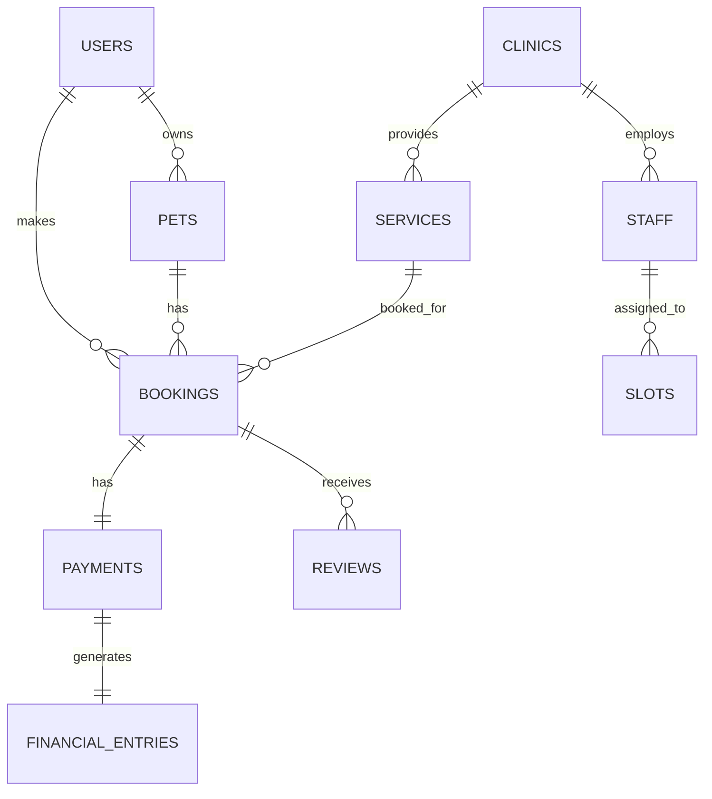
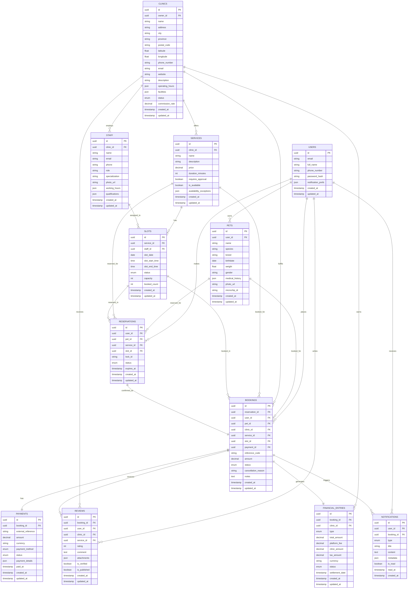

# Detailed Entity Relationship Diagram: Booking Domain
# 詳細エンティティ関連図：予約ドメイン

**English**
This document contains detailed Entity Relationship Diagrams (ERD) for the Booking domain on the PetPro platform, focusing on level 2 and 3 data structures.

**日本語**
この文書は、PetProプラットフォームの予約ドメインに関する詳細なエンティティ関連図（ERD）を含み、レベル2および3のデータ構造に焦点を当てています。

## Level 1: Overview Booking Domain ERD
## レベル1：予約ドメインERD概要



## Level 2: Detailed Booking Domain ERD
## レベル2：詳細予約ドメインERD



## Level 3: Database Schema Detail for Booking Domain
## レベル3：予約ドメインのデータベーススキーマ詳細

### `users` Table
### `users` テーブル

```sql
CREATE TABLE users (
    id UUID PRIMARY KEY DEFAULT gen_random_uuid(),
    email VARCHAR(255) NOT NULL UNIQUE,
    full_name VARCHAR(255) NOT NULL,
    phone_number VARCHAR(20) NOT NULL,
    password_hash VARCHAR(255) NOT NULL,
    notification_prefs JSONB DEFAULT '{"email": true, "push": true, "sms": false}',
    created_at TIMESTAMP WITH TIME ZONE DEFAULT CURRENT_TIMESTAMP,
    updated_at TIMESTAMP WITH TIME ZONE DEFAULT CURRENT_TIMESTAMP,
    last_login_at TIMESTAMP WITH TIME ZONE,
    account_status VARCHAR(20) DEFAULT 'active',
    verification_status VARCHAR(20) DEFAULT 'unverified',
    
    CONSTRAINT email_format CHECK (email ~* '^[A-Za-z0-9._%-]+@[A-Za-z0-9.-]+[.][A-Za-z]+$')
);

CREATE INDEX idx_users_email ON users(email);
CREATE INDEX idx_users_phone ON users(phone_number);
```

### `pets` Table
### `pets` テーブル

```sql
CREATE TABLE pets (
    id UUID PRIMARY KEY DEFAULT gen_random_uuid(),
    user_id UUID NOT NULL,
    name VARCHAR(100) NOT NULL,
    species VARCHAR(50) NOT NULL,
    breed VARCHAR(100),
    birthdate DATE,
    weight DECIMAL(5,2),
    gender VARCHAR(10) CHECK (gender IN ('male', 'female', 'unknown')),
    medical_history JSONB DEFAULT '{}',
    photo_url VARCHAR(255),
    microchip_id VARCHAR(50),
    created_at TIMESTAMP WITH TIME ZONE DEFAULT CURRENT_TIMESTAMP,
    updated_at TIMESTAMP WITH TIME ZONE DEFAULT CURRENT_TIMESTAMP,
    
    CONSTRAINT fk_user FOREIGN KEY(user_id) REFERENCES users(id) ON DELETE CASCADE
);

CREATE INDEX idx_pets_user_id ON pets(user_id);
CREATE INDEX idx_pets_species ON pets(species);
CREATE INDEX idx_pets_breed ON pets(breed);
```

### `clinics` Table
### `clinics` テーブル

```sql
CREATE TABLE clinics (
    id UUID PRIMARY KEY DEFAULT gen_random_uuid(),
    owner_id UUID NOT NULL,
    name VARCHAR(255) NOT NULL,
    address TEXT NOT NULL,
    city VARCHAR(100) NOT NULL,
    province VARCHAR(100) NOT NULL,
    postal_code VARCHAR(10) NOT NULL,
    latitude DECIMAL(10,8),
    longitude DECIMAL(11,8),
    phone_number VARCHAR(20) NOT NULL,
    email VARCHAR(255) NOT NULL,
    website VARCHAR(255),
    description TEXT,
    operating_hours JSONB NOT NULL DEFAULT '{
        "monday": {"open": "09:00", "close": "18:00", "is_open": true},
        "tuesday": {"open": "09:00", "close": "18:00", "is_open": true},
        "wednesday": {"open": "09:00", "close": "18:00", "is_open": true},
        "thursday": {"open": "09:00", "close": "18:00", "is_open": true},
        "friday": {"open": "09:00", "close": "18:00", "is_open": true},
        "saturday": {"open": "09:00", "close": "15:00", "is_open": true},
        "sunday": {"open": null, "close": null, "is_open": false}
    }',
    facilities JSONB DEFAULT '[]',
    status VARCHAR(20) NOT NULL DEFAULT 'pending' CHECK (status IN ('pending', 'approved', 'rejected', 'suspended')),
    commission_rate DECIMAL(5,2) DEFAULT 10.00,
    created_at TIMESTAMP WITH TIME ZONE DEFAULT CURRENT_TIMESTAMP,
    updated_at TIMESTAMP WITH TIME ZONE DEFAULT CURRENT_TIMESTAMP,
    
    CONSTRAINT fk_owner FOREIGN KEY(owner_id) REFERENCES users(id)
);

CREATE INDEX idx_clinics_owner ON clinics(owner_id);
CREATE INDEX idx_clinics_status ON clinics(status);
CREATE INDEX idx_clinics_location ON clinics(city, province);
CREATE INDEX idx_clinics_geolocation ON clinics USING gist (point(longitude, latitude) <-> point(0,0));
```

### `services` Table
### `services` テーブル

```sql
CREATE TABLE services (
    id UUID PRIMARY KEY DEFAULT gen_random_uuid(),
    clinic_id UUID NOT NULL,
    name VARCHAR(255) NOT NULL,
    description TEXT,
    price DECIMAL(12,2) NOT NULL,
    duration_minutes INTEGER NOT NULL DEFAULT 30,
    requires_approval BOOLEAN DEFAULT FALSE,
    is_available BOOLEAN DEFAULT TRUE,
    availability_exceptions JSONB DEFAULT '[]',
    created_at TIMESTAMP WITH TIME ZONE DEFAULT CURRENT_TIMESTAMP,
    updated_at TIMESTAMP WITH TIME ZONE DEFAULT CURRENT_TIMESTAMP,
    
    CONSTRAINT fk_clinic FOREIGN KEY(clinic_id) REFERENCES clinics(id) ON DELETE CASCADE,
    CONSTRAINT valid_duration CHECK (duration_minutes > 0)
);

CREATE INDEX idx_services_clinic ON services(clinic_id);
CREATE INDEX idx_services_price ON services(price);
CREATE INDEX idx_services_availability ON services(is_available);
```

### `staff` Table
### `staff` テーブル

```sql
CREATE TABLE staff (
    id UUID PRIMARY KEY DEFAULT gen_random_uuid(),
    clinic_id UUID NOT NULL,
    name VARCHAR(255) NOT NULL,
    email VARCHAR(255) NOT NULL,
    phone VARCHAR(20),
    role VARCHAR(50) NOT NULL,
    specialization VARCHAR(100),
    photo_url VARCHAR(255),
    working_hours JSONB,
    qualifications JSONB DEFAULT '[]',
    created_at TIMESTAMP WITH TIME ZONE DEFAULT CURRENT_TIMESTAMP,
    updated_at TIMESTAMP WITH TIME ZONE DEFAULT CURRENT_TIMESTAMP,
    
    CONSTRAINT fk_clinic FOREIGN KEY(clinic_id) REFERENCES clinics(id) ON DELETE CASCADE
);

CREATE INDEX idx_staff_clinic ON staff(clinic_id);
CREATE INDEX idx_staff_role ON staff(role);
CREATE INDEX idx_staff_email ON staff(email);
```

### `slots` Table
### `slots` テーブル

```sql
CREATE TABLE slots (
    id UUID PRIMARY KEY DEFAULT gen_random_uuid(),
    service_id UUID NOT NULL,
    staff_id UUID,
    slot_date DATE NOT NULL,
    slot_start_time TIME NOT NULL,
    slot_end_time TIME NOT NULL,
    status VARCHAR(20) DEFAULT 'available' CHECK (status IN ('available', 'booked', 'blocked')),
    capacity INTEGER DEFAULT 1,
    booked_count INTEGER DEFAULT 0,
    created_at TIMESTAMP WITH TIME ZONE DEFAULT CURRENT_TIMESTAMP,
    updated_at TIMESTAMP WITH TIME ZONE DEFAULT CURRENT_TIMESTAMP,
    
    CONSTRAINT fk_service FOREIGN KEY(service_id) REFERENCES services(id) ON DELETE CASCADE,
    CONSTRAINT fk_staff FOREIGN KEY(staff_id) REFERENCES staff(id) ON DELETE SET NULL,
    CONSTRAINT valid_slot_time CHECK (slot_end_time > slot_start_time),
    CONSTRAINT valid_booked_count CHECK (booked_count <= capacity)
);

CREATE INDEX idx_slots_service ON slots(service_id);
CREATE INDEX idx_slots_staff ON slots(staff_id);
CREATE INDEX idx_slots_date_time ON slots(slot_date, slot_start_time);
CREATE INDEX idx_slots_status ON slots(status);
```

### `reservations` Table
### `reservations` テーブル

```sql
CREATE TABLE reservations (
    id UUID PRIMARY KEY DEFAULT gen_random_uuid(),
    user_id UUID NOT NULL,
    pet_id UUID NOT NULL,
    service_id UUID NOT NULL,
    slot_id UUID NOT NULL,
    lock_id VARCHAR(100) NOT NULL,
    status VARCHAR(20) DEFAULT 'pending' CHECK (status IN ('pending', 'confirmed', 'cancelled', 'expired')),
    expires_at TIMESTAMP WITH TIME ZONE NOT NULL,
    created_at TIMESTAMP WITH TIME ZONE DEFAULT CURRENT_TIMESTAMP,
    updated_at TIMESTAMP WITH TIME ZONE DEFAULT CURRENT_TIMESTAMP,
    
    CONSTRAINT fk_user FOREIGN KEY(user_id) REFERENCES users(id) ON DELETE CASCADE,
    CONSTRAINT fk_pet FOREIGN KEY(pet_id) REFERENCES pets(id) ON DELETE CASCADE,
    CONSTRAINT fk_service FOREIGN KEY(service_id) REFERENCES services(id) ON DELETE CASCADE,
    CONSTRAINT fk_slot FOREIGN KEY(slot_id) REFERENCES slots(id) ON DELETE CASCADE
);

CREATE INDEX idx_reservations_user ON reservations(user_id);
CREATE INDEX idx_reservations_service ON reservations(service_id);
CREATE INDEX idx_reservations_slot ON reservations(slot_id);
CREATE INDEX idx_reservations_status ON reservations(status);
CREATE INDEX idx_reservations_expiry ON reservations(expires_at);
```

### `bookings` Table
### `bookings` テーブル

```sql
CREATE TABLE bookings (
    id UUID PRIMARY KEY DEFAULT gen_random_uuid(),
    reservation_id UUID,
    user_id UUID NOT NULL,
    pet_id UUID NOT NULL,
    clinic_id UUID NOT NULL,
    service_id UUID NOT NULL,
    slot_id UUID NOT NULL,
    payment_id UUID,
    reference_code VARCHAR(20) NOT NULL UNIQUE,
    amount DECIMAL(12,2) NOT NULL,
    status VARCHAR(20) DEFAULT 'confirmed' CHECK (status IN ('confirmed', 'in-progress', 'completed', 'cancelled', 'no-show')),
    cancellation_reason TEXT,
    notes TEXT,
    created_at TIMESTAMP WITH TIME ZONE DEFAULT CURRENT_TIMESTAMP,
    updated_at TIMESTAMP WITH TIME ZONE DEFAULT CURRENT_TIMESTAMP,
    
    CONSTRAINT fk_reservation FOREIGN KEY(reservation_id) REFERENCES reservations(id) ON DELETE SET NULL,
    CONSTRAINT fk_user FOREIGN KEY(user_id) REFERENCES users(id) ON DELETE RESTRICT,
    CONSTRAINT fk_pet FOREIGN KEY(pet_id) REFERENCES pets(id) ON DELETE RESTRICT,
    CONSTRAINT fk_clinic FOREIGN KEY(clinic_id) REFERENCES clinics(id) ON DELETE RESTRICT,
    CONSTRAINT fk_service FOREIGN KEY(service_id) REFERENCES services(id) ON DELETE RESTRICT,
    CONSTRAINT fk_slot FOREIGN KEY(slot_id) REFERENCES slots(id) ON DELETE RESTRICT
);

CREATE INDEX idx_bookings_user ON bookings(user_id);
CREATE INDEX idx_bookings_clinic ON bookings(clinic_id);
CREATE INDEX idx_bookings_service ON bookings(service_id);
CREATE INDEX idx_bookings_slot ON bookings(slot_id);
CREATE INDEX idx_bookings_reference ON bookings(reference_code);
CREATE INDEX idx_bookings_status ON bookings(status);
CREATE INDEX idx_bookings_created ON bookings(created_at);
```

### `payments` Table
### `payments` テーブル

```sql
CREATE TABLE payments (
    id UUID PRIMARY KEY DEFAULT gen_random_uuid(),
    booking_id UUID NOT NULL,
    external_reference VARCHAR(100),
    amount DECIMAL(12,2) NOT NULL,
    currency VARCHAR(3) DEFAULT 'IDR',
    payment_method VARCHAR(50) NOT NULL,
    status VARCHAR(20) DEFAULT 'pending' CHECK (status IN ('pending', 'processing', 'success', 'failed', 'refunded')),
    payment_details JSONB,
    paid_at TIMESTAMP WITH TIME ZONE,
    created_at TIMESTAMP WITH TIME ZONE DEFAULT CURRENT_TIMESTAMP,
    updated_at TIMESTAMP WITH TIME ZONE DEFAULT CURRENT_TIMESTAMP,
    
    CONSTRAINT fk_booking FOREIGN KEY(booking_id) REFERENCES bookings(id) ON DELETE CASCADE
);

CREATE INDEX idx_payments_booking ON payments(booking_id);
CREATE INDEX idx_payments_status ON payments(status);
CREATE INDEX idx_payments_external_ref ON payments(external_reference);
```

### `financial_entries` Table
### `financial_entries` テーブル

```sql
CREATE TABLE financial_entries (
    id UUID PRIMARY KEY DEFAULT gen_random_uuid(),
    booking_id UUID NOT NULL,
    clinic_id UUID NOT NULL,
    type VARCHAR(20) CHECK (type IN ('booking_fee', 'refund', 'adjustment')),
    total_amount DECIMAL(12,2) NOT NULL,
    platform_fee DECIMAL(12,2) NOT NULL,
    clinic_amount DECIMAL(12,2) NOT NULL,
    tax_amount DECIMAL(12,2) DEFAULT 0,
    currency VARCHAR(3) DEFAULT 'IDR',
    status VARCHAR(20) DEFAULT 'pending' CHECK (status IN ('pending', 'settled', 'cancelled')),
    settlement_date TIMESTAMP WITH TIME ZONE,
    created_at TIMESTAMP WITH TIME ZONE DEFAULT CURRENT_TIMESTAMP,
    updated_at TIMESTAMP WITH TIME ZONE DEFAULT CURRENT_TIMESTAMP,
    
    CONSTRAINT fk_booking FOREIGN KEY(booking_id) REFERENCES bookings(id) ON DELETE CASCADE,
    CONSTRAINT fk_clinic FOREIGN KEY(clinic_id) REFERENCES clinics(id) ON DELETE CASCADE,
    CONSTRAINT amount_validation CHECK (platform_fee + clinic_amount + tax_amount = total_amount)
);

CREATE INDEX idx_financial_booking ON financial_entries(booking_id);
CREATE INDEX idx_financial_clinic ON financial_entries(clinic_id);
CREATE INDEX idx_financial_status ON financial_entries(status);
CREATE INDEX idx_financial_settlement ON financial_entries(settlement_date);
```

### `reviews` Table
### `reviews` テーブル

```sql
CREATE TABLE reviews (
    id UUID PRIMARY KEY DEFAULT gen_random_uuid(),
    booking_id UUID NOT NULL UNIQUE,
    user_id UUID NOT NULL,
    clinic_id UUID NOT NULL,
    service_id UUID NOT NULL,
    rating INTEGER NOT NULL CHECK (rating BETWEEN 1 AND 5),
    comment TEXT,
    attachments JSONB DEFAULT '[]',
    is_verified BOOLEAN DEFAULT TRUE,
    is_published BOOLEAN DEFAULT TRUE,
    created_at TIMESTAMP WITH TIME ZONE DEFAULT CURRENT_TIMESTAMP,
    updated_at TIMESTAMP WITH TIME ZONE DEFAULT CURRENT_TIMESTAMP,
    
    CONSTRAINT fk_booking FOREIGN KEY(booking_id) REFERENCES bookings(id) ON DELETE CASCADE,
    CONSTRAINT fk_user FOREIGN KEY(user_id) REFERENCES users(id) ON DELETE CASCADE,
    CONSTRAINT fk_clinic FOREIGN KEY(clinic_id) REFERENCES clinics(id) ON DELETE CASCADE,
    CONSTRAINT fk_service FOREIGN KEY(service_id) REFERENCES services(id) ON DELETE CASCADE
);

CREATE INDEX idx_reviews_booking ON reviews(booking_id);
CREATE INDEX idx_reviews_user ON reviews(user_id);
CREATE INDEX idx_reviews_clinic ON reviews(clinic_id);
CREATE INDEX idx_reviews_service ON reviews(service_id);
CREATE INDEX idx_reviews_rating ON reviews(rating);
CREATE INDEX idx_reviews_published ON reviews(is_published);
```

### `notifications` Table
### `notifications` テーブル

```sql
CREATE TABLE notifications (
    id UUID PRIMARY KEY DEFAULT gen_random_uuid(),
    user_id UUID NOT NULL,
    booking_id UUID,
    type VARCHAR(50) NOT NULL,
    title VARCHAR(255) NOT NULL,
    content TEXT NOT NULL,
    metadata JSONB DEFAULT '{}',
    is_read BOOLEAN DEFAULT FALSE,
    read_at TIMESTAMP WITH TIME ZONE,
    created_at TIMESTAMP WITH TIME ZONE DEFAULT CURRENT_TIMESTAMP,
    
    CONSTRAINT fk_user FOREIGN KEY(user_id) REFERENCES users(id) ON DELETE CASCADE,
    CONSTRAINT fk_booking FOREIGN KEY(booking_id) REFERENCES bookings(id) ON DELETE SET NULL
);

CREATE INDEX idx_notifications_user ON notifications(user_id);
CREATE INDEX idx_notifications_booking ON notifications(booking_id);
CREATE INDEX idx_notifications_read ON notifications(is_read);
CREATE INDEX idx_notifications_created ON notifications(created_at);
```

## Transactional Database Considerations
## トランザクションデータベースの考慮事項

### Data Consistency
### データ整合性

**English**
1. **Reservation to Booking**:
   * Using transactions to convert reservations to bookings
   * Verifying reservation status before confirmation

2. **Cancellation and Refunds**:
   * Distributed transactions between booking, payment, and financial_entries
   * Compensating transaction pattern for rollback in case of failure
   
**日本語**
1. **予約から予約確定へ**:
   * 予約を予約確定に変換するためのトランザクションの使用
   * 確認前の予約ステータスの確認

2. **キャンセルと返金**:
   * 予約、決済、及び財務エントリ間の分散トランザクション
   * 失敗時のロールバックのための補正トランザクションパターン

### Partitioning and Sharding
### パーティショニングとシャーディング

**English**
1. **Time-based Partitioning**:
   * Partition bookings, slots, and reservations tables based on date
   * Optimize queries for specific time periods

```sql
-- Example partition for bookings table
CREATE TABLE bookings (
    id UUID NOT NULL,
    /* other columns */
    created_at TIMESTAMP WITH TIME ZONE NOT NULL
) PARTITION BY RANGE (created_at);

CREATE TABLE bookings_2025_q1 PARTITION OF bookings
    FOR VALUES FROM ('2025-01-01') TO ('2025-04-01');
    
CREATE TABLE bookings_2025_q2 PARTITION OF bookings
    FOR VALUES FROM ('2025-04-01') TO ('2025-07-01');
```

**日本語**
1. **時間ベースのパーティショニング**:
   * 日付に基づいてbookings、slots、reservationsテーブルをパーティション化
   * 特定の期間のクエリを最適化

```sql
-- bookingsテーブルのパーティション例
CREATE TABLE bookings (
    id UUID NOT NULL,
    /* 他のカラム */
    created_at TIMESTAMP WITH TIME ZONE NOT NULL
) PARTITION BY RANGE (created_at);

CREATE TABLE bookings_2025_q1 PARTITION OF bookings
    FOR VALUES FROM ('2025-01-01') TO ('2025-04-01');
    
CREATE TABLE bookings_2025_q2 PARTITION OF bookings
    FOR VALUES FROM ('2025-04-01') TO ('2025-07-01');
```

### Indexes and Query Optimization
### インデックスとクエリ最適化

**English**
1. **Composite Indexes**:
   * Create combined indexes for frequently executed queries:

```sql
-- For searching bookings by user and status
CREATE INDEX idx_bookings_user_status ON bookings(user_id, status);

-- For searching slots by service and date range
CREATE INDEX idx_slots_service_date ON slots(service_id, slot_date);
```

**日本語**
1. **複合インデックス**:
   * 頻繁に実行されるクエリ用の複合インデックスを作成します：

```sql
-- ユーザーとステータスで予約を検索するため
CREATE INDEX idx_bookings_user_status ON bookings(user_id, status);

-- サービスと日付範囲でスロットを検索するため
CREATE INDEX idx_slots_service_date ON slots(service_id, slot_date);
```

**English**
2. **Materialized Views**:
   * For aggregation queries and reporting:

```sql
CREATE MATERIALIZED VIEW clinic_booking_summary AS
SELECT 
    clinic_id,
    DATE_TRUNC('month', created_at) AS month,
    COUNT(*) AS total_bookings,
    SUM(amount) AS total_revenue,
    COUNT(CASE WHEN status = 'cancelled' THEN 1 END) AS cancelled_count
FROM bookings
GROUP BY clinic_id, DATE_TRUNC('month', created_at);

-- Refresh daily
CREATE OR REPLACE FUNCTION refresh_materialized_views()
RETURNS VOID AS $$
BEGIN
    REFRESH MATERIALIZED VIEW CONCURRENTLY clinic_booking_summary;
    RETURN;
END;
$$ LANGUAGE plpgsql;
```

**日本語**
2. **マテリアライズドビュー**:
   * 集計クエリとレポーティングのためです：

```sql
CREATE MATERIALIZED VIEW clinic_booking_summary AS
SELECT 
    clinic_id,
    DATE_TRUNC('month', created_at) AS month,
    COUNT(*) AS total_bookings,
    SUM(amount) AS total_revenue,
    COUNT(CASE WHEN status = 'cancelled' THEN 1 END) AS cancelled_count
FROM bookings
GROUP BY clinic_id, DATE_TRUNC('month', created_at);

-- 毎日更新
CREATE OR REPLACE FUNCTION refresh_materialized_views()
RETURNS VOID AS $$
BEGIN
    REFRESH MATERIALIZED VIEW CONCURRENTLY clinic_booking_summary;
    RETURN;
END;
$$ LANGUAGE plpgsql;
```

## Domain Event Model
## ドメインイベントモデル

### Booking Domain Events
### 予約ドメインイベント

**English**
1. **ReservationCreated**
```json
{
  "event_type": "reservation.created",
  "reservation_id": "uuid",
  "user_id": "uuid",
  "pet_id": "uuid",
  "service_id": "uuid",
  "slot_id": "uuid",
  "expires_at": "timestamp"
}
```

**日本語**
1. **予約作成完了**
```json
{
  "event_type": "reservation.created",
  "reservation_id": "uuid",
  "user_id": "uuid",
  "pet_id": "uuid",
  "service_id": "uuid",
  "slot_id": "uuid",
  "expires_at": "timestamp"
}
```

**English**
2. **ReservationExpired**
```json
{
  "event_type": "reservation.expired",
  "reservation_id": "uuid",
  "user_id": "uuid",
  "service_id": "uuid",
  "slot_id": "uuid"
}
```

**日本語**
2. **予約期限切れ**
```json
{
  "event_type": "reservation.expired",
  "reservation_id": "uuid",
  "user_id": "uuid",
  "service_id": "uuid",
  "slot_id": "uuid"
}
```

**English**
3. **BookingConfirmed**
```json
{
  "event_type": "booking.confirmed",
  "booking_id": "uuid",
  "reference_code": "string",
  "user_id": "uuid",
  "pet_id": "uuid",
  "clinic_id": "uuid",
  "service_id": "uuid",
  "slot_date": "date",
  "slot_time": "time",
  "amount": "decimal"
}
```

**日本語**
3. **予約確定**
```json
{
  "event_type": "booking.confirmed",
  "booking_id": "uuid",
  "reference_code": "string",
  "user_id": "uuid",
  "pet_id": "uuid",
  "clinic_id": "uuid",
  "service_id": "uuid",
  "slot_date": "date",
  "slot_time": "time",
  "amount": "decimal"
}
```

**English**
4. **BookingCancelled**
```json
{
  "event_type": "booking.cancelled",
  "booking_id": "uuid",
  "user_id": "uuid",
  "clinic_id": "uuid",
  "cancellation_reason": "string",
  "refund_amount": "decimal",
  "refund_status": "string"
}
```

**日本語**
4. **予約キャンセル**
```json
{
  "event_type": "booking.cancelled",
  "booking_id": "uuid",
  "user_id": "uuid",
  "clinic_id": "uuid",
  "cancellation_reason": "string",
  "refund_amount": "decimal",
  "refund_status": "string"
}
```

**English**
5. **BookingCompleted**
```json
{
  "event_type": "booking.completed",
  "booking_id": "uuid",
  "user_id": "uuid",
  "clinic_id": "uuid",
  "service_id": "uuid",
  "completed_at": "timestamp"
}
```

**日本語**
5. **予約完了**
```json
{
  "event_type": "booking.completed",
  "booking_id": "uuid",
  "user_id": "uuid",
  "clinic_id": "uuid",
  "service_id": "uuid",
  "completed_at": "timestamp"
}
```
