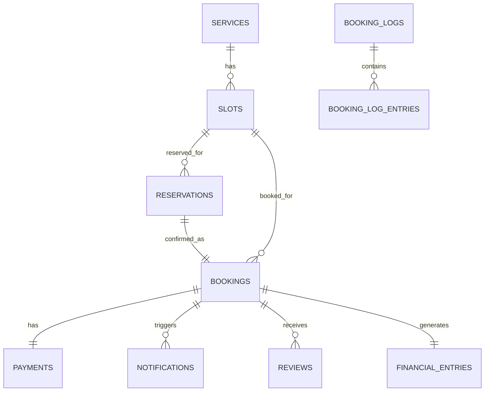
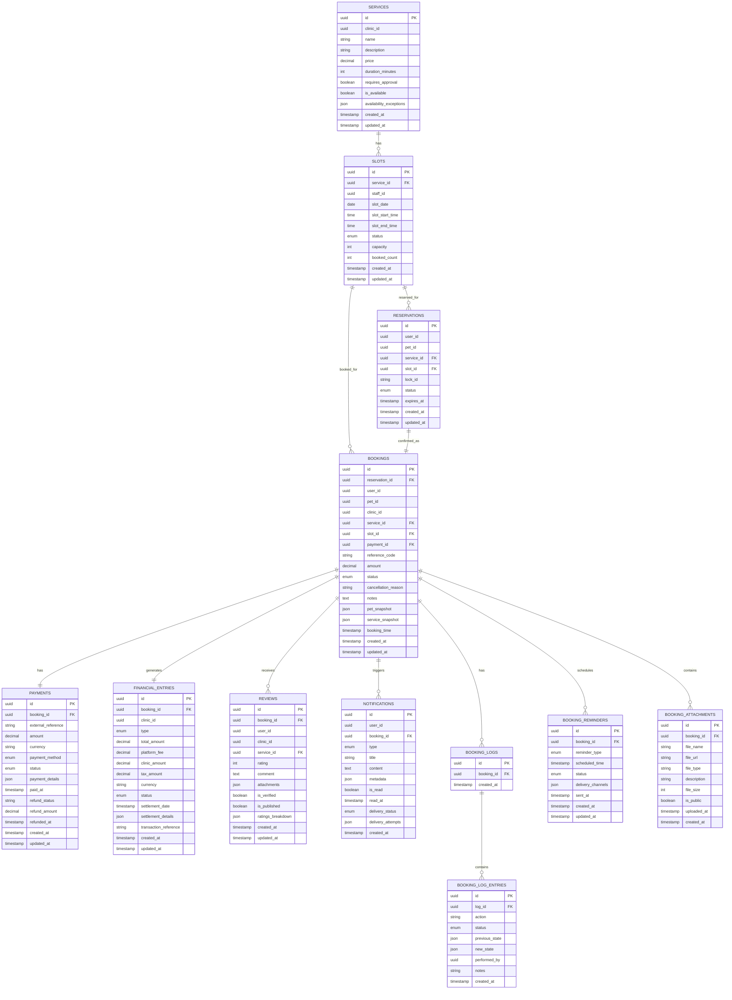

# Booking Service Entity Relationship Diagram
# 予約サービスエンティティ関連図

**English**
This document provides a detailed Entity Relationship Diagram (ERD) for the Booking microservice within the PetPro platform, focusing on domain-specific data models, service boundaries, and integration patterns.

**日本語**
このドキュメントでは、PetProプラットフォーム内の予約マイクロサービスの詳細なエンティティ関連図（ERD）を提供し、ドメイン固有のデータモデル、サービス境界、および統合パターンに焦点を当てています。

## Level 1: Booking Service Domain Overview



## Level 2: Booking Service Detailed Data Model



## Level 3: Booking Service Database Schema

### `services` Table
```sql
CREATE TABLE services (
    id UUID PRIMARY KEY DEFAULT gen_random_uuid(),
    clinic_id UUID NOT NULL,
    name VARCHAR(255) NOT NULL,
    description TEXT,
    price DECIMAL(12,2) NOT NULL,
    duration_minutes INTEGER NOT NULL DEFAULT 30,
    requires_approval BOOLEAN DEFAULT FALSE,
    is_available BOOLEAN DEFAULT TRUE,
    availability_exceptions JSONB DEFAULT '[]',
    created_at TIMESTAMP WITH TIME ZONE DEFAULT CURRENT_TIMESTAMP,
    updated_at TIMESTAMP WITH TIME ZONE DEFAULT CURRENT_TIMESTAMP,
    
    CONSTRAINT valid_duration CHECK (duration_minutes > 0)
);

CREATE INDEX idx_services_clinic ON services(clinic_id);
CREATE INDEX idx_services_price ON services(price);
CREATE INDEX idx_services_availability ON services(is_available);
```

### `slots` Table
```sql
CREATE TABLE slots (
    id UUID PRIMARY KEY DEFAULT gen_random_uuid(),
    service_id UUID NOT NULL,
    staff_id UUID,
    slot_date DATE NOT NULL,
    slot_start_time TIME NOT NULL,
    slot_end_time TIME NOT NULL,
    status VARCHAR(20) DEFAULT 'available' CHECK (status IN ('available', 'booked', 'blocked')),
    capacity INTEGER DEFAULT 1,
    booked_count INTEGER DEFAULT 0,
    created_at TIMESTAMP WITH TIME ZONE DEFAULT CURRENT_TIMESTAMP,
    updated_at TIMESTAMP WITH TIME ZONE DEFAULT CURRENT_TIMESTAMP,
    
    CONSTRAINT fk_service FOREIGN KEY(service_id) REFERENCES services(id) ON DELETE CASCADE,
    CONSTRAINT valid_slot_time CHECK (slot_end_time > slot_start_time),
    CONSTRAINT valid_booked_count CHECK (booked_count <= capacity)
);

CREATE INDEX idx_slots_service ON slots(service_id);
CREATE INDEX idx_slots_staff ON slots(staff_id);
CREATE INDEX idx_slots_date_time ON slots(slot_date, slot_start_time);
CREATE INDEX idx_slots_status ON slots(status);
```

### `reservations` Table
```sql
CREATE TABLE reservations (
    id UUID PRIMARY KEY DEFAULT gen_random_uuid(),
    user_id UUID NOT NULL,
    pet_id UUID NOT NULL,
    service_id UUID NOT NULL,
    slot_id UUID NOT NULL,
    lock_id VARCHAR(100) NOT NULL,
    status VARCHAR(20) DEFAULT 'pending' CHECK (status IN ('pending', 'confirmed', 'cancelled', 'expired')),
    expires_at TIMESTAMP WITH TIME ZONE NOT NULL,
    created_at TIMESTAMP WITH TIME ZONE DEFAULT CURRENT_TIMESTAMP,
    updated_at TIMESTAMP WITH TIME ZONE DEFAULT CURRENT_TIMESTAMP,
    
    CONSTRAINT fk_service FOREIGN KEY(service_id) REFERENCES services(id) ON DELETE CASCADE,
    CONSTRAINT fk_slot FOREIGN KEY(slot_id) REFERENCES slots(id) ON DELETE CASCADE
);

CREATE INDEX idx_reservations_user ON reservations(user_id);
CREATE INDEX idx_reservations_service ON reservations(service_id);
CREATE INDEX idx_reservations_slot ON reservations(slot_id);
CREATE INDEX idx_reservations_status ON reservations(status);
CREATE INDEX idx_reservations_expiry ON reservations(expires_at);
```

### `bookings` Table
```sql
CREATE TABLE bookings (
    id UUID PRIMARY KEY DEFAULT gen_random_uuid(),
    reservation_id UUID,
    user_id UUID NOT NULL,
    pet_id UUID NOT NULL,
    clinic_id UUID NOT NULL,
    service_id UUID NOT NULL,
    slot_id UUID NOT NULL,
    payment_id UUID,
    reference_code VARCHAR(20) NOT NULL UNIQUE,
    amount DECIMAL(12,2) NOT NULL,
    status VARCHAR(20) DEFAULT 'confirmed' CHECK (status IN ('confirmed', 'in-progress', 'completed', 'cancelled', 'no-show')),
    cancellation_reason TEXT,
    notes TEXT,
    pet_snapshot JSONB DEFAULT '{}',
    service_snapshot JSONB DEFAULT '{}',
    booking_time TIMESTAMP WITH TIME ZONE,
    created_at TIMESTAMP WITH TIME ZONE DEFAULT CURRENT_TIMESTAMP,
    updated_at TIMESTAMP WITH TIME ZONE DEFAULT CURRENT_TIMESTAMP,
    
    CONSTRAINT fk_reservation FOREIGN KEY(reservation_id) REFERENCES reservations(id) ON DELETE SET NULL,
    CONSTRAINT fk_service FOREIGN KEY(service_id) REFERENCES services(id) ON DELETE RESTRICT,
    CONSTRAINT fk_slot FOREIGN KEY(slot_id) REFERENCES slots(id) ON DELETE RESTRICT
);

CREATE INDEX idx_bookings_user ON bookings(user_id);
CREATE INDEX idx_bookings_clinic ON bookings(clinic_id);
CREATE INDEX idx_bookings_service ON bookings(service_id);
CREATE INDEX idx_bookings_slot ON bookings(slot_id);
CREATE INDEX idx_bookings_reference ON bookings(reference_code);
CREATE INDEX idx_bookings_status ON bookings(status);
CREATE INDEX idx_bookings_booking_time ON bookings(booking_time);
CREATE INDEX idx_bookings_created ON bookings(created_at);
```

### `payments` Table
```sql
CREATE TABLE payments (
    id UUID PRIMARY KEY DEFAULT gen_random_uuid(),
    booking_id UUID NOT NULL,
    external_reference VARCHAR(100),
    amount DECIMAL(12,2) NOT NULL,
    currency VARCHAR(3) DEFAULT 'IDR',
    payment_method VARCHAR(50) NOT NULL,
    status VARCHAR(20) DEFAULT 'pending' CHECK (status IN ('pending', 'processing', 'success', 'failed', 'refunded')),
    payment_details JSONB,
    paid_at TIMESTAMP WITH TIME ZONE,
    refund_status VARCHAR(20) DEFAULT NULL CHECK (refund_status IS NULL OR refund_status IN ('pending', 'processing', 'completed', 'failed')),
    refund_amount DECIMAL(12,2),
    refunded_at TIMESTAMP WITH TIME ZONE,
    created_at TIMESTAMP WITH TIME ZONE DEFAULT CURRENT_TIMESTAMP,
    updated_at TIMESTAMP WITH TIME ZONE DEFAULT CURRENT_TIMESTAMP,
    
    CONSTRAINT fk_booking FOREIGN KEY(booking_id) REFERENCES bookings(id) ON DELETE CASCADE,
    CONSTRAINT valid_refund CHECK (refund_amount IS NULL OR refund_amount <= amount)
);

CREATE INDEX idx_payments_booking ON payments(booking_id);
CREATE INDEX idx_payments_status ON payments(status);
CREATE INDEX idx_payments_external_ref ON payments(external_reference);
CREATE INDEX idx_payments_refund_status ON payments(refund_status) WHERE refund_status IS NOT NULL;
```

### `booking_logs` Table
```sql
CREATE TABLE booking_logs (
    id UUID PRIMARY KEY DEFAULT gen_random_uuid(),
    booking_id UUID NOT NULL,
    created_at TIMESTAMP WITH TIME ZONE DEFAULT CURRENT_TIMESTAMP,
    
    CONSTRAINT fk_booking FOREIGN KEY(booking_id) REFERENCES bookings(id) ON DELETE CASCADE
);

CREATE INDEX idx_booking_logs_booking ON booking_logs(booking_id);
```

### `booking_log_entries` Table
```sql
CREATE TABLE booking_log_entries (
    id UUID PRIMARY KEY DEFAULT gen_random_uuid(),
    log_id UUID NOT NULL,
    action VARCHAR(100) NOT NULL,
    status VARCHAR(50) NOT NULL,
    previous_state JSONB,
    new_state JSONB,
    performed_by UUID,
    notes TEXT,
    created_at TIMESTAMP WITH TIME ZONE DEFAULT CURRENT_TIMESTAMP,
    
    CONSTRAINT fk_log FOREIGN KEY(log_id) REFERENCES booking_logs(id) ON DELETE CASCADE
);

CREATE INDEX idx_booking_log_entries_log ON booking_log_entries(log_id);
CREATE INDEX idx_booking_log_entries_action ON booking_log_entries(action);
CREATE INDEX idx_booking_log_entries_created ON booking_log_entries(created_at);
```

### `booking_reminders` Table
```sql
CREATE TABLE booking_reminders (
    id UUID PRIMARY KEY DEFAULT gen_random_uuid(),
    booking_id UUID NOT NULL,
    reminder_type VARCHAR(50) NOT NULL CHECK (reminder_type IN ('upcoming', 'check_in', 'follow_up', 'review_request')),
    scheduled_time TIMESTAMP WITH TIME ZONE NOT NULL,
    status VARCHAR(20) DEFAULT 'pending' CHECK (status IN ('pending', 'sent', 'failed', 'cancelled')),
    delivery_channels JSONB DEFAULT '["email"]',
    sent_at TIMESTAMP WITH TIME ZONE,
    created_at TIMESTAMP WITH TIME ZONE DEFAULT CURRENT_TIMESTAMP,
    updated_at TIMESTAMP WITH TIME ZONE DEFAULT CURRENT_TIMESTAMP,
    
    CONSTRAINT fk_booking FOREIGN KEY(booking_id) REFERENCES bookings(id) ON DELETE CASCADE
);

CREATE INDEX idx_booking_reminders_booking ON booking_reminders(booking_id);
CREATE INDEX idx_booking_reminders_scheduled ON booking_reminders(scheduled_time);
CREATE INDEX idx_booking_reminders_status ON booking_reminders(status);
```

## Level 4: Booking Service Microservice Integration

### External Service References

Within the Booking microservice, references to external services are maintained as foreign keys, but with special handling:

1. **User and Pet References**:
   - User and pet data from the Auth Service is referenced by UUID
   - Critical data is stored as snapshots in the booking record to maintain consistency
   - Updates to user/pet data are handled through event-driven patterns

2. **Clinic References**:
   - Clinic data from the Clinic Service is referenced by UUID
   - Clinic service offerings are cached within the booking service for performance
   - Changes to clinic data trigger events that update booking service data

### Event-Based Integration

The Booking Service produces and consumes events to maintain data consistency with other microservices:

### Published Events

1. **ReservationCreated**
   ```json
   {
     "event_type": "reservation.created",
     "reservation_id": "uuid",
     "user_id": "uuid",
     "pet_id": "uuid",
     "service_id": "uuid",
     "slot_id": "uuid",
     "expires_at": "timestamp",
     "created_at": "timestamp"
   }
   ```

2. **BookingConfirmed**
   ```json
   {
     "event_type": "booking.confirmed",
     "booking_id": "uuid",
     "reference_code": "string",
     "user_id": "uuid",
     "pet_id": "uuid",
     "clinic_id": "uuid",
     "service_id": "uuid",
     "slot_date": "date",
     "slot_time": "time",
     "amount": "decimal",
     "created_at": "timestamp"
   }
   ```

3. **BookingCancelled**
   ```json
   {
     "event_type": "booking.cancelled",
     "booking_id": "uuid",
     "reference_code": "string",
     "user_id": "uuid",
     "pet_id": "uuid",
     "clinic_id": "uuid",
     "cancellation_reason": "string",
     "refund_amount": "decimal",
     "refund_status": "string",
     "cancelled_at": "timestamp"
   }
   ```

4. **BookingCompleted**
   ```json
   {
     "event_type": "booking.completed",
     "booking_id": "uuid",
     "reference_code": "string",
     "user_id": "uuid",
     "pet_id": "uuid",
     "clinic_id": "uuid",
     "service_id": "uuid",
     "service_name": "string",
     "completed_at": "timestamp"
   }
   ```

5. **BookingStatusChanged**
   ```json
   {
     "event_type": "booking.status_changed",
     "booking_id": "uuid",
     "reference_code": "string",
     "previous_status": "string",
     "new_status": "string",
     "changed_at": "timestamp"
   }
   ```

6. **PaymentProcessed**
   ```json
   {
     "event_type": "payment.processed",
     "payment_id": "uuid",
     "booking_id": "uuid",
     "amount": "decimal",
     "currency": "string",
     "payment_method": "string",
     "status": "string",
     "processed_at": "timestamp"
   }
   ```

7. **ReviewSubmitted**
   ```json
   {
     "event_type": "review.submitted",
     "review_id": "uuid",
     "booking_id": "uuid",
     "user_id": "uuid",
     "clinic_id": "uuid",
     "service_id": "uuid",
     "rating": "integer",
     "submitted_at": "timestamp"
   }
   ```

### Consumed Events

1. **UserUpdated**
   ```json
   {
     "event_type": "user.updated",
     "user_id": "uuid",
     "email": "string",
     "full_name": "string",
     "phone_number": "string",
     "updated_at": "timestamp"
   }
   ```

2. **PetUpdated**
   ```json
   {
     "event_type": "pet.updated",
     "pet_id": "uuid",
     "name": "string",
     "species": "string",
     "breed": "string",
     "updated_at": "timestamp"
   }
   ```

3. **ClinicUpdated**
   ```json
   {
     "event_type": "clinic.updated",
     "clinic_id": "uuid",
     "name": "string",
     "address": "string",
     "phone_number": "string",
     "updated_at": "timestamp"
   }
   ```

4. **ServiceUpdated**
   ```json
   {
     "event_type": "service.updated",
     "service_id": "uuid",
     "clinic_id": "uuid",
     "name": "string",
     "price": "decimal",
     "duration_minutes": "integer",
     "is_available": "boolean",
     "updated_at": "timestamp"
   }
   ```

5. **PaymentStatusChanged**
   ```json
   {
     "event_type": "payment.status_changed",
     "payment_id": "uuid",
     "external_reference": "string",
     "previous_status": "string",
     "new_status": "string",
     "changed_at": "timestamp"
   }
   ```

## Database Optimizations for Microservices

### 1. Query Patterns and Materialized Views

```sql
-- Materialized view for upcoming bookings dashboard
CREATE MATERIALIZED VIEW upcoming_bookings_view AS
SELECT 
    b.id,
    b.reference_code,
    b.user_id,
    b.pet_id,
    b.clinic_id,
    b.service_id,
    s.name AS service_name,
    b.amount,
    b.status,
    sl.slot_date,
    sl.slot_start_time,
    sl.slot_end_time
FROM bookings b
JOIN services s ON b.service_id = s.id
JOIN slots sl ON b.slot_id = sl.id
WHERE b.status = 'confirmed' 
AND (sl.slot_date > CURRENT_DATE OR (sl.slot_date = CURRENT_DATE AND sl.slot_start_time > CURRENT_TIME))
ORDER BY sl.slot_date, sl.slot_start_time;

-- Materialized view for booking completion rates
CREATE MATERIALIZED VIEW booking_completion_rates AS
SELECT
    DATE_TRUNC('month', b.created_at) AS month,
    COUNT(*) AS total_bookings,
    COUNT(CASE WHEN b.status = 'completed' THEN 1 END) AS completed_bookings,
    COUNT(CASE WHEN b.status = 'cancelled' THEN 1 END) AS cancelled_bookings,
    COUNT(CASE WHEN b.status = 'no-show' THEN 1 END) AS no_show_bookings,
    ROUND((COUNT(CASE WHEN b.status = 'completed' THEN 1 END)::numeric / COUNT(*)) * 100, 2) AS completion_rate,
    ROUND((COUNT(CASE WHEN b.status = 'cancelled' THEN 1 END)::numeric / COUNT(*)) * 100, 2) AS cancellation_rate
FROM bookings b
GROUP BY DATE_TRUNC('month', b.created_at);
```

### 2. Outbox Pattern Implementation

```sql
CREATE TABLE booking_events_outbox (
    id UUID PRIMARY KEY DEFAULT gen_random_uuid(),
    aggregate_type VARCHAR(50) NOT NULL,
    aggregate_id UUID NOT NULL,
    event_type VARCHAR(100) NOT NULL,
    payload JSONB NOT NULL,
    created_at TIMESTAMP WITH TIME ZONE DEFAULT CURRENT_TIMESTAMP,
    published BOOLEAN DEFAULT FALSE,
    published_at TIMESTAMP WITH TIME ZONE,
    attempts INTEGER DEFAULT 0
);

CREATE INDEX idx_booking_events_outbox_unpublished 
ON booking_events_outbox(published) 
WHERE published = FALSE;

CREATE INDEX idx_booking_events_outbox_aggregate 
ON booking_events_outbox(aggregate_type, aggregate_id);

-- Example trigger function to populate the outbox when a booking is created/updated
CREATE OR REPLACE FUNCTION booking_event_trigger() RETURNS TRIGGER AS $$
DECLARE
    payload JSONB;
BEGIN
    IF TG_OP = 'INSERT' THEN
        payload = jsonb_build_object(
            'booking_id', NEW.id,
            'reference_code', NEW.reference_code,
            'user_id', NEW.user_id,
            'clinic_id', NEW.clinic_id,
            'service_id', NEW.service_id,
            'amount', NEW.amount,
            'status', NEW.status,
            'created_at', NEW.created_at
        );
        
        INSERT INTO booking_events_outbox (
            aggregate_type, 
            aggregate_id, 
            event_type, 
            payload
        ) VALUES (
            'booking',
            NEW.id,
            'booking.created',
            payload
        );
    ELSIF TG_OP = 'UPDATE' AND OLD.status <> NEW.status THEN
        payload = jsonb_build_object(
            'booking_id', NEW.id,
            'reference_code', NEW.reference_code,
            'previous_status', OLD.status,
            'new_status', NEW.status,
            'changed_at', NOW()
        );
        
        INSERT INTO booking_events_outbox (
            aggregate_type, 
            aggregate_id, 
            event_type, 
            payload
        ) VALUES (
            'booking',
            NEW.id,
            'booking.status_changed',
            payload
        );
    END IF;
    
    RETURN NULL;
END;
$$ LANGUAGE plpgsql;

CREATE TRIGGER booking_event_trigger
AFTER INSERT OR UPDATE ON bookings
FOR EACH ROW EXECUTE FUNCTION booking_event_trigger();
```

## Service API and Endpoints

### Internal TCP Message Patterns

| Pattern | Command | Description |
|---------|---------|-------------|
| Request/Response | `booking.reservation.create` | Create a new reservation |
| Request/Response | `booking.reservation.confirm` | Confirm a reservation as booking |
| Request/Response | `booking.availability.check` | Check service availability |
| Request/Response | `booking.slots.find` | Find available slots |
| Request/Response | `booking.booking.find` | Find booking by ID or criteria |
| Request/Response | `booking.booking.update` | Update booking status |
| Event | `booking.created` | Booking created event |
| Event | `booking.cancelled` | Booking cancelled event |
| Event | `booking.completed` | Booking completed event |
| Event | `payment.processed` | Payment processed event |

### REST Endpoints (via API Gateway)

| Method | Endpoint | Description |
|--------|----------|-------------|
| GET | `/bookings` | List user's bookings with pagination and filtering |
| GET | `/bookings/:id` | Get booking details by ID |
| POST | `/reservations` | Create a new reservation |
| POST | `/reservations/:id/confirm` | Confirm a reservation as booking |
| POST | `/bookings/:id/cancel` | Cancel a booking |
| PUT | `/bookings/:id/status` | Update booking status |
| GET | `/services/:id/slots` | Get available slots for a service |
| GET | `/clinics/:id/services` | Get services offered by a clinic |
| POST | `/bookings/:id/reviews` | Create a review for a booking |

## Domain-Driven Design Concepts

### Aggregates

1. **Booking Aggregate**
   - Root: Booking
   - Entities: Payment, Review
   - Value Objects: BookingReference, Money

2. **Reservation Aggregate**
   - Root: Reservation
   - Value Objects: LockId, ExpiryTime

3. **Slot Aggregate**
   - Root: Slot
   - Value Objects: TimeRange, Capacity

### Bounded Context

The Booking Service maintains a well-defined bounded context:

1. **Core Responsibilities:**
   - Managing the booking lifecycle
   - Handling reservations
   - Processing payments
   - Managing reviews
   - Scheduling reminders

2. **Context Boundaries:**
   - Relies on the Auth Service for user/pet information
   - Relies on the Clinic Service for clinic/staff information
   - Publishes booking events for other services to consume
   - Maintains its own copies of critical external data (via snapshots)

### CQRS Implementation

```typescript
// Command: Create Booking
interface CreateBookingCommand {
  userId: string;
  petId: string;
  serviceId: string;
  slotId: string;
  paymentDetails: PaymentDetails;
}

// Query: Get Upcoming Bookings
interface GetUpcomingBookingsQuery {
  userId: string;
  startDate: Date;
  endDate: Date;
  status?: BookingStatus[];
  page: number;
  limit: number;
}
```
