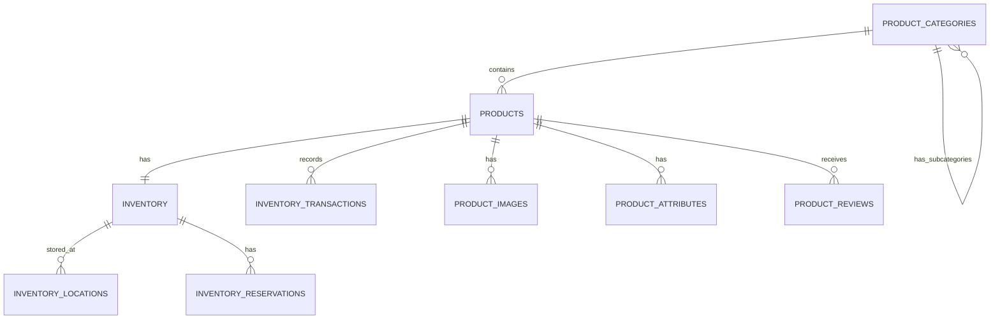
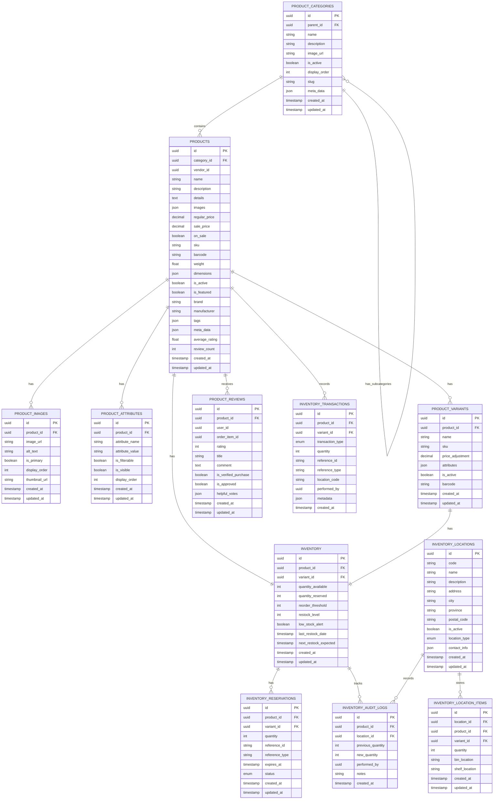

# Inventory Service Entity Relationship Diagram
# 在庫サービスエンティティ関連図

**English**
This document provides a detailed Entity Relationship Diagram (ERD) for the Inventory microservice within the PetPro platform, covering domain-specific data models, relationships, and database schemas.

**日本語**
このドキュメントでは、PetProプラットフォーム内の在庫マイクロサービスの詳細なエンティティ関連図（ERD）を提供し、ドメイン固有のデータモデル、関係、およびデータベーススキーマをカバーしています。

## Level 1: Inventory Service Domain Overview



## Level 2: Inventory Service Detailed Data Model



## Level 3: Inventory Service Database Schema

### `product_categories` Table
```sql
CREATE TABLE product_categories (
    id UUID PRIMARY KEY DEFAULT gen_random_uuid(),
    parent_id UUID,
    name VARCHAR(255) NOT NULL,
    description TEXT,
    image_url VARCHAR(255),
    is_active BOOLEAN DEFAULT TRUE,
    display_order INTEGER DEFAULT 0,
    slug VARCHAR(255) NOT NULL UNIQUE,
    meta_data JSONB DEFAULT '{}',
    created_at TIMESTAMP WITH TIME ZONE DEFAULT CURRENT_TIMESTAMP,
    updated_at TIMESTAMP WITH TIME ZONE DEFAULT CURRENT_TIMESTAMP,
    
    CONSTRAINT fk_parent FOREIGN KEY (parent_id) REFERENCES product_categories(id) ON DELETE SET NULL
);

CREATE INDEX idx_product_categories_parent ON product_categories(parent_id);
CREATE INDEX idx_product_categories_active ON product_categories(is_active);
CREATE INDEX idx_product_categories_slug ON product_categories(slug);
CREATE INDEX idx_product_categories_order ON product_categories(display_order);
```

### `products` Table
```sql
CREATE TABLE products (
    id UUID PRIMARY KEY DEFAULT gen_random_uuid(),
    category_id UUID NOT NULL,
    vendor_id UUID,
    name VARCHAR(255) NOT NULL,
    description TEXT NOT NULL,
    details TEXT,
    images JSONB DEFAULT '[]',
    regular_price DECIMAL(12,2) NOT NULL,
    sale_price DECIMAL(12,2),
    on_sale BOOLEAN DEFAULT FALSE,
    sku VARCHAR(100) NOT NULL UNIQUE,
    barcode VARCHAR(100),
    weight DECIMAL(10,3),
    dimensions JSONB DEFAULT '{"length": 0, "width": 0, "height": 0, "unit": "cm"}',
    is_active BOOLEAN DEFAULT TRUE,
    is_featured BOOLEAN DEFAULT FALSE,
    brand VARCHAR(100),
    manufacturer VARCHAR(100),
    tags JSONB DEFAULT '[]',
    meta_data JSONB DEFAULT '{}',
    average_rating DECIMAL(3,2) DEFAULT 0,
    review_count INTEGER DEFAULT 0,
    created_at TIMESTAMP WITH TIME ZONE DEFAULT CURRENT_TIMESTAMP,
    updated_at TIMESTAMP WITH TIME ZONE DEFAULT CURRENT_TIMESTAMP,
    
    CONSTRAINT fk_category FOREIGN KEY (category_id) REFERENCES product_categories(id) ON DELETE RESTRICT,
    CONSTRAINT valid_price CHECK (regular_price > 0),
    CONSTRAINT valid_sale_price CHECK (sale_price IS NULL OR (sale_price > 0 AND sale_price < regular_price))
);

CREATE INDEX idx_products_category ON products(category_id);
CREATE INDEX idx_products_vendor ON products(vendor_id);
CREATE INDEX idx_products_active ON products(is_active);
CREATE INDEX idx_products_featured ON products(is_featured);
CREATE INDEX idx_products_sku ON products(sku);
CREATE INDEX idx_products_name ON products(name);
CREATE INDEX idx_products_price ON products(regular_price);
CREATE INDEX idx_products_rating ON products(average_rating DESC);
CREATE INDEX idx_products_created ON products(created_at DESC);
```

### `product_images` Table
```sql
CREATE TABLE product_images (
    id UUID PRIMARY KEY DEFAULT gen_random_uuid(),
    product_id UUID NOT NULL,
    image_url VARCHAR(255) NOT NULL,
    alt_text VARCHAR(255),
    is_primary BOOLEAN DEFAULT FALSE,
    display_order INTEGER DEFAULT 0,
    thumbnail_url VARCHAR(255),
    created_at TIMESTAMP WITH TIME ZONE DEFAULT CURRENT_TIMESTAMP,
    updated_at TIMESTAMP WITH TIME ZONE DEFAULT CURRENT_TIMESTAMP,
    
    CONSTRAINT fk_product FOREIGN KEY (product_id) REFERENCES products(id) ON DELETE CASCADE
);

CREATE INDEX idx_product_images_product ON product_images(product_id);
CREATE INDEX idx_product_images_primary ON product_images(is_primary);
CREATE INDEX idx_product_images_order ON product_images(display_order);
```

### `product_attributes` Table
```sql
CREATE TABLE product_attributes (
    id UUID PRIMARY KEY DEFAULT gen_random_uuid(),
    product_id UUID NOT NULL,
    attribute_name VARCHAR(100) NOT NULL,
    attribute_value VARCHAR(255) NOT NULL,
    is_filterable BOOLEAN DEFAULT TRUE,
    is_visible BOOLEAN DEFAULT TRUE,
    display_order INTEGER DEFAULT 0,
    created_at TIMESTAMP WITH TIME ZONE DEFAULT CURRENT_TIMESTAMP,
    updated_at TIMESTAMP WITH TIME ZONE DEFAULT CURRENT_TIMESTAMP,
    
    CONSTRAINT fk_product FOREIGN KEY (product_id) REFERENCES products(id) ON DELETE CASCADE,
    UNIQUE (product_id, attribute_name)
);

CREATE INDEX idx_product_attributes_product ON product_attributes(product_id);
CREATE INDEX idx_product_attributes_filterable ON product_attributes(is_filterable);
CREATE INDEX idx_product_attributes_name ON product_attributes(attribute_name);
CREATE INDEX idx_product_attributes_name_value ON product_attributes(attribute_name, attribute_value);
```

### `inventory` Table
```sql
CREATE TABLE inventory (
    id UUID PRIMARY KEY DEFAULT gen_random_uuid(),
    product_id UUID NOT NULL,
    variant_id UUID,
    quantity_available INTEGER NOT NULL DEFAULT 0,
    quantity_reserved INTEGER NOT NULL DEFAULT 0,
    reorder_threshold INTEGER NOT NULL DEFAULT 5,
    restock_level INTEGER NOT NULL DEFAULT 20,
    low_stock_alert BOOLEAN DEFAULT FALSE,
    last_restock_date TIMESTAMP WITH TIME ZONE,
    next_restock_expected TIMESTAMP WITH TIME ZONE,
    created_at TIMESTAMP WITH TIME ZONE DEFAULT CURRENT_TIMESTAMP,
    updated_at TIMESTAMP WITH TIME ZONE DEFAULT CURRENT_TIMESTAMP,
    
    CONSTRAINT fk_product FOREIGN KEY (product_id) REFERENCES products(id) ON DELETE CASCADE,
    CONSTRAINT valid_quantity CHECK (quantity_available >= 0),
    CONSTRAINT valid_reserved CHECK (quantity_reserved >= 0),
    CONSTRAINT valid_threshold CHECK (reorder_threshold >= 0),
    CONSTRAINT valid_restock CHECK (restock_level >= reorder_threshold)
);

CREATE INDEX idx_inventory_product ON inventory(product_id);
CREATE INDEX idx_inventory_variant ON inventory(variant_id);
CREATE INDEX idx_inventory_low_stock ON inventory(low_stock_alert) WHERE low_stock_alert = TRUE;
CREATE INDEX idx_inventory_quantity ON inventory(quantity_available);
```

### `inventory_transactions` Table
```sql
CREATE TABLE inventory_transactions (
    id UUID PRIMARY KEY DEFAULT gen_random_uuid(),
    product_id UUID NOT NULL,
    variant_id UUID,
    transaction_type VARCHAR(50) NOT NULL CHECK (
        transaction_type IN ('stock_in', 'stock_out', 'adjustment', 'reservation', 'release', 'damaged', 'returned')
    ),
    quantity INTEGER NOT NULL,
    reference_id UUID,
    reference_type VARCHAR(50),
    location_code VARCHAR(50),
    performed_by UUID,
    metadata JSONB DEFAULT '{}',
    created_at TIMESTAMP WITH TIME ZONE DEFAULT CURRENT_TIMESTAMP,
    
    CONSTRAINT fk_product FOREIGN KEY (product_id) REFERENCES products(id) ON DELETE RESTRICT
);

CREATE INDEX idx_inventory_transactions_product ON inventory_transactions(product_id);
CREATE INDEX idx_inventory_transactions_type ON inventory_transactions(transaction_type);
CREATE INDEX idx_inventory_transactions_reference ON inventory_transactions(reference_id);
CREATE INDEX idx_inventory_transactions_created ON inventory_transactions(created_at DESC);
```

### `inventory_locations` Table
```sql
CREATE TABLE inventory_locations (
    id UUID PRIMARY KEY DEFAULT gen_random_uuid(),
    code VARCHAR(50) NOT NULL UNIQUE,
    name VARCHAR(255) NOT NULL,
    description TEXT,
    address TEXT,
    city VARCHAR(100),
    province VARCHAR(100),
    postal_code VARCHAR(20),
    is_active BOOLEAN DEFAULT TRUE,
    location_type VARCHAR(50) NOT NULL CHECK (
        location_type IN ('warehouse', 'store', 'supplier', 'customer')
    ),
    contact_info JSONB DEFAULT '{}',
    created_at TIMESTAMP WITH TIME ZONE DEFAULT CURRENT_TIMESTAMP,
    updated_at TIMESTAMP WITH TIME ZONE DEFAULT CURRENT_TIMESTAMP
);

CREATE INDEX idx_inventory_locations_code ON inventory_locations(code);
CREATE INDEX idx_inventory_locations_active ON inventory_locations(is_active);
CREATE INDEX idx_inventory_locations_type ON inventory_locations(location_type);
CREATE INDEX idx_inventory_locations_city ON inventory_locations(city);
```

### `inventory_reservations` Table
```sql
CREATE TABLE inventory_reservations (
    id UUID PRIMARY KEY DEFAULT gen_random_uuid(),
    product_id UUID NOT NULL,
    variant_id UUID,
    quantity INTEGER NOT NULL,
    reference_id UUID NOT NULL,
    reference_type VARCHAR(50) NOT NULL,
    expires_at TIMESTAMP WITH TIME ZONE NOT NULL,
    status VARCHAR(20) NOT NULL DEFAULT 'active' CHECK (
        status IN ('active', 'completed', 'cancelled', 'expired')
    ),
    created_at TIMESTAMP WITH TIME ZONE DEFAULT CURRENT_TIMESTAMP,
    updated_at TIMESTAMP WITH TIME ZONE DEFAULT CURRENT_TIMESTAMP,
    
    CONSTRAINT fk_product FOREIGN KEY (product_id) REFERENCES products(id) ON DELETE CASCADE,
    CONSTRAINT valid_quantity CHECK (quantity > 0)
);

CREATE INDEX idx_inventory_reservations_product ON inventory_reservations(product_id);
CREATE INDEX idx_inventory_reservations_reference ON inventory_reservations(reference_id);
CREATE INDEX idx_inventory_reservations_status ON inventory_reservations(status);
CREATE INDEX idx_inventory_reservations_expires ON inventory_reservations(expires_at);
```

## Level 4: Inventory Service Data Access Patterns

### Primary Query Patterns

1. **Product Category Navigation**
   - Hierarchical category browsing
   - Category-based product filtering
   - Featured categories

2. **Product Search and Discovery**
   - Full-text search by name, description, and attributes
   - Filtered search by multiple attributes
   - Sorting by price, rating, popularity

3. **Inventory Availability**
   - Real-time inventory status
   - Low stock alerts
   - Multi-location inventory aggregation

4. **Inventory Management**
   - Stock adjustment operations
   - Inventory audit trail
   - Reservation management

### Materialized Views for Performance

```sql
CREATE MATERIALIZED VIEW product_search_view AS
SELECT 
    p.id,
    p.name,
    p.description,
    p.regular_price,
    p.sale_price,
    p.on_sale,
    p.is_active,
    p.is_featured,
    p.average_rating,
    p.review_count,
    c.name as category_name,
    c.id as category_id,
    i.quantity_available,
    i.quantity_reserved,
    (
        SELECT json_agg(json_build_object(
            'attribute_name', pa.attribute_name,
            'attribute_value', pa.attribute_value
        ))
        FROM product_attributes pa
        WHERE pa.product_id = p.id
    ) as attributes,
    (
        SELECT json_agg(json_build_object(
            'image_url', pi.image_url,
            'is_primary', pi.is_primary
        ))
        FROM product_images pi
        WHERE pi.product_id = p.id
        ORDER BY pi.is_primary DESC, pi.display_order
    ) as images
FROM products p
JOIN product_categories c ON p.category_id = c.id
LEFT JOIN inventory i ON p.id = i.product_id AND i.variant_id IS NULL
WHERE p.is_active = true;

CREATE INDEX idx_product_search_view_name ON product_search_view USING gin(name gin_trgm_ops);
CREATE INDEX idx_product_search_view_description ON product_search_view USING gin(description gin_trgm_ops);
CREATE INDEX idx_product_search_view_category ON product_search_view(category_id);
CREATE INDEX idx_product_search_view_price ON product_search_view(regular_price);
CREATE INDEX idx_product_search_view_rating ON product_search_view(average_rating DESC);
```

## Event-Based Integration

The Inventory Service produces and consumes events to maintain data consistency with other services:

### Published Events

1. **ProductCreated**
   ```json
   {
     "event_type": "product.created",
     "product_id": "uuid",
     "name": "string",
     "category_id": "uuid",
     "regular_price": "decimal",
     "sale_price": "decimal",
     "on_sale": "boolean",
     "created_at": "timestamp"
   }
   ```

2. **ProductUpdated**
   ```json
   {
     "event_type": "product.updated",
     "product_id": "uuid",
     "name": "string",
     "description": "string",
     "category_id": "uuid",
     "regular_price": "decimal",
     "sale_price": "decimal",
     "on_sale": "boolean",
     "images": "json",
     "updated_at": "timestamp"
   }
   ```

3. **InventoryChanged**
   ```json
   {
     "event_type": "inventory.changed",
     "product_id": "uuid",
     "variant_id": "uuid", 
     "previous_quantity": "integer",
     "new_quantity": "integer",
     "transaction_type": "string",
     "changed_at": "timestamp"
   }
   ```

4. **LowStockAlert**
   ```json
   {
     "event_type": "inventory.low_stock",
     "product_id": "uuid",
     "variant_id": "uuid",
     "current_quantity": "integer",
     "reorder_threshold": "integer",
     "product_name": "string",
     "detected_at": "timestamp"
   }
   ```

### Consumed Events

1. **OrderCreated**
   ```json
   {
     "event_type": "order.created",
     "order_id": "uuid",
     "items": [
       {
         "product_id": "uuid",
         "variant_id": "uuid",
         "quantity": "integer"
       }
     ],
     "created_at": "timestamp"
   }
   ```

2. **OrderCancelled**
   ```json
   {
     "event_type": "order.cancelled",
     "order_id": "uuid",
     "items": [
       {
         "product_id": "uuid",
         "variant_id": "uuid",
         "quantity": "integer"
       }
     ],
     "cancelled_at": "timestamp"
   }
   ```

3. **ProductReviewed**
   ```json
   {
     "event_type": "product.reviewed",
     "product_id": "uuid",
     "user_id": "uuid",
     "order_item_id": "uuid",
     "rating": "integer",
     "reviewed_at": "timestamp"
   }
   ```

## Domain-Driven Design Concepts

### Aggregates

1. **Product Aggregate**
   - Root: Product
   - Entities: ProductImages, ProductAttributes, ProductVariants
   - Value Objects: Price, Dimensions

2. **Inventory Aggregate**
   - Root: Inventory
   - Entities: InventoryReservations, InventoryTransactions
   - Value Objects: StockLevel, ReorderThreshold

3. **Location Aggregate**
   - Root: InventoryLocation
   - Entities: InventoryLocationItems
   - Value Objects: Address, ContactInfo

### Bounded Context

The Inventory Service maintains a well-defined bounded context:

1. **Core Responsibilities:**
   - Product catalog management
   - Inventory tracking and reservation
   - Location management
   - Stock movement tracking

2. **Context Boundaries:**
   - Relies on the Vendor Service for vendor information
   - Provides product information to the Booking Service
   - Handles inventory reservations from the Order Service

## Service API

The Inventory Service exposes the following API endpoints and message patterns:

### REST Endpoints (via API Gateway)

| Method | Endpoint | Description |
|--------|----------|-------------|
| GET | `/products` | List all products with pagination and filtering |
| GET | `/products/:id` | Get product details by ID |
| POST | `/products` | Create a new product (Admin) |
| PUT | `/products/:id` | Update a product (Admin) |
| GET | `/categories` | List all product categories |
| GET | `/categories/:id/products` | List products by category |
| GET | `/inventory/status/:productId` | Get inventory availability |

### Internal TCP Message Patterns

| Pattern | Command | Description |
|---------|---------|-------------|
| Request/Response | `inventory.product.find` | Find product by ID or criteria |
| Request/Response | `inventory.product.list` | List products with filters |
| Request/Response | `inventory.check` | Check product availability |
| Request/Response | `inventory.reserve` | Reserve inventory for a product |
| Request/Response | `inventory.release` | Release previously reserved inventory |
| Event | `inventory.product.created` | Product created event |
| Event | `inventory.product.updated` | Product updated event |
| Event | `inventory.changed` | Inventory levels changed event |
