# Microservices Entity Relationship Diagrams
# マイクロサービスエンティティ関連図

**English**
This document contains comprehensive Entity Relationship Diagrams (ERD) for the PetPro microservices architecture, showing domain-specific data models and cross-service relationships.

**日本語**
このドキュメントには、PetProマイクロサービスアーキテクチャのための包括的なエンティティ関連図（ERD）が含まれており、ドメイン固有のデータモデルとサービス間の関係を示しています。

## Overview of Microservice Domains

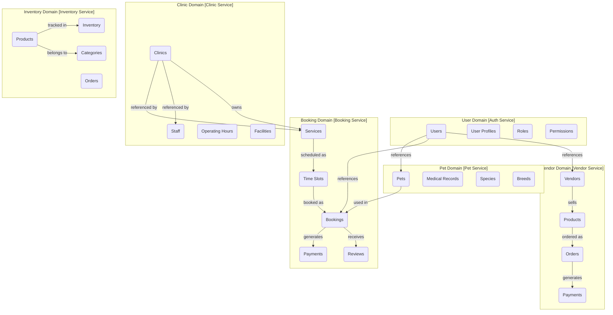

## Database Schemas by Microservice

Each microservice maintains its own database schema, with service boundaries clearly defined. References to entities in other services are maintained via unique IDs and eventual consistency patterns.

## Auth Service Schema

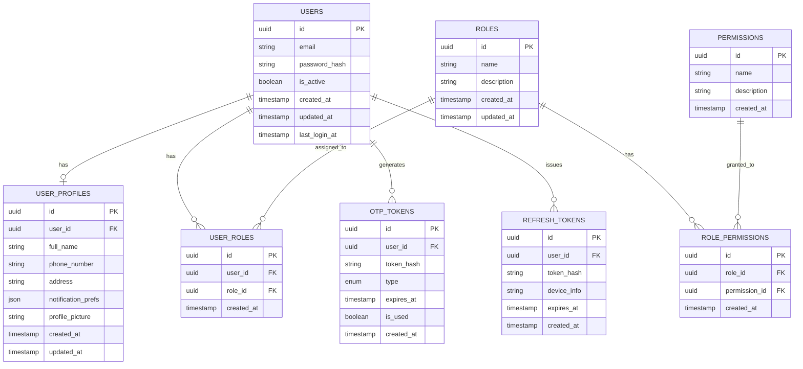

## Pet Service Schema

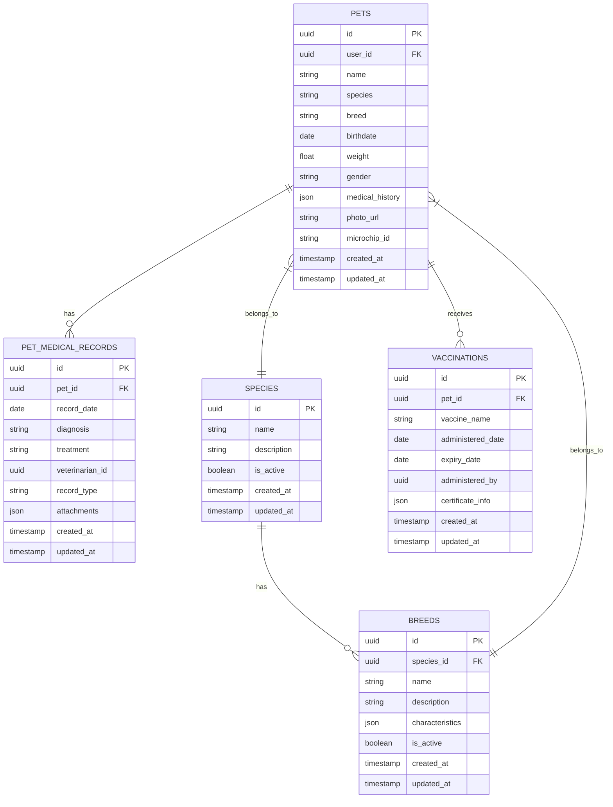

## Booking Service Schema

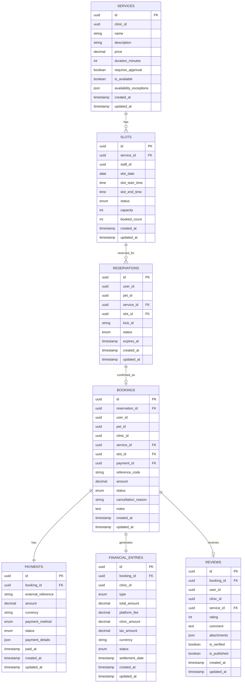

## Clinic Service Schema

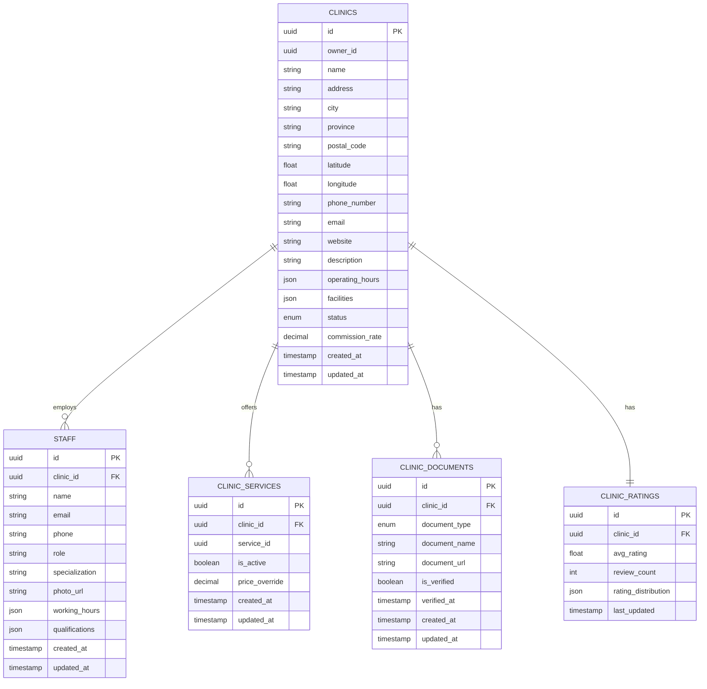

## Inventory Service Schema

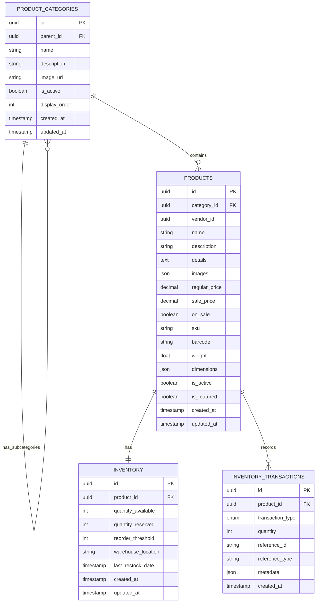

## Vendor Service Schema

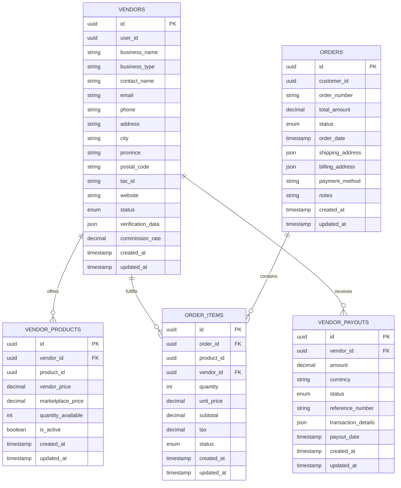

## Cross-Service Data Consistency

### Event-Based Consistency Model

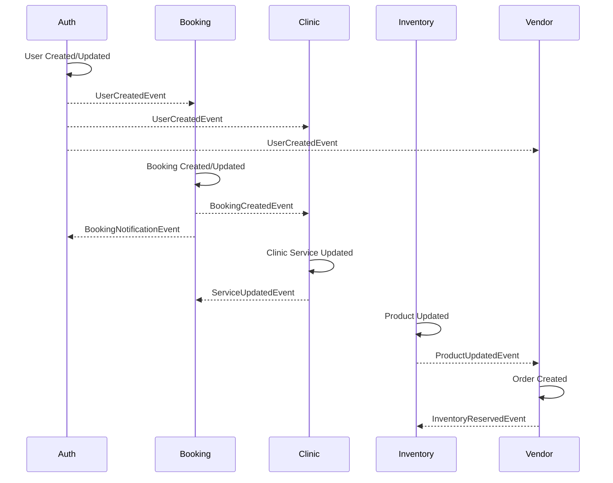

### Materialized View Pattern for Cross-Service Queries

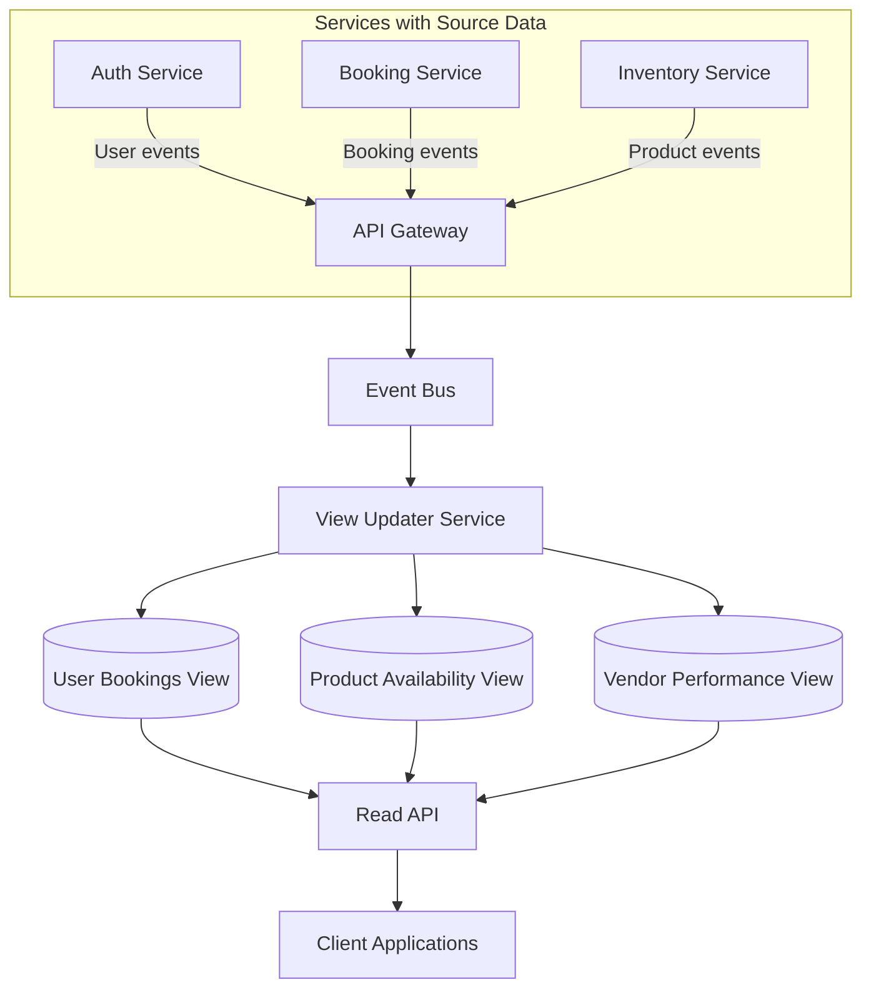

## Microservices Database Deployment Strategy

### Physical Database Separation

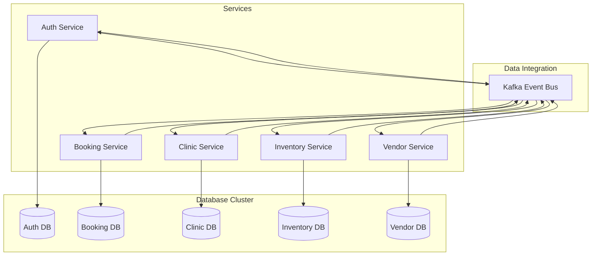

## Data Replication and Consistency Patterns

### Outbox Pattern Implementation

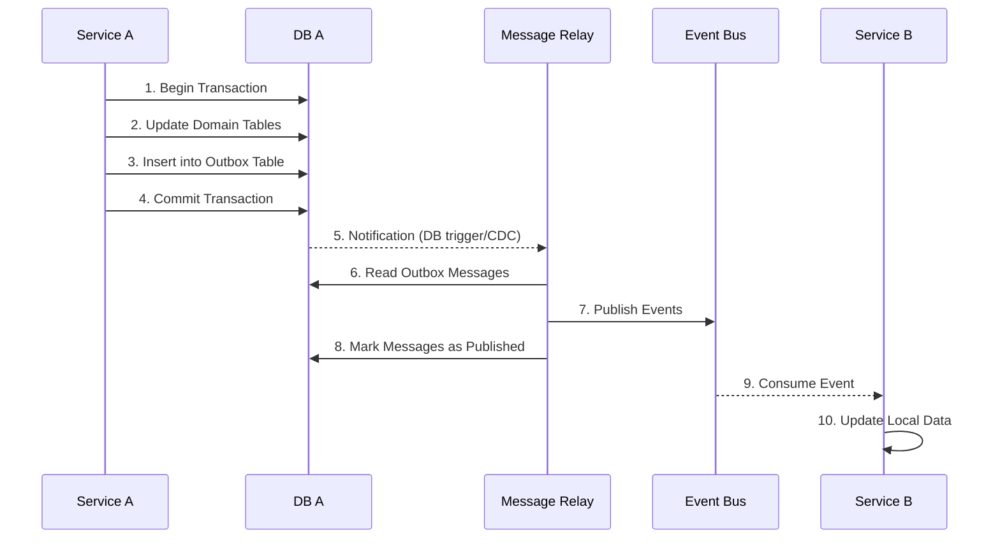

## Data Synchronization and Migration Strategies

- **Data Versioning**: Each microservice maintains its own schema version
- **Dual Write**: Critical operations write to both old and new schemas during migration
- **Feature Flags**: Control access to new data models during transition
- **Read-Repair**: Fix inconsistencies during read operations
- **Background Reconciliation**: Jobs that verify and fix data across services
