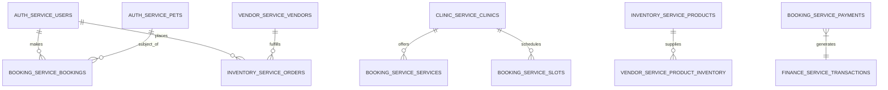
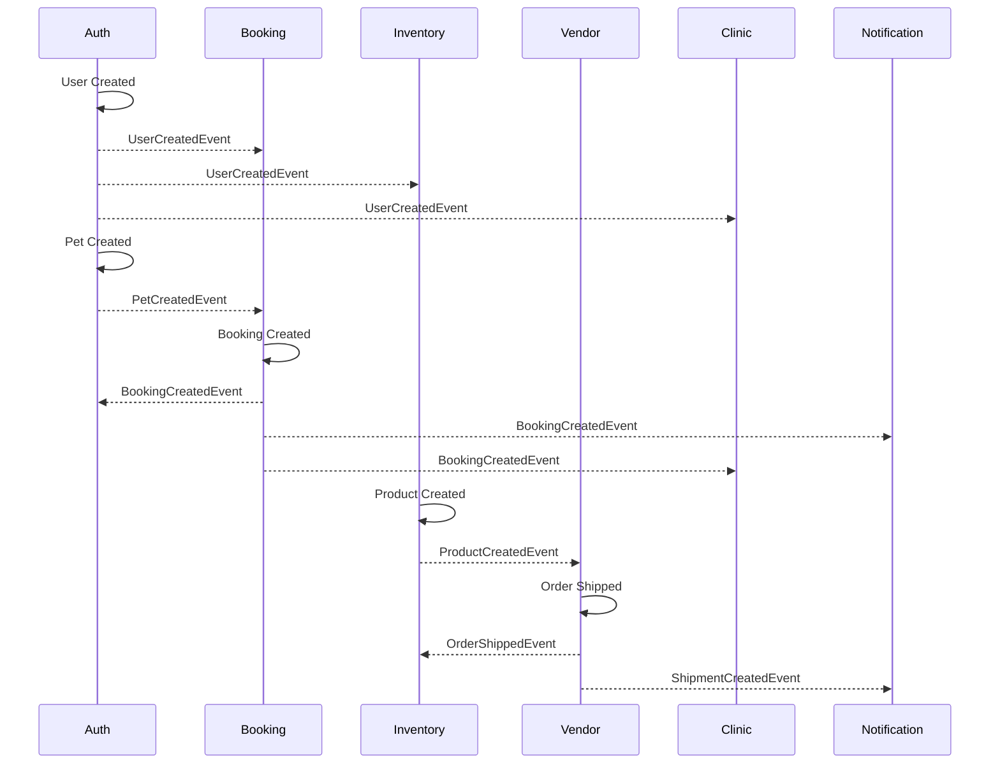
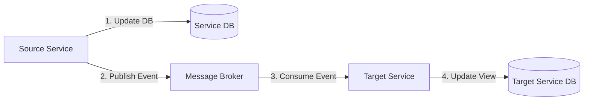
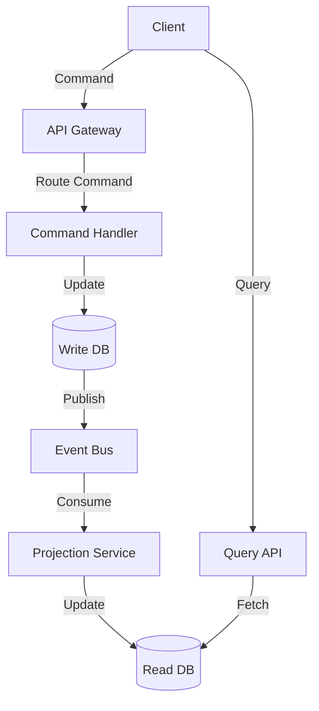
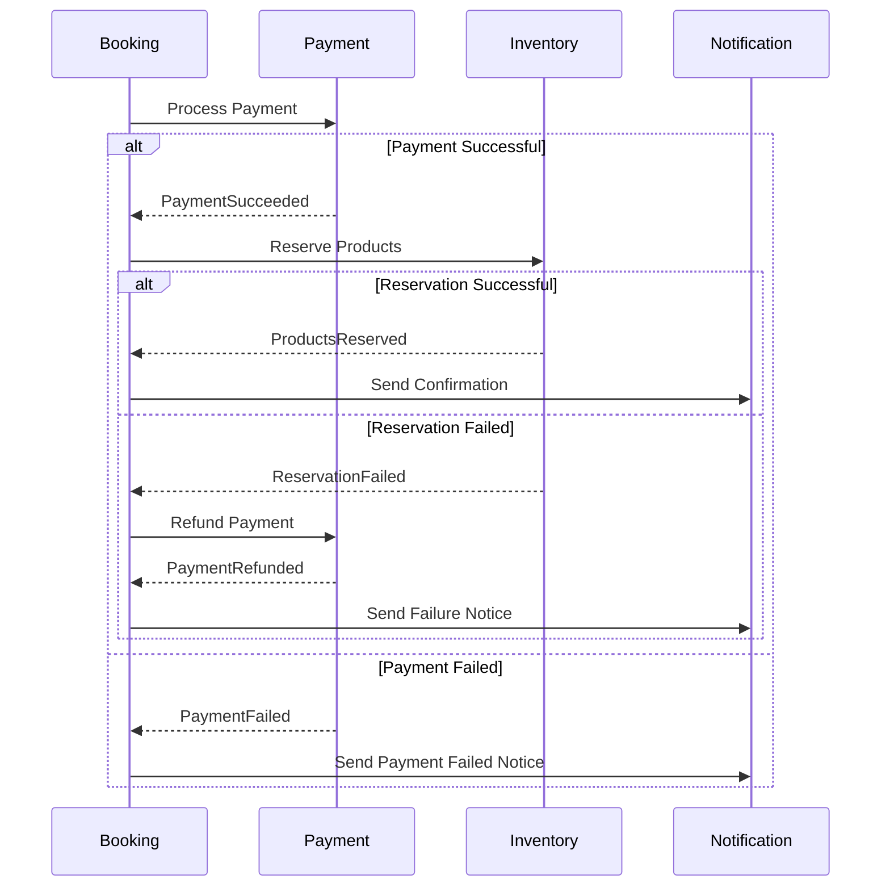
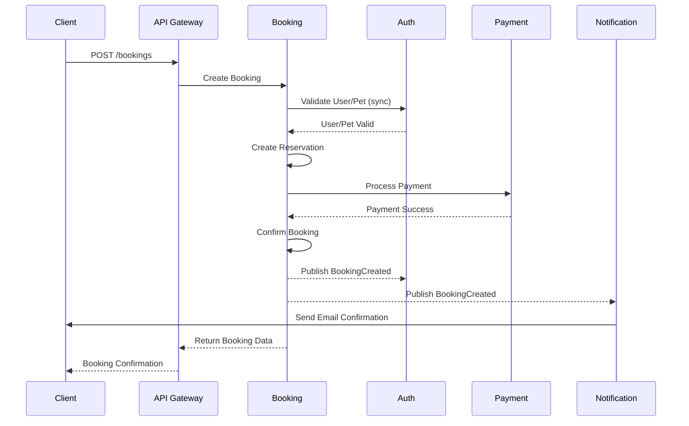
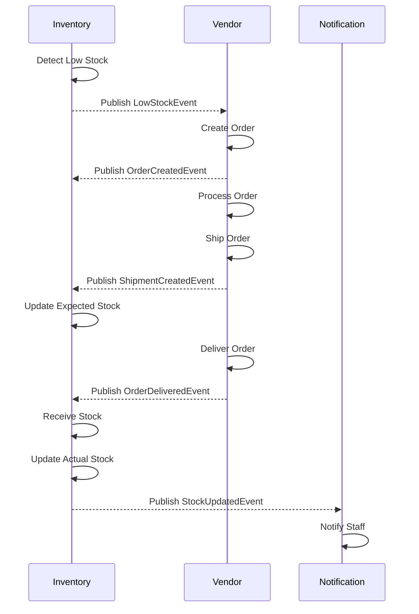
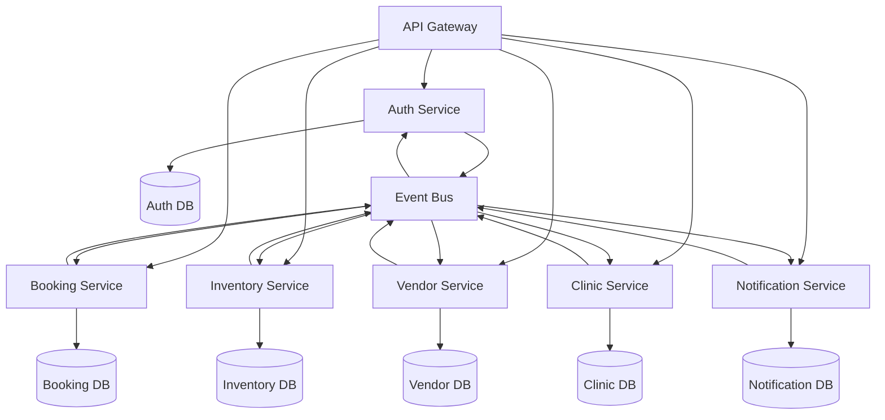
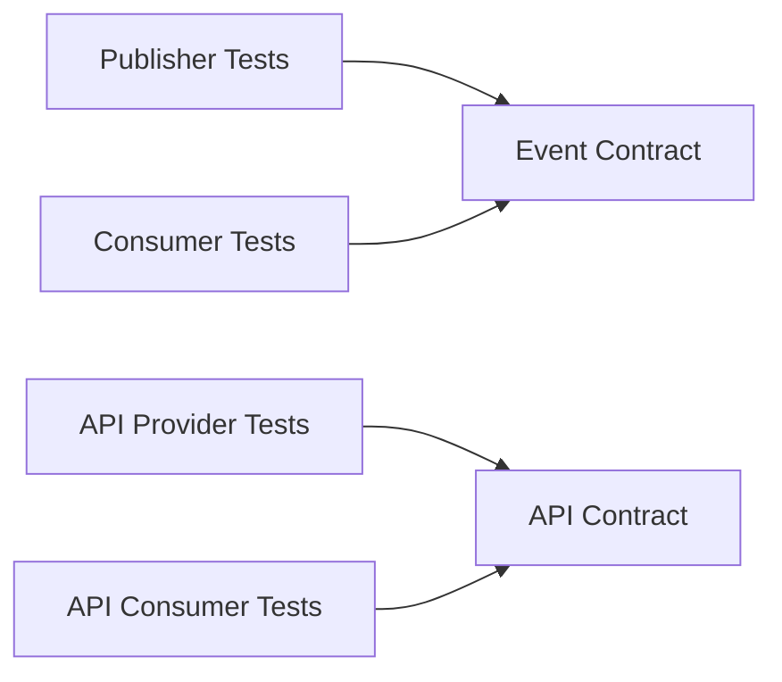

# Microservices Integration ERD Summary
# マイクロサービス統合ERDサマリー

**English**
This document provides a comprehensive integration summary for all PetPro platform microservices, focusing on cross-service data relationships, consistency patterns, and event-driven integration.

**日本語**
このドキュメントでは、PetProプラットフォームの全マイクロサービスの包括的な統合概要を提供し、サービス間のデータ関係、一貫性パターン、およびイベント駆動型統合に焦点を当てています。

## Microservices Architecture Overview

The PetPro platform consists of the following core microservices, each with its own database and domain boundary:

1. **Auth Service** - User identity, pets, permissions
2. **Booking Service** - Appointments, slots, payments
3. **Inventory Service** - Products, stock, categories
4. **Vendor Service** - Suppliers, orders, shipments
5. **Clinic Service** - Veterinary clinics, staff, services
6. **Notification Service** - Messaging across multiple channels

Each microservice maintains:
- A separate PostgreSQL database schema
- Ownership of specific domain entities
- Event-driven communication via message broker
- REST APIs exposed through API Gateway

## Cross-Service Entity Relationships

### Key Entity Relationships Across Microservices



## Service Boundaries and Entity Ownership

| Entity Type | Owner Service | Referenced By | Reference Pattern |
|-------------|--------------|--------------|------------------|
| Users | Auth | Booking, Inventory, Clinic | ID reference + Event subscription |
| Pets | Auth | Booking | ID reference + Snapshot + Event subscription |
| Bookings | Booking | Auth, Finance | ID reference + Event subscription |
| Products | Inventory | Vendor | ID reference + Catalog sync |
| Clinics | Clinic | Booking, Auth | ID reference + Cache + Event subscription |
| Vendors | Vendor | Inventory | ID reference + Event subscription |

## Event-Driven Integration Patterns

### Core Domain Events



### Event Catalog Summary

| Event | Publisher | Subscribers | Purpose |
|-------|-----------|-------------|---------|
| user.created | Auth | Booking, Inventory, Clinic | Initialize user data in other services |
| user.updated | Auth | All services | Synchronize user details |
| pet.created | Auth | Booking | Make pet available for appointments |
| booking.created | Booking | Auth, Clinic, Notification | Update booking history, notify user |
| booking.cancelled | Booking | Auth, Clinic, Finance | Process cancellation, handle refunds |
| product.created | Inventory | Vendor | Update product catalog |
| product.stock_changed | Inventory | Vendor, Notification | Trigger re-order, notify on low stock |
| order.created | Vendor | Inventory, Finance | Update inventory, process payment |
| payment.processed | Booking | Finance, Notification | Update financial records, notify user |

## Data Consistency Models

### 1. Event-Driven Eventual Consistency

The primary consistency model used across PetPro microservices is event-driven eventual consistency:



Key components:
1. **Transactional Outbox Pattern** - Events are stored in an outbox table within the same transaction that updates the database
2. **Event Relay** - Background process publishes events from the outbox to the message broker
3. **Idempotent Consumers** - Subscribers handle events idempotently to prevent duplicate processing
4. **Materialized Views** - Services maintain read-optimized projections of data owned by other services

### 2. CQRS Pattern Implementation

For complex data workflows, the Command Query Responsibility Segregation pattern is implemented:



### 3. Saga Patterns for Complex Transactions

Long-running business transactions that span multiple services use the Saga pattern:



## Service Integration Examples

### Booking Creation Flow



### Inventory Restocking Flow



## Database Mirroring and Caching Patterns

### 1. Denormalized Read Models

Services maintain read-optimized copies of frequently accessed data owned by other services:

```sql
-- Example: Booking service's denormalized pet data
CREATE TABLE booking_pet_cache (
    pet_id UUID PRIMARY KEY,
    owner_id UUID NOT NULL,
    name VARCHAR(100) NOT NULL,
    species VARCHAR(50) NOT NULL,
    breed VARCHAR(100),
    last_updated TIMESTAMP WITH TIME ZONE DEFAULT CURRENT_TIMESTAMP
);

-- Updated by PetUpdated events from Auth service
```

### 2. Materialized View Patterns

```sql
-- Example: Vendor dashboard with inventory status
CREATE MATERIALIZED VIEW vendor_inventory_status AS
SELECT 
    v.id AS vendor_id,
    v.name AS vendor_name,
    p.id AS product_id,
    p.name AS product_name,
    p.sku,
    i.current_stock,
    i.reserved_stock,
    i.available_stock,
    i.reorder_threshold,
    CASE WHEN i.available_stock <= i.reorder_threshold THEN TRUE ELSE FALSE END AS needs_reorder
FROM vendor_service.vendors v
JOIN vendor_service.vendor_products vp ON v.id = vp.vendor_id
JOIN inventory_service.products p ON vp.product_id = p.id
JOIN inventory_service.inventory i ON p.id = i.product_id;

-- Refreshed via scheduled job or event-triggered refresh
```

### 3. Cross-Service Query Patterns

For complex queries that need data from multiple services:

1. **API Composition** - Performed by API Gateway for simple aggregations
2. **CQRS Projections** - Dedicated read models updated via events
3. **GraphQL Federation** - For complex client-driven queries

## Data Integrity and Validation

### 1. Ownership Boundaries

Each microservice has clear ownership of its domain entities:

| Service | Primary Entities | Validation Responsibility |
|---------|------------------|---------------------------|
| Auth | Users, Pets, Permissions | Email uniqueness, password policy, pet details |
| Booking | Bookings, Slots, Payments | Slot availability, payment validation |
| Inventory | Products, Stock, Categories | Stock levels, product details |
| Vendor | Vendors, Orders, Shipments | Order validation, shipment tracking |
| Clinic | Clinics, Staff, Services | Clinic details, service offerings |

### 2. Cross-Service Validation Approaches

1. **Pre-validation with Caching**
   - Services cache validation data from other services
   - Periodic refresh via events ensures reasonably fresh data

2. **Synchronous Validation for Critical Paths**
   - Direct service-to-service calls for real-time validation
   - Used sparingly for critical operations (e.g., booking confirmation)

3. **Compensating Actions for Failed Validations**
   - Detect validation failures via events
   - Implement compensating transactions to restore consistency

## Event Schema Versioning and Evolution

To support ongoing development without breaking event consumers:

1. **Schema Registry**
   - Central repository of event schemas
   - Versioning of event definitions

2. **Backward Compatible Changes**
   - Only additive changes to events
   - Deprecation process for fields before removal

3. **Consumer-Driven Contracts**
   - Consumers specify expected event format
   - Automated testing ensures compatibility

## Deployment and Infrastructure Integration



Key integration points:
1. **API Gateway** - Routes client requests to appropriate services
2. **Event Bus** - Handles asynchronous communication between services
3. **Distributed Tracing** - Follows requests across service boundaries
4. **Centralized Logging** - Aggregates logs from all services
5. **Health Monitoring** - Tracks service health and dependencies

## Microservices Contract Testing



1. **Event Contract Testing**
   - Publishers verify events match expected format
   - Consumers verify they can process events correctly

2. **API Contract Testing**
   - Service providers test API endpoints against contract
   - Service consumers test integration against contract

## Resilience Patterns

1. **Circuit Breaker Pattern**
   - Prevents cascading failures between services
   - Implements fallback mechanisms

2. **Retry with Exponential Backoff**
   - Handles temporary failures in service communication
   - Gradually increases retry intervals

3. **Bulkhead Pattern**
   - Isolates failures to specific components
   - Prevents resource exhaustion

4. **Fallback Responses**
   - Provides default responses when dependencies fail
   - Degrades functionality gracefully

## Conclusion: Cross-Cutting Concerns

The PetPro microservices architecture addresses these cross-cutting integration concerns:

1. **Data Consistency** - Through event-driven patterns and clear entity ownership
2. **Service Discovery** - Via infrastructure registry and API gateway
3. **Observability** - Through distributed tracing and centralized logging
4. **Resilience** - With circuit breakers, retries, and fallbacks
5. **Security** - Through token-based authentication and service-to-service auth
6. **Scalability** - By allowing independent scaling of services
7. **Maintainability** - Through clear boundaries and contracts
