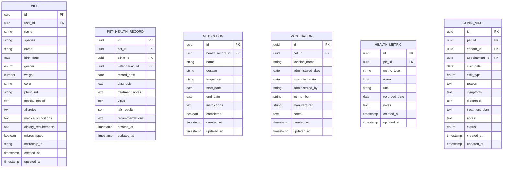

# Pet Services ERD
# ペットサービスERD
# ERD Layanan Hewan Peliharaan

**English**
This document provides a detailed Entity Relationship Diagram (ERD) for the pet-related services within the PetPro platform, including Pet Grooming, Pet Hotel, and Pet Health Tracking.

**日本語**
このドキュメントでは、PetProプラットフォーム内のペット関連サービス（ペットグルーミング、ペットホテル、ペット健康管理など）に関する詳細なエンティティ関連図（ERD）を提供します。

**Bahasa Indonesia**
Dokumen ini menyediakan Diagram Hubungan Entitas (ERD) terperinci untuk layanan terkait hewan peliharaan dalam platform PetPro, termasuk Perawatan Hewan, Hotel Hewan, dan Pelacakan Kesehatan Hewan.

## Level 1: Pet Services Domain Overview


## Level 2: Pet Data Model



## Level 3: Pet Grooming Service Model


## Level 4: Pet Hotel Service Model


## Level 5: Clinic Service Model


## Database Schema for Pet Model

### `pets` Table
```sql
CREATE TABLE pets (
    id UUID PRIMARY KEY DEFAULT gen_random_uuid(),
    user_id UUID NOT NULL,
    name VARCHAR(100) NOT NULL,
    species VARCHAR(50) NOT NULL,
    breed VARCHAR(100),
    birth_date DATE,
    gender VARCHAR(20) CHECK (gender IN ('male', 'female', 'unknown')),
    weight DECIMAL(5, 2),
    color VARCHAR(50),
    photo_url VARCHAR(255),
    special_needs TEXT,
    allergies TEXT,
    medical_conditions TEXT,
    dietary_requirements TEXT,
    microchipped BOOLEAN DEFAULT FALSE,
    microchip_id VARCHAR(100),
    created_at TIMESTAMP WITH TIME ZONE DEFAULT CURRENT_TIMESTAMP,
    updated_at TIMESTAMP WITH TIME ZONE DEFAULT CURRENT_TIMESTAMP,
    
    CONSTRAINT fk_user FOREIGN KEY(user_id) REFERENCES users(id) ON DELETE CASCADE
);

CREATE INDEX idx_pets_user_id ON pets(user_id);
CREATE INDEX idx_pets_species ON pets(species);
CREATE INDEX idx_pets_breed ON pets(breed);
```

### `pet_health_records` Table
```sql
CREATE TABLE pet_health_records (
    id UUID PRIMARY KEY DEFAULT gen_random_uuid(),
    pet_id UUID NOT NULL,
    clinic_id UUID NOT NULL,
    veterinarian_id UUID,
    record_date DATE NOT NULL,
    diagnosis TEXT,
    treatment_notes TEXT,
    vitals JSONB DEFAULT '{}',
    lab_results JSONB DEFAULT '{}',
    recommendations TEXT,
    created_at TIMESTAMP WITH TIME ZONE DEFAULT CURRENT_TIMESTAMP,
    updated_at TIMESTAMP WITH TIME ZONE DEFAULT CURRENT_TIMESTAMP,
    
    CONSTRAINT fk_pet FOREIGN KEY(pet_id) REFERENCES pets(id) ON DELETE CASCADE,
    CONSTRAINT fk_clinic FOREIGN KEY(clinic_id) REFERENCES vendors(id)
);

CREATE INDEX idx_health_records_pet_id ON pet_health_records(pet_id);
CREATE INDEX idx_health_records_clinic_id ON pet_health_records(clinic_id);
CREATE INDEX idx_health_records_record_date ON pet_health_records(record_date);
```

## Database Schema for Pet Grooming Service

### `pet_grooming_services` Table
```sql
CREATE TABLE pet_grooming_services (
    id UUID PRIMARY KEY DEFAULT gen_random_uuid(),
    vendor_id UUID NOT NULL,
    name VARCHAR(100) NOT NULL,
    description TEXT,
    pet_type VARCHAR(50) NOT NULL CHECK (pet_type IN ('dog', 'cat', 'small_animal', 'bird', 'all')),
    suitable_breeds JSONB DEFAULT '[]',
    size_category VARCHAR(20) CHECK (size_category IN ('small', 'medium', 'large', 'all')),
    base_price DECIMAL(10, 2) NOT NULL,
    duration_minutes INTEGER NOT NULL,
    included_items JSONB DEFAULT '[]',
    requires_appointment BOOLEAN DEFAULT TRUE,
    active BOOLEAN DEFAULT TRUE,
    created_at TIMESTAMP WITH TIME ZONE DEFAULT CURRENT_TIMESTAMP,
    updated_at TIMESTAMP WITH TIME ZONE DEFAULT CURRENT_TIMESTAMP,
    
    CONSTRAINT fk_vendor FOREIGN KEY(vendor_id) REFERENCES vendors(id) ON DELETE CASCADE
);

CREATE INDEX idx_grooming_services_vendor_id ON pet_grooming_services(vendor_id);
CREATE INDEX idx_grooming_services_pet_type ON pet_grooming_services(pet_type);
CREATE INDEX idx_grooming_services_active ON pet_grooming_services(active);
```

### `pet_grooming_appointments` Table
```sql
CREATE TABLE pet_grooming_appointments (
    id UUID PRIMARY KEY DEFAULT gen_random_uuid(),
    pet_id UUID NOT NULL,
    vendor_id UUID NOT NULL,
    service_id UUID NOT NULL,
    groomer_id UUID,
    appointment_time TIMESTAMP WITH TIME ZONE NOT NULL,
    duration_minutes INTEGER NOT NULL,
    special_instructions TEXT,
    total_price DECIMAL(10, 2) NOT NULL,
    status VARCHAR(20) NOT NULL DEFAULT 'booked' CHECK (status IN ('booked', 'confirmed', 'in_progress', 'completed', 'cancelled', 'no_show')),
    cancellation_reason TEXT,
    created_at TIMESTAMP WITH TIME ZONE DEFAULT CURRENT_TIMESTAMP,
    updated_at TIMESTAMP WITH TIME ZONE DEFAULT CURRENT_TIMESTAMP,
    
    CONSTRAINT fk_pet FOREIGN KEY(pet_id) REFERENCES pets(id) ON DELETE CASCADE,
    CONSTRAINT fk_vendor FOREIGN KEY(vendor_id) REFERENCES vendors(id) ON DELETE CASCADE,
    CONSTRAINT fk_service FOREIGN KEY(service_id) REFERENCES pet_grooming_services(id)
);

CREATE INDEX idx_grooming_appointments_pet_id ON pet_grooming_appointments(pet_id);
CREATE INDEX idx_grooming_appointments_vendor_id ON pet_grooming_appointments(vendor_id);
CREATE INDEX idx_grooming_appointments_appointment_time ON pet_grooming_appointments(appointment_time);
CREATE INDEX idx_grooming_appointments_status ON pet_grooming_appointments(status);
```

## Database Schema for Pet Hotel Service

### `pet_hotel_rooms` Table
```sql
CREATE TABLE pet_hotel_rooms (
    id UUID PRIMARY KEY DEFAULT gen_random_uuid(),
    vendor_id UUID NOT NULL,
    room_number VARCHAR(20) NOT NULL,
    name VARCHAR(100) NOT NULL,
    room_type VARCHAR(50) NOT NULL CHECK (room_type IN ('standard', 'deluxe', 'suite', 'private')),
    pet_size VARCHAR(20) CHECK (pet_size IN ('small', 'medium', 'large', 'all')),
    pet_type VARCHAR(50) NOT NULL CHECK (pet_type IN ('dog', 'cat', 'small_animal', 'all')),
    capacity INTEGER NOT NULL DEFAULT 1,
    base_price_per_night DECIMAL(10, 2) NOT NULL,
    description TEXT,
    amenities JSONB DEFAULT '[]',
    photos JSONB DEFAULT '[]',
    active BOOLEAN DEFAULT TRUE,
    created_at TIMESTAMP WITH TIME ZONE DEFAULT CURRENT_TIMESTAMP,
    updated_at TIMESTAMP WITH TIME ZONE DEFAULT CURRENT_TIMESTAMP,
    
    CONSTRAINT fk_vendor FOREIGN KEY(vendor_id) REFERENCES vendors(id) ON DELETE CASCADE,
    CONSTRAINT unique_room_number_per_vendor UNIQUE(vendor_id, room_number)
);

CREATE INDEX idx_hotel_rooms_vendor_id ON pet_hotel_rooms(vendor_id);
CREATE INDEX idx_hotel_rooms_room_type ON pet_hotel_rooms(room_type);
CREATE INDEX idx_hotel_rooms_pet_type ON pet_hotel_rooms(pet_type);
CREATE INDEX idx_hotel_rooms_active ON pet_hotel_rooms(active);
```

### `pet_hotel_bookings` Table
```sql
CREATE TABLE pet_hotel_bookings (
    id UUID PRIMARY KEY DEFAULT gen_random_uuid(),
    pet_id UUID NOT NULL,
    room_id UUID NOT NULL,
    vendor_id UUID NOT NULL,
    check_in_date DATE NOT NULL,
    check_out_date DATE NOT NULL,
    expected_check_in_time TIME,
    expected_check_out_time TIME,
    nights_count INTEGER NOT NULL,
    total_price DECIMAL(10, 2) NOT NULL,
    status VARCHAR(20) NOT NULL DEFAULT 'booked' CHECK (status IN ('booked', 'checked_in', 'checked_out', 'cancelled', 'no_show')),
    special_instructions TEXT,
    pet_items JSONB DEFAULT '{}',
    feeding_schedule JSONB DEFAULT '[]',
    medication_schedule JSONB DEFAULT '[]',
    cancellation_reason TEXT,
    created_at TIMESTAMP WITH TIME ZONE DEFAULT CURRENT_TIMESTAMP,
    updated_at TIMESTAMP WITH TIME ZONE DEFAULT CURRENT_TIMESTAMP,
    
    CONSTRAINT fk_pet FOREIGN KEY(pet_id) REFERENCES pets(id) ON DELETE CASCADE,
    CONSTRAINT fk_room FOREIGN KEY(room_id) REFERENCES pet_hotel_rooms(id),
    CONSTRAINT fk_vendor FOREIGN KEY(vendor_id) REFERENCES vendors(id) ON DELETE CASCADE
);

CREATE INDEX idx_hotel_bookings_pet_id ON pet_hotel_bookings(pet_id);
CREATE INDEX idx_hotel_bookings_vendor_id ON pet_hotel_bookings(vendor_id);
CREATE INDEX idx_hotel_bookings_check_in_date ON pet_hotel_bookings(check_in_date);
CREATE INDEX idx_hotel_bookings_check_out_date ON pet_hotel_bookings(check_out_date);
CREATE INDEX idx_hotel_bookings_status ON pet_hotel_bookings(status);
```

## API Endpoints for Pet Services

### Pet Management API

| Method | Endpoint | Description | 説明 | Deskripsi |
|--------|----------|-------------|-----|-----------|
| GET | `/api/users/:userId/pets` | Get all pets for a user | ユーザーのすべてのペットを取得 | Dapatkan semua hewan peliharaan untuk pengguna |
| GET | `/api/pets/:id` | Get pet details | ペット詳細を取得 | Dapatkan detail hewan peliharaan |
| POST | `/api/users/:userId/pets` | Add new pet | 新しいペットを追加 | Tambah hewan peliharaan baru |
| PUT | `/api/pets/:id` | Update pet details | ペット詳細を更新 | Perbarui detail hewan peliharaan |
| DELETE | `/api/pets/:id` | Remove pet | ペットを削除 | Hapus hewan peliharaan |
| GET | `/api/pets/:id/health-records` | Get pet health history | ペット健康履歴を取得 | Dapatkan riwayat kesehatan hewan |
| POST | `/api/pets/:id/health-records` | Add health record | 健康記録を追加 | Tambah catatan kesehatan |
| GET | `/api/pets/:id/vaccinations` | Get pet vaccinations | ペットのワクチン接種履歴を取得 | Dapatkan vaksinasi hewan |
| POST | `/api/pets/:id/vaccinations` | Add vaccination record | ワクチン接種記録を追加 | Tambah catatan vaksinasi |

### Pet Grooming API

| Method | Endpoint | Description | 説明 | Deskripsi |
|--------|----------|-------------|-----|-----------|
| GET | `/api/vendors/:vendorId/grooming-services` | List vendor's grooming services | ベンダーのグルーミングサービス一覧 | Daftar layanan perawatan vendor |
| POST | `/api/vendors/:vendorId/grooming-services` | Add grooming service | グルーミングサービスを追加 | Tambah layanan perawatan |
| GET | `/api/grooming-services/:id` | Get grooming service details | グルーミングサービスの詳細を取得 | Dapatkan detail layanan perawatan |
| PUT | `/api/grooming-services/:id` | Update grooming service | グルーミングサービスを更新 | Perbarui layanan perawatan |
| DELETE | `/api/grooming-services/:id` | Delete grooming service | グルーミングサービスを削除 | Hapus layanan perawatan |
| GET | `/api/vendors/:vendorId/grooming-appointments` | List vendor's grooming appointments | ベンダーのグルーミング予約一覧 | Daftar janji perawatan vendor |
| POST | `/api/grooming-appointments` | Book grooming appointment | グルーミング予約を作成 | Buat janji perawatan |
| PUT | `/api/grooming-appointments/:id` | Update grooming appointment | グルーミング予約を更新 | Perbarui janji perawatan |
| GET | `/api/users/:userId/grooming-appointments` | Get user's grooming appointments | ユーザーのグルーミング予約を取得 | Dapatkan janji perawatan pengguna |

### Pet Hotel API

| Method | Endpoint | Description | 説明 | Deskripsi |
|--------|----------|-------------|-----|-----------|
| GET | `/api/vendors/:vendorId/hotel-rooms` | List vendor's hotel rooms | ベンダーのホテル部屋一覧 | Daftar kamar hotel vendor |
| POST | `/api/vendors/:vendorId/hotel-rooms` | Add hotel room | ホテル部屋を追加 | Tambah kamar hotel |
| GET | `/api/hotel-rooms/:id` | Get hotel room details | ホテル部屋の詳細を取得 | Dapatkan detail kamar hotel |
| PUT | `/api/hotel-rooms/:id` | Update hotel room | ホテル部屋を更新 | Perbarui kamar hotel |
| DELETE | `/api/hotel-rooms/:id` | Delete hotel room | ホテル部屋を削除 | Hapus kamar hotel |
| GET | `/api/vendors/:vendorId/hotel-bookings` | List vendor's hotel bookings | ベンダーのホテル予約一覧 | Daftar pemesanan hotel vendor |
| POST | `/api/hotel-bookings` | Book hotel stay | ホテル滞在を予約 | Pesan penginapan hotel |
| PUT | `/api/hotel-bookings/:id` | Update hotel booking | ホテル予約を更新 | Perbarui pemesanan hotel |
| GET | `/api/users/:userId/hotel-bookings` | Get user's hotel bookings | ユーザーのホテル予約を取得 | Dapatkan pemesanan hotel pengguna |
| POST | `/api/hotel-bookings/:id/daily-reports` | Add daily report for pet | ペットの日報を追加 | Tambah laporan harian untuk hewan |

### Clinic Services API

| Method | Endpoint | Description | 説明 | Deskripsi |
|--------|----------|-------------|-----|-----------|
| GET | `/api/vendors/:vendorId/clinic-services` | List vendor's clinic services | ベンダーのクリニックサービス一覧 | Daftar layanan klinik vendor |
| POST | `/api/vendors/:vendorId/clinic-services` | Add clinic service | クリニックサービスを追加 | Tambah layanan klinik |
| GET | `/api/clinic-services/:id` | Get clinic service details | クリニックサービスの詳細を取得 | Dapatkan detail layanan klinik |
| PUT | `/api/clinic-services/:id` | Update clinic service | クリニックサービスを更新 | Perbarui layanan klinik |
| DELETE | `/api/clinic-services/:id` | Delete clinic service | クリニックサービスを削除 | Hapus layanan klinik |
| GET | `/api/vendors/:vendorId/clinic-appointments` | List vendor's clinic appointments | ベンダーのクリニック予約一覧 | Daftar janji klinik vendor |
| POST | `/api/clinic-appointments` | Book clinic appointment | クリニック予約を作成 | Buat janji klinik |
| PUT | `/api/clinic-appointments/:id` | Update clinic appointment | クリニック予約を更新 | Perbarui janji klinik |
| GET | `/api/users/:userId/clinic-appointments` | Get user's clinic appointments | ユーザーのクリニック予約を取得 | Dapatkan janji klinik pengguna |
| GET | `/api/pets/:petId/clinic-visits` | Get pet clinic visit history | ペットのクリニック訪問履歴を取得 | Dapatkan riwayat kunjungan klinik hewan |

## Pet Health Tracking Mobile App Features

**English**
- Dashboard with health overview
- Vaccination record and reminders
- Weight and growth tracking
- Medication schedule and reminders
- Symptom tracking and health journal
- Veterinary appointment management
- Historical health records
- Diet tracking and recommendations
- Exercise and activity monitoring

**日本語**
- 健康状態の概要ダッシュボード
- ワクチン接種記録とリマインダー
- 体重と成長の追跡
- 投薬スケジュールとリマインダー
- 症状の追跡と健康ジャーナル
- 獣医の予約管理
- 過去の健康記録
- 食事の追跡と推奨
- 運動と活動のモニタリング

**Bahasa Indonesia**
- Dasbor dengan gambaran kesehatan
- Catatan vaksinasi dan pengingat
- Pelacakan berat dan pertumbuhan
- Jadwal pengobatan dan pengingat
- Pelacakan gejala dan jurnal kesehatan
- Pengelolaan janji dokter hewan
- Catatan kesehatan historis
- Pelacakan diet dan rekomendasi
- Pemantauan latihan dan aktivitas
