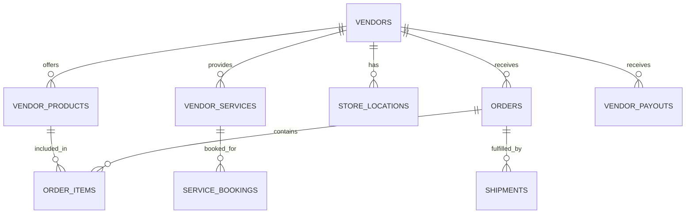
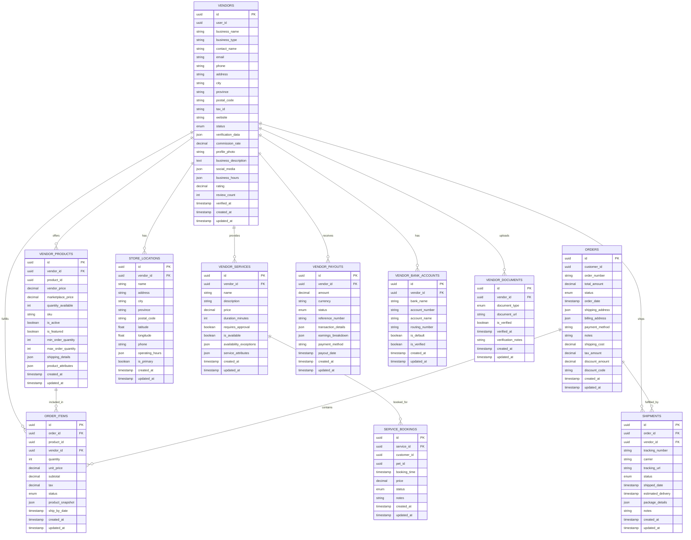

# Vendor Service Entity Relationship Diagram
# ベンダーサービスエンティティ関連図

**English**
This document provides a detailed Entity Relationship Diagram (ERD) for the Vendor microservice within the PetPro platform, covering domain-specific data models and service boundaries.

**日本語**
このドキュメントでは、PetProプラットフォーム内のベンダーマイクロサービスの詳細なエンティティ関連図（ERD）を提供し、ドメイン固有のデータモデルとサービス境界をカバーしています。

## Level 1: Vendor Service Domain Overview



## Level 2: Vendor Service Detailed Data Model



## Level 3: Vendor Service Database Schema

### `vendors` Table
```sql
CREATE TABLE vendors (
    id UUID PRIMARY KEY DEFAULT gen_random_uuid(),
    user_id UUID NOT NULL,
    business_name VARCHAR(255) NOT NULL,
    business_type VARCHAR(100) NOT NULL,
    contact_name VARCHAR(255) NOT NULL,
    email VARCHAR(255) NOT NULL,
    phone VARCHAR(20) NOT NULL,
    address TEXT NOT NULL,
    city VARCHAR(100) NOT NULL,
    province VARCHAR(100) NOT NULL,
    postal_code VARCHAR(20) NOT NULL,
    tax_id VARCHAR(50),
    website VARCHAR(255),
    status VARCHAR(20) NOT NULL DEFAULT 'pending' CHECK (status IN ('pending', 'approved', 'rejected', 'suspended')),
    verification_data JSONB DEFAULT '{}',
    commission_rate DECIMAL(5,2) DEFAULT 10.00,
    profile_photo VARCHAR(255),
    business_description TEXT,
    social_media JSONB DEFAULT '{}',
    business_hours JSONB DEFAULT '{}',
    rating DECIMAL(3,2),
    review_count INTEGER DEFAULT 0,
    verified_at TIMESTAMP WITH TIME ZONE,
    created_at TIMESTAMP WITH TIME ZONE DEFAULT CURRENT_TIMESTAMP,
    updated_at TIMESTAMP WITH TIME ZONE DEFAULT CURRENT_TIMESTAMP,
    
    CONSTRAINT email_format CHECK (email ~* '^[A-Za-z0-9._%-]+@[A-Za-z0-9.-]+[.][A-Za-z]+$')
);

CREATE INDEX idx_vendors_user_id ON vendors(user_id);
CREATE INDEX idx_vendors_status ON vendors(status);
CREATE INDEX idx_vendors_location ON vendors(city, province);
CREATE INDEX idx_vendors_business_name ON vendors(business_name);
CREATE INDEX idx_vendors_rating ON vendors(rating DESC);
```

### `vendor_products` Table
```sql
CREATE TABLE vendor_products (
    id UUID PRIMARY KEY DEFAULT gen_random_uuid(),
    vendor_id UUID NOT NULL,
    product_id UUID NOT NULL,
    vendor_price DECIMAL(12,2) NOT NULL,
    marketplace_price DECIMAL(12,2) NOT NULL,
    quantity_available INTEGER NOT NULL DEFAULT 0,
    sku VARCHAR(100),
    is_active BOOLEAN DEFAULT TRUE,
    is_featured BOOLEAN DEFAULT FALSE,
    min_order_quantity INTEGER DEFAULT 1,
    max_order_quantity INTEGER,
    shipping_details JSONB DEFAULT '{}',
    product_attributes JSONB DEFAULT '{}',
    created_at TIMESTAMP WITH TIME ZONE DEFAULT CURRENT_TIMESTAMP,
    updated_at TIMESTAMP WITH TIME ZONE DEFAULT CURRENT_TIMESTAMP,
    
    CONSTRAINT fk_vendor FOREIGN KEY(vendor_id) REFERENCES vendors(id) ON DELETE CASCADE,
    CONSTRAINT valid_price CHECK (vendor_price > 0 AND marketplace_price > 0),
    CONSTRAINT valid_quantity CHECK (quantity_available >= 0),
    CONSTRAINT valid_order_quantity CHECK (min_order_quantity > 0 AND (max_order_quantity IS NULL OR max_order_quantity >= min_order_quantity))
);

CREATE INDEX idx_vendor_products_vendor ON vendor_products(vendor_id);
CREATE INDEX idx_vendor_products_product ON vendor_products(product_id);
CREATE INDEX idx_vendor_products_active ON vendor_products(is_active);
CREATE INDEX idx_vendor_products_price ON vendor_products(marketplace_price);
```

### `orders` Table
```sql
CREATE TABLE orders (
    id UUID PRIMARY KEY DEFAULT gen_random_uuid(),
    customer_id UUID NOT NULL,
    order_number VARCHAR(20) NOT NULL UNIQUE,
    total_amount DECIMAL(12,2) NOT NULL,
    status VARCHAR(20) NOT NULL DEFAULT 'pending' CHECK (status IN ('pending', 'processing', 'shipped', 'delivered', 'cancelled', 'refunded')),
    order_date TIMESTAMP WITH TIME ZONE DEFAULT CURRENT_TIMESTAMP,
    shipping_address JSONB NOT NULL,
    billing_address JSONB NOT NULL,
    payment_method VARCHAR(50) NOT NULL,
    notes TEXT,
    shipping_cost DECIMAL(12,2) DEFAULT 0,
    tax_amount DECIMAL(12,2) DEFAULT 0,
    discount_amount DECIMAL(12,2) DEFAULT 0,
    discount_code VARCHAR(50),
    created_at TIMESTAMP WITH TIME ZONE DEFAULT CURRENT_TIMESTAMP,
    updated_at TIMESTAMP WITH TIME ZONE DEFAULT CURRENT_TIMESTAMP,
    
    CONSTRAINT valid_amount CHECK (total_amount >= 0),
    CONSTRAINT valid_shipping CHECK (shipping_cost >= 0),
    CONSTRAINT valid_tax CHECK (tax_amount >= 0),
    CONSTRAINT valid_discount CHECK (discount_amount >= 0)
);

CREATE INDEX idx_orders_customer ON orders(customer_id);
CREATE INDEX idx_orders_number ON orders(order_number);
CREATE INDEX idx_orders_status ON orders(status);
CREATE INDEX idx_orders_date ON orders(order_date);
```

### `order_items` Table
```sql
CREATE TABLE order_items (
    id UUID PRIMARY KEY DEFAULT gen_random_uuid(),
    order_id UUID NOT NULL,
    product_id UUID NOT NULL,
    vendor_id UUID NOT NULL,
    quantity INTEGER NOT NULL,
    unit_price DECIMAL(12,2) NOT NULL,
    subtotal DECIMAL(12,2) NOT NULL,
    tax DECIMAL(12,2) DEFAULT 0,
    status VARCHAR(20) DEFAULT 'pending' CHECK (status IN ('pending', 'processing', 'shipped', 'delivered', 'cancelled', 'refunded')),
    product_snapshot JSONB NOT NULL,
    ship_by_date TIMESTAMP WITH TIME ZONE,
    created_at TIMESTAMP WITH TIME ZONE DEFAULT CURRENT_TIMESTAMP,
    updated_at TIMESTAMP WITH TIME ZONE DEFAULT CURRENT_TIMESTAMP,
    
    CONSTRAINT fk_order FOREIGN KEY(order_id) REFERENCES orders(id) ON DELETE CASCADE,
    CONSTRAINT fk_vendor FOREIGN KEY(vendor_id) REFERENCES vendors(id) ON DELETE RESTRICT,
    CONSTRAINT valid_quantity CHECK (quantity > 0),
    CONSTRAINT valid_price CHECK (unit_price >= 0),
    CONSTRAINT valid_subtotal CHECK (subtotal = quantity * unit_price),
    CONSTRAINT valid_tax CHECK (tax >= 0)
);

CREATE INDEX idx_order_items_order ON order_items(order_id);
CREATE INDEX idx_order_items_vendor ON order_items(vendor_id);
CREATE INDEX idx_order_items_product ON order_items(product_id);
CREATE INDEX idx_order_items_status ON order_items(status);
```

### `shipments` Table
```sql
CREATE TABLE shipments (
    id UUID PRIMARY KEY DEFAULT gen_random_uuid(),
    order_id UUID NOT NULL,
    vendor_id UUID NOT NULL,
    tracking_number VARCHAR(100),
    carrier VARCHAR(100),
    tracking_url VARCHAR(255),
    status VARCHAR(20) DEFAULT 'pending' CHECK (status IN ('pending', 'processing', 'shipped', 'delivered', 'failed')),
    shipped_date TIMESTAMP WITH TIME ZONE,
    estimated_delivery TIMESTAMP WITH TIME ZONE,
    package_details JSONB DEFAULT '{}',
    notes TEXT,
    created_at TIMESTAMP WITH TIME ZONE DEFAULT CURRENT_TIMESTAMP,
    updated_at TIMESTAMP WITH TIME ZONE DEFAULT CURRENT_TIMESTAMP,
    
    CONSTRAINT fk_order FOREIGN KEY(order_id) REFERENCES orders(id) ON DELETE CASCADE,
    CONSTRAINT fk_vendor FOREIGN KEY(vendor_id) REFERENCES vendors(id) ON DELETE RESTRICT
);

CREATE INDEX idx_shipments_order ON shipments(order_id);
CREATE INDEX idx_shipments_vendor ON shipments(vendor_id);
CREATE INDEX idx_shipments_tracking ON shipments(tracking_number);
CREATE INDEX idx_shipments_status ON shipments(status);
```

### `vendor_payouts` Table
```sql
CREATE TABLE vendor_payouts (
    id UUID PRIMARY KEY DEFAULT gen_random_uuid(),
    vendor_id UUID NOT NULL,
    amount DECIMAL(12,2) NOT NULL,
    currency VARCHAR(3) DEFAULT 'IDR',
    status VARCHAR(20) DEFAULT 'pending' CHECK (status IN ('pending', 'processing', 'completed', 'failed')),
    reference_number VARCHAR(100),
    transaction_details JSONB DEFAULT '{}',
    earnings_breakdown JSONB DEFAULT '{}',
    payment_method VARCHAR(50) NOT NULL,
    payout_date TIMESTAMP WITH TIME ZONE,
    created_at TIMESTAMP WITH TIME ZONE DEFAULT CURRENT_TIMESTAMP,
    updated_at TIMESTAMP WITH TIME ZONE DEFAULT CURRENT_TIMESTAMP,
    
    CONSTRAINT fk_vendor FOREIGN KEY(vendor_id) REFERENCES vendors(id) ON DELETE CASCADE,
    CONSTRAINT valid_amount CHECK (amount > 0)
);

CREATE INDEX idx_vendor_payouts_vendor ON vendor_payouts(vendor_id);
CREATE INDEX idx_vendor_payouts_status ON vendor_payouts(status);
CREATE INDEX idx_vendor_payouts_date ON vendor_payouts(payout_date);
```

## Event-Based Integration

The Vendor Service produces and consumes events to maintain data consistency with other services:

### Published Events

1. **VendorCreated**
   ```json
   {
     "event_type": "vendor.created",
     "vendor_id": "uuid",
     "user_id": "uuid",
     "business_name": "string",
     "status": "string",
     "created_at": "timestamp"
   }
   ```

2. **VendorStatusChanged**
   ```json
   {
     "event_type": "vendor.status_changed",
     "vendor_id": "uuid",
     "previous_status": "string",
     "new_status": "string",
     "changed_at": "timestamp"
   }
   ```

3. **ProductInventoryChanged**
   ```json
   {
     "event_type": "vendor.inventory_changed",
     "vendor_id": "uuid",
     "product_id": "uuid",
     "previous_quantity": "integer",
     "new_quantity": "integer",
     "changed_at": "timestamp"
   }
   ```

4. **OrderStatusChanged**
   ```json
   {
     "event_type": "vendor.order_status_changed",
     "order_id": "uuid",
     "vendor_id": "uuid",
     "order_item_id": "uuid",
     "product_id": "uuid",
     "previous_status": "string",
     "new_status": "string",
     "changed_at": "timestamp"
   }
   ```

### Consumed Events

1. **UserUpdated**
   ```json
   {
     "event_type": "user.updated",
     "user_id": "uuid",
     "email": "string",
     "full_name": "string",
     "phone_number": "string",
     "updated_at": "timestamp"
   }
   ```

2. **ProductUpdated**
   ```json
   {
     "event_type": "product.updated",
     "product_id": "uuid",
     "name": "string",
     "description": "string",
     "category_id": "uuid",
     "images": "json",
     "updated_at": "timestamp"
   }
   ```

3. **PaymentCompleted**
   ```json
   {
     "event_type": "payment.completed",
     "payment_id": "uuid",
     "order_id": "uuid",
     "amount": "decimal",
     "payment_method": "string",
     "completed_at": "timestamp"
   }
   ```
