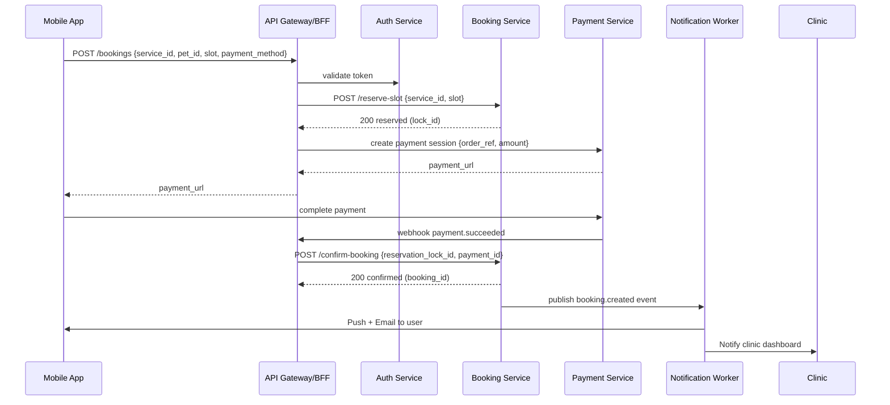
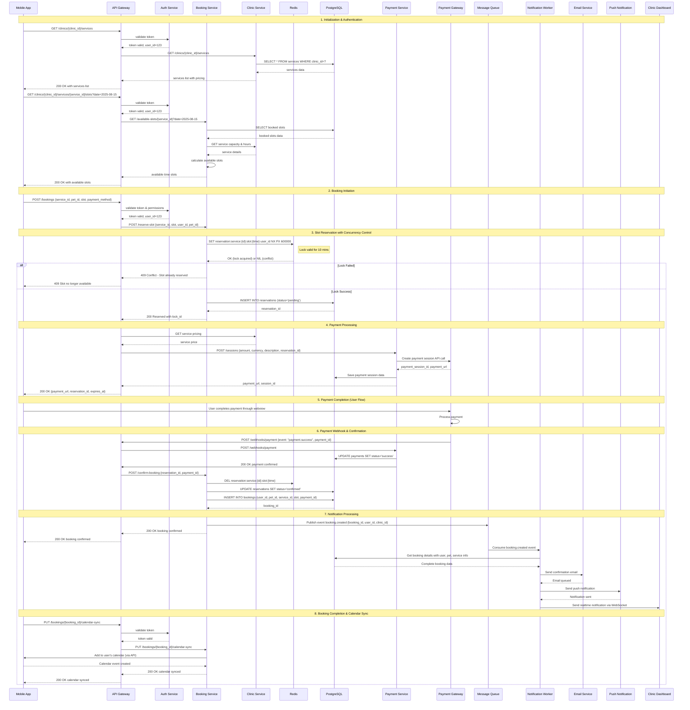
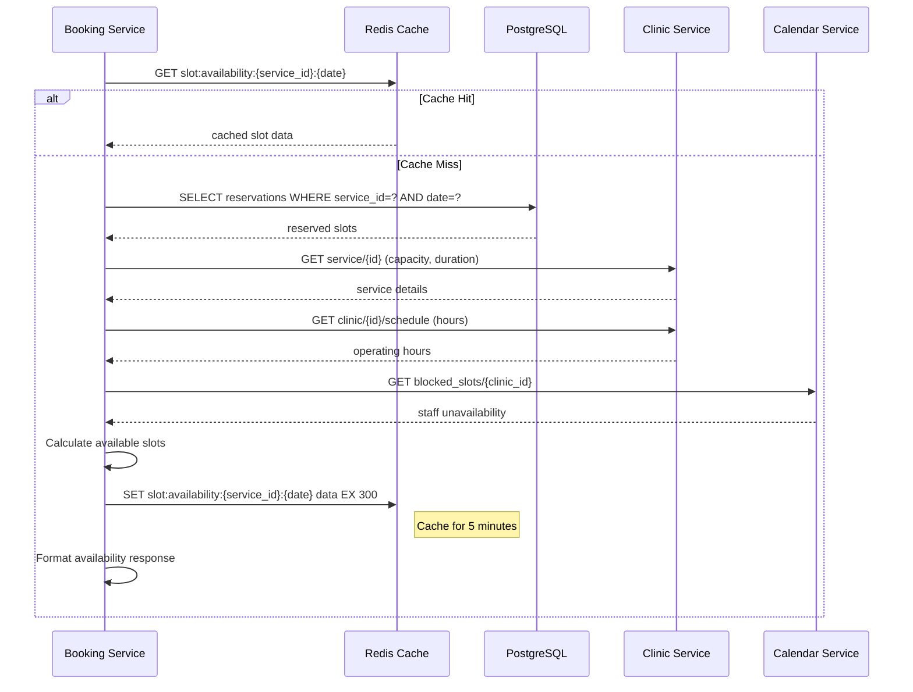
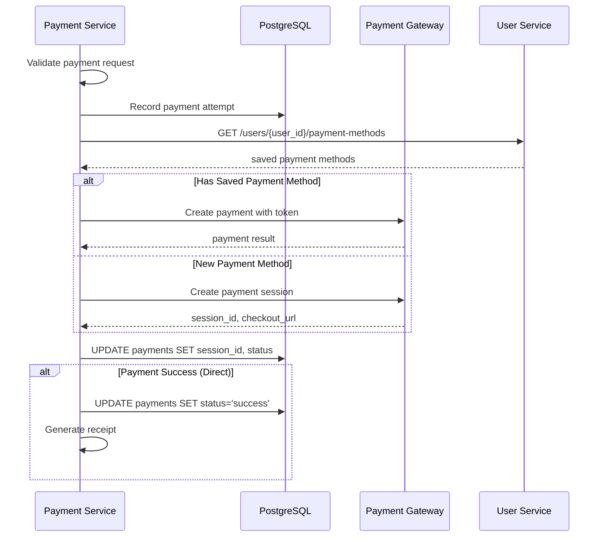
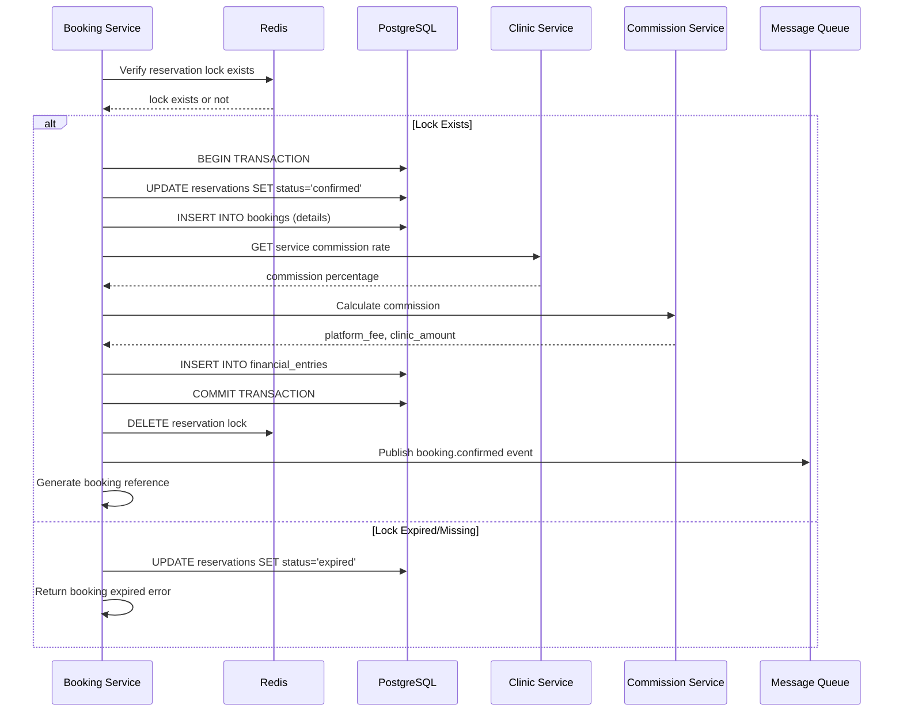
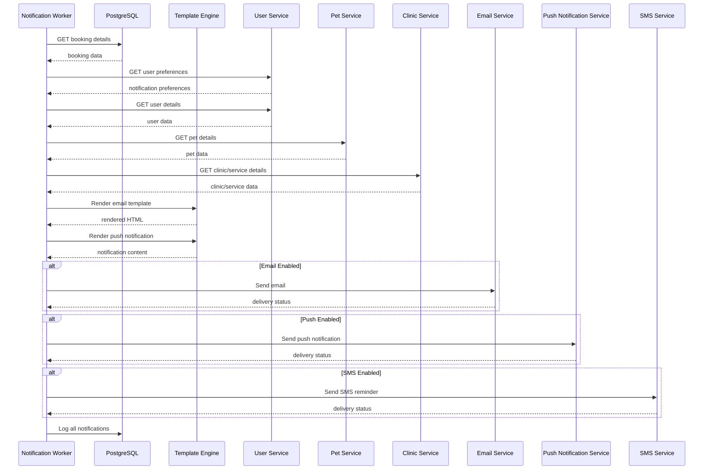
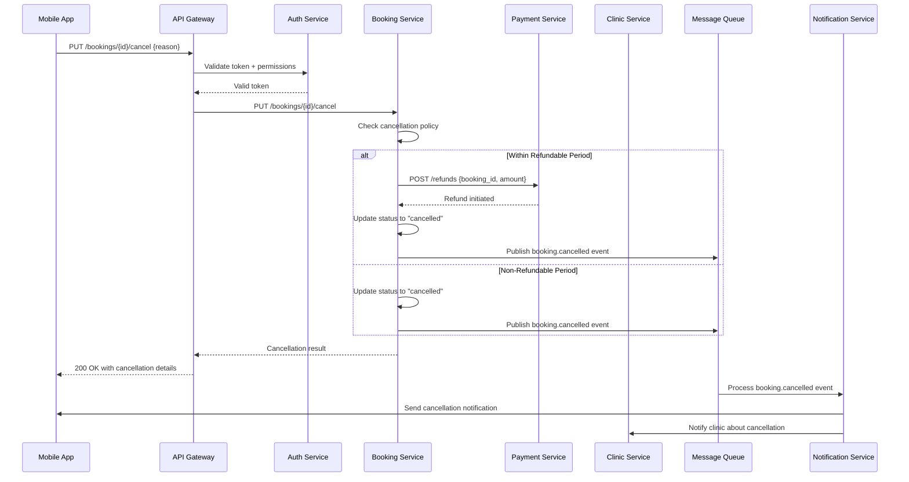
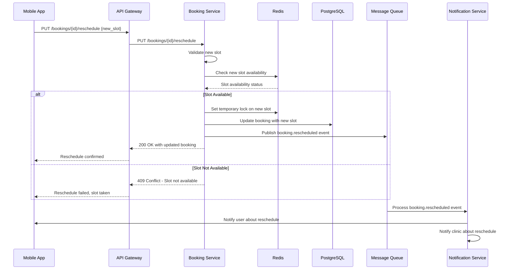

# Detailed Sequence Diagram: Booking Flow
# 詳細シーケンス図：予約フロー

**English**

This document contains detailed sequence diagrams for the Booking feature on the PetPro platform, focusing on level 2 and 3 interactions between system components.

**日本語**

この文書は、PetProプラットフォームの予約機能に関する詳細なシーケンス図を含み、システムコンポーネント間のレベル2および2の相互作用に焦点を当てています。

## Level 1: Overview Booking Flow
## レベル1: 予約フロー概要



## Level 2: Detailed Booking Flow
## レベル2: 詳細予約フロー

**English**
The following diagram shows more detailed level 2 interactions for the booking process:

**日本語**
以下の図は、予約プロセスにおけるより詳細なレベル2の相互作用を示しています：



## Level 3: Component-Level Booking Interactions
## レベル3: コンポーネントレベルの予約相互作用

**English**
The following are more detailed level 3 sequence diagrams for key subprocesses in the booking flow:

**日本語**
以下は、予約フローにおける主要なサブプロセスのより詳細なレベル3シーケンス図です：

### L3: Slot Availability Calculation
### L3: スロット空き状況計算



### L3: Payment Processing
### L3: 決済処理



### L3: Booking Confirmation Process
### L3: 予約確認プロセス



### L3: Notification Handling for Booking
### L3: 予約通知の処理



## Detailed Components for Booking Implementation
## 予約実装のための詳細コンポーネント

### Domain Models
### ドメインモデル

#### Reservation Model
#### 予約モデル
```json
{
  "id": "uuid",
  "user_id": "uuid",
  "pet_id": "uuid", 
  "clinic_id": "uuid",
  "service_id": "uuid",
  "slot_date": "2025-08-15",
  "slot_time": "14:30:00",
  "slot_duration": 30,
  "status": "pending|confirmed|cancelled|expired",
  "lock_id": "string",
  "lock_expiry": "ISO timestamp",
  "created_at": "ISO timestamp",
  "updated_at": "ISO timestamp"
}
```

#### Booking Model
#### 予約モデル
```json
{
  "id": "uuid",
  "reference_code": "BP12345678",
  "reservation_id": "uuid",
  "user_id": "uuid",
  "pet_id": "uuid",
  "clinic_id": "uuid",
  "service_id": "uuid",
  "payment_id": "uuid",
  "slot_date": "2025-08-15",
  "slot_time": "14:30:00",
  "duration_minutes": 30,
  "amount": 250000,
  "currency": "IDR",
  "status": "confirmed|in-progress|completed|cancelled|no-show",
  "cancellation_reason": "string|null",
  "notes": "string|null",
  "created_at": "ISO timestamp",
  "updated_at": "ISO timestamp"
}
```

### API Endpoints Detail

#### Booking Service APIs
#### 予約サービスAPI

**English**
| Endpoint | Method | Description | Request Body | Response |

**日本語**
| エンドポイント | メソッド | 説明 | リクエストボディ | レスポンス |
|----------|--------|-------------|-------------|----------|
| `/services/{service_id}/slots` | GET | Get available slots | `date: YYYY-MM-DD` | `{ "slots": [ { "time": "09:00", "available": true }, ... ] }` |
| `/reservations` | POST | Reserve a slot | `{ "service_id": "uuid", "pet_id": "uuid", "date": "YYYY-MM-DD", "time": "HH:MM" }` | `{ "reservation_id": "uuid", "lock_id": "string", "expires_at": "timestamp" }` |
| `/reservations/{id}` | GET | Get reservation | - | Reservation object |
| `/reservations/{id}/extend` | PUT | Extend reservation lock | - | `{ "expires_at": "timestamp" }` |
| `/reservations/{id}/confirm` | PUT | Confirm reservation | `{ "payment_id": "uuid" }` | `{ "booking_id": "uuid", "reference": "BP12345678" }` |
| `/reservations/{id}/cancel` | PUT | Cancel reservation | `{ "reason": "string" }` | `{ "success": true }` |
| `/bookings/{id}` | GET | Get booking details | - | Booking object with relations |
| `/bookings/{id}/reschedule` | PUT | Reschedule booking | `{ "date": "YYYY-MM-DD", "time": "HH:MM" }` | Updated booking |
| `/bookings/{id}/cancel` | PUT | Cancel booking | `{ "reason": "string", "refund_requested": true }` | Cancellation result with refund info |

### Error Handling
### エラー処理

#### Reservation Errors
#### 予約エラー
**English**
1. **Slot Not Available**: 409 Conflict - Slot already booked or reserved
2. **Reservation Expired**: 410 Gone - Reservation lock has expired
3. **Invalid Slot**: 400 Bad Request - Time slot is invalid or outside clinic hours
4. **Service Unavailable**: 400 Bad Request - Service not available on selected date

**日本語**
1. **スロット利用不可**: 409 Conflict - スロットはすでに予約済みまたは確保済み
2. **予約期限切れ**: 410 Gone - 予約ロックの有効期限が切れています
3. **無効なスロット**: 400 Bad Request - 時間枠が無効であるか、クリニックの営業時間外です
4. **サービス利用不可**: 400 Bad Request - 選択された日付にサービスが利用できません

#### Payment Errors
#### 決済エラー
**English**
1. **Payment Failed**: 400 Bad Request - Payment failed to process
2. **Payment Timeout**: 408 Request Timeout - Payment session expired
3. **Invalid Payment Method**: 400 Bad Request - Payment method not supported

**日本語**
1. **決済失敗**: 400 Bad Request - 決済の処理に失敗しました
2. **決済タイムアウト**: 408 Request Timeout - 決済セッションの有効期限が切れました
3. **無効な決済方法**: 400 Bad Request - サポートされていない決済方法です

#### Business Rules
#### ビジネスルール

**English**
1. **Reservation Lock**: 
   - Locks slot for 10 minutes
   - Can extend lock once for additional 5 minutes
   - Automatically expires if not confirmed

2. **Cancellation Policy**:
   - Within 24 hours: No refund
   - 24-48 hours: 50% refund
   - >48 hours: 100% refund
   - Clinic can override with custom policy

3. **Double Booking Prevention**:
   - Distributed lock mechanism via Redis
   - Two-phase commit for booking confirmation
   - Monitoring for lock leakage and expiry

**日本語**
1. **予約ロック**:
   - スロットを10分間ロックします
   - 1回限り、さらに5分間ロックを延長可能
   - 確認されない場合は自動的に期限切れになります

2. **キャンセルポリシー**:
   - 24時間以内：返金なし
   - 24〜48時間：50％返金
   - 48時間以上：100％返金
   - クリニックはカスタムポリシーで上書き可能

3. **二重予約防止**:
   - Redisによる分散ロックメカニズム
   - 予約確認のための二段階コミット
   - ロックの漏洩と期限切れの監視

## Exception Flows
## 例外フロー

### Booking Cancellation
### 予約キャンセル



### Booking Rescheduling
### 予約の再スケジュール


