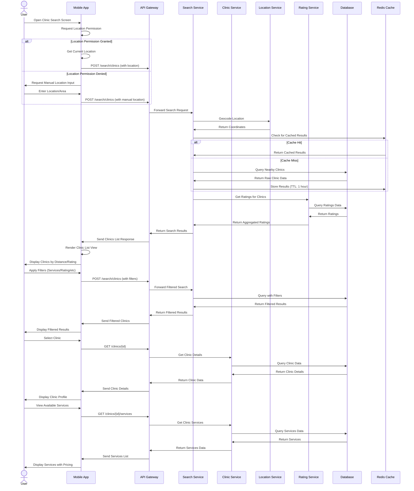
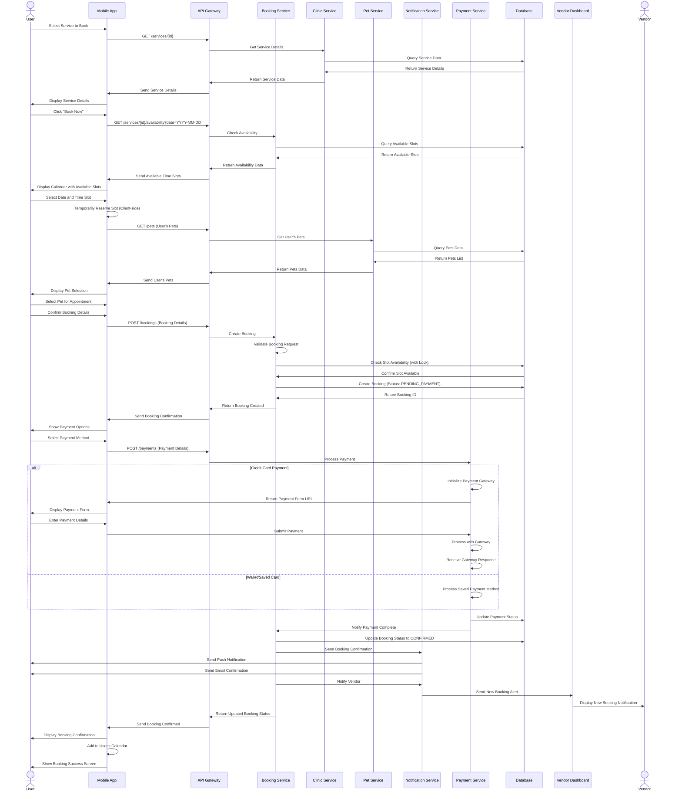
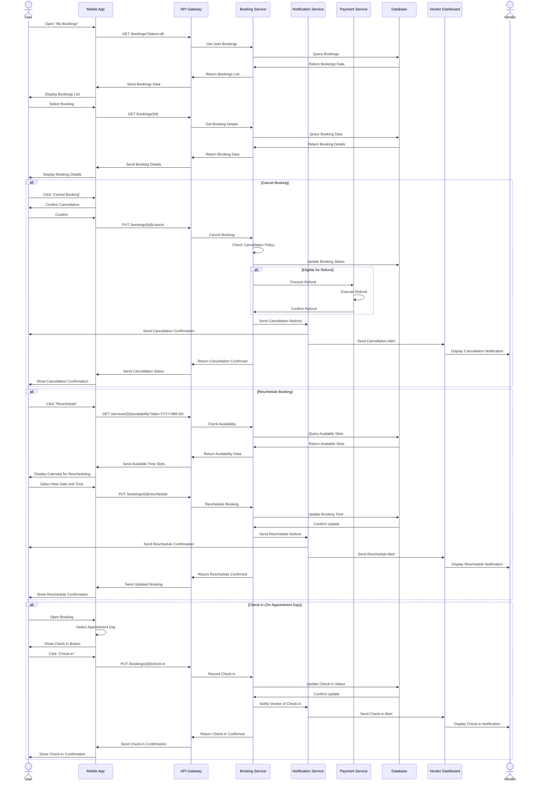

# Clinic Search & Booking Flow - Detailed Sequence Diagram (Level 2)

## Overview
This document provides a detailed Level 2 sequence diagram for the clinic search, service browsing, and booking process in the PetPro platform. The diagram shows the step-by-step flow between the user, mobile app, backend services, and clinic/vendor systems.

## 1. Clinic Search & Browse Flow

## 2. Service Booking Flow

## 3. Booking Management Flow

## Error Handling Details

### Error Scenarios During Booking Process

1. **Availability Conflicts**:
   - Slot no longer available (taken by another user)
   - Service temporarily unavailable
   - Response: 409 Conflict with message

2. **Payment Failures**:
   - Insufficient funds
   - Payment gateway error
   - Declined transaction
   - Response: 400 Payment Required with failure reason

3. **Validation Errors**:
   - Invalid pet information
   - Required fields missing
   - Response: 400 Bad Request with specific validation errors

4. **Service Unavailable**:
   - Vendor marked service as unavailable
   - Clinic closed on selected date
   - Response: 400 Bad Request with explanation

5. **Cancellation/Reschedule Policy Violations**:
   - Cancellation after allowed timeframe
   - Too many reschedule attempts
   - Response: 403 Forbidden with policy details

### Business Rules

1. **Booking Requirements**:
   - Must have active pet profile
   - Booking must be at least 1 hour in advance
   - Maximum 3 active bookings per pet

2. **Slot Duration and Availability**:
   - Default slots are 30 minutes
   - Service duration determines how many slots are reserved
   - Buffer time between appointments configurable by vendor

3. **Payment Rules**:
   - Full payment required to confirm booking
   - Partial payment options for premium users
   - Payment must complete within 15 minutes or slot is released

4. **Cancellation Policy**:
   - Full refund if cancelled 24+ hours before appointment
   - 50% refund if cancelled 12-24 hours before appointment
   - No refund if cancelled less than 12 hours before appointment
   - Policy customizable by vendor within platform limits

5. **Rescheduling Policy**:
   - Free rescheduling if done 24+ hours in advance
   - One free reschedule allowed, subsequent reschedules incur fee
   - No rescheduling less than 3 hours before appointment

## Implementation Notes

1. **Concurrency Control**:
   - Pessimistic locking for slot reservation
   - Transaction isolation level: Serializable for booking operations
   - Slot held for maximum 10 minutes during checkout process

2. **Performance**:
   - Search results cached for 1 hour with geospatial index
   - Availability calendar pre-computed nightly
   - Booking confirmation API response time < 1 second

3. **Scalability**:
   - Booking service horizontally scalable
   - Read replicas for availability queries
   - Scheduled jobs distributed across cluster

## Japanese Translation / 日本語訳

### 概要
このドキュメントでは、PetProプラットフォームでのクリニック検索、サービス閲覧、予約プロセスの詳細なレベル2シーケンス図を提供します。この図は、ユーザー、モバイルアプリ、バックエンドサービス、クリニック/ベンダーシステム間のステップバイステップのフローを示しています。

### エラー処理の詳細

#### 予約プロセス中のエラーシナリオ

1. **可用性の競合**:
   - スロットがもう利用できない（他のユーザーによって予約された）
   - サービスが一時的に利用不可
   - レスポンス: メッセージを含む409 Conflict

2. **決済の失敗**:
   - 残高不足
   - 決済ゲートウェイエラー
   - 取引拒否
   - レスポンス: 失敗理由を含む400 Payment Required

3. **バリデーションエラー**:
   - 無効なペット情報
   - 必須フィールドの欠落
   - レスポンス: 特定のバリデーションエラーを含む400 Bad Request

4. **サービス利用不可**:
   - ベンダーがサービスを利用不可としてマーク
   - 選択された日付にクリニックが閉店
   - レスポンス: 説明を含む400 Bad Request

5. **キャンセル/再スケジュールポリシー違反**:
   - 許可された時間枠後のキャンセル
   - 再スケジュールの試行回数が多すぎる
   - レスポンス: ポリシー詳細を含む403 Forbidden

#### ビジネスルール

1. **予約要件**:
   - アクティブなペットプロファイルが必要
   - 予約は少なくとも1時間前に行う必要がある
   - ペットごとに最大3つのアクティブな予約

2. **スロットの期間と可用性**:
   - デフォルトのスロットは30分
   - サービスの期間によって予約されるスロット数が決まる
   - 予約間のバッファ時間はベンダーが設定可能

3. **支払いルール**:
   - 予約を確認するには全額支払いが必要
   - プレミアムユーザー向けの部分支払いオプション
   - 支払いは15分以内に完了する必要があり、それ以外の場合はスロットが解放される

4. **キャンセルポリシー**:
   - 予約の24時間以上前にキャンセルした場合は全額返金
   - 予約の12〜24時間前にキャンセルした場合は50%返金
   - 予約の12時間未満前にキャンセルした場合は返金なし
   - ポリシーはプラットフォームの制限内でベンダーがカスタマイズ可能

5. **再スケジュールポリシー**:
   - 24時間以上前に行えば無料で再スケジュール可能
   - 1回の無料再スケジュールが許可され、それ以降の再スケジュールには料金が発生
   - 予約の3時間未満前の再スケジュールは不可

#### 実装メモ

1. **同時実行制御**:
   - スロット予約のための悲観的ロック
   - トランザクション分離レベル: 予約操作のためのSerializable
   - チェックアウトプロセス中は最大10分間スロットを保持

2. **パフォーマンス**:
   - 検索結果は地理空間インデックスで1時間キャッシュ
   - 可用性カレンダーは毎晩事前計算
   - 予約確認APIの応答時間 < 1秒

3. **スケーラビリティ**:
   - 予約サービスは水平方向にスケーラブル
   - 可用性クエリのための読み取りレプリカ
   - スケジュールされたジョブはクラスター全体に分散
