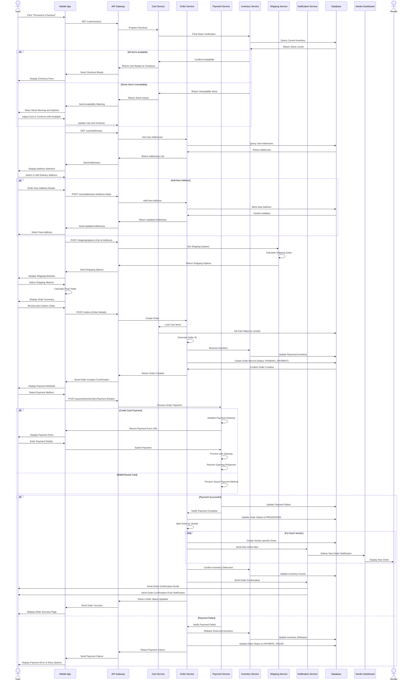
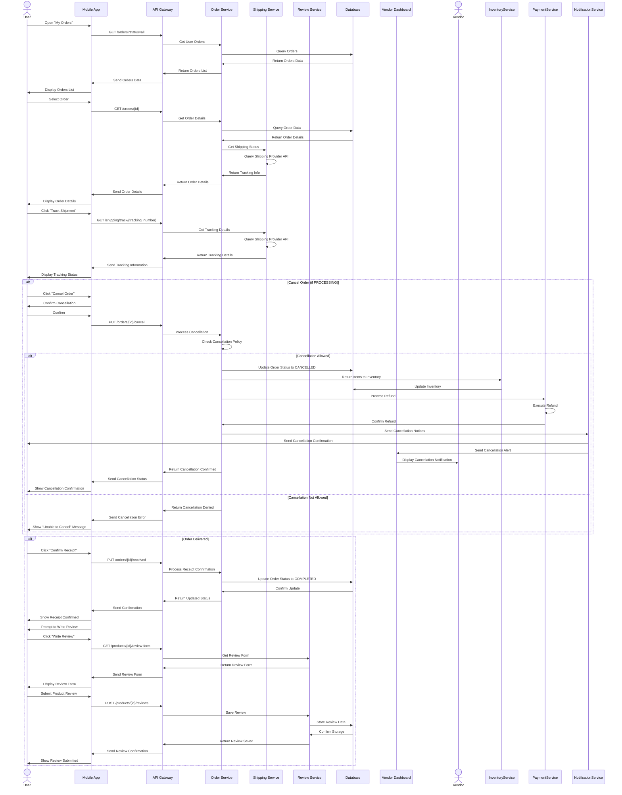
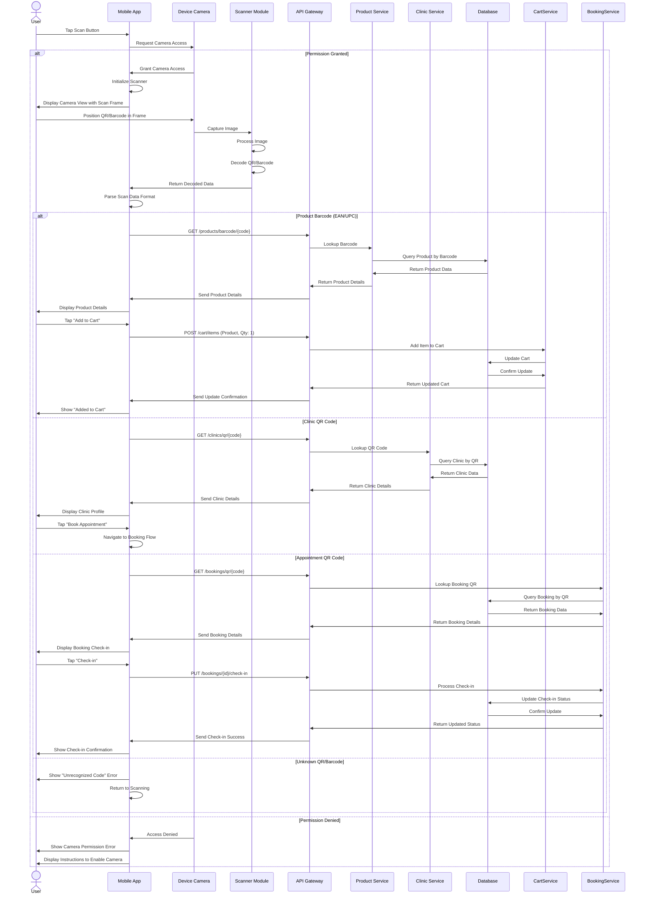

# E-Commerce & Order Flow - Detailed Sequence Diagram (Level 2)

## Overview
This document provides a detailed Level 2 sequence diagram for the e-commerce product browsing, shopping cart, and order process in the PetPro platform. The diagram shows the step-by-step flow between the user, mobile app, backend services, and vendor systems.

## 1. Product Browsing & Shopping Cart Flow

```mermaid
sequenceDiagram
    actor User
    participant MobileApp as Mobile App
    participant APIGateway as API Gateway
    participant ProductService as Product Service
    participant SearchService as Search Service
    participant CartService as Cart Service
    participant InventoryService as Inventory Service
    participant DB as Database
    participant Cache as Redis Cache

    %% Initial Product Browse
    User->>MobileApp: Navigate to Shop Section
    MobileApp->>APIGateway: GET /products/categories
    APIGateway->>ProductService: Get Product Categories
    ProductService->>Cache: Check for Cached Categories
    
    alt Cache Hit
        Cache->>ProductService: Return Cached Categories
    else Cache Miss
        ProductService->>DB: Query Product Categories
        DB->>ProductService: Return Categories
        ProductService->>Cache: Store Categories (TTL: 12 hours)
    end
    
    ProductService->>APIGateway: Return Categories
    APIGateway->>MobileApp: Send Categories List
    MobileApp->>User: Display Product Categories
    
    %% Browse Products in Category
    User->>MobileApp: Select Category
    MobileApp->>APIGateway: GET /products?category={id}&page=1&limit=20
    APIGateway->>ProductService: Get Products in Category
    
    ProductService->>Cache: Check for Cached Products
    alt Cache Hit
        Cache->>ProductService: Return Cached Products
    else Cache Miss
        ProductService->>DB: Query Products
        DB->>ProductService: Return Products Data
        ProductService->>Cache: Store Products (TTL: 1 hour)
    end
    
    ProductService->>APIGateway: Return Product List
    APIGateway->>MobileApp: Send Products
    MobileApp->>User: Display Product Grid
    
    %% Product Search
    User->>MobileApp: Enter Search Query
    MobileApp->>APIGateway: POST /search/products (Query)
    APIGateway->>SearchService: Process Search
    SearchService->>DB: Execute Search Query
    DB->>SearchService: Return Search Results
    SearchService->>APIGateway: Return Search Results
    APIGateway->>MobileApp: Send Search Results
    MobileApp->>User: Display Search Results
    
    %% View Product Details
    User->>MobileApp: Select Product
    MobileApp->>APIGateway: GET /products/{id}
    APIGateway->>ProductService: Get Product Details
    
    ProductService->>DB: Query Product Data
    DB->>ProductService: Return Product Details
    ProductService->>InventoryService: Check Stock Status
    InventoryService->>DB: Query Inventory
    DB->>InventoryService: Return Stock Level
    InventoryService->>ProductService: Return Availability
    
    ProductService->>APIGateway: Return Product Details
    APIGateway->>MobileApp: Send Product Details
    MobileApp->>User: Display Product Details Page
    
    %% Add to Cart
    User->>MobileApp: Select Quantity
    User->>MobileApp: Click "Add to Cart"
    MobileApp->>APIGateway: POST /cart/items (Product, Qty)
    APIGateway->>CartService: Add Item to Cart
    CartService->>InventoryService: Verify Availability
    InventoryService->>CartService: Confirm Available Quantity
    
    alt Sufficient Stock
        CartService->>DB: Add/Update Cart Item
        DB->>CartService: Confirm Addition
        CartService->>APIGateway: Return Updated Cart
        APIGateway->>MobileApp: Send Updated Cart
        MobileApp->>User: Show "Added to Cart" Confirmation
    else Insufficient Stock
        InventoryService->>CartService: Return Available Quantity
        CartService->>APIGateway: Return Stock Limitation
        APIGateway->>MobileApp: Send Stock Warning
        MobileApp->>User: Show "Limited Stock Available" Warning
    end
    
    %% View Shopping Cart
    User->>MobileApp: Open Shopping Cart
    MobileApp->>APIGateway: GET /cart
    APIGateway->>CartService: Get Cart Contents
    CartService->>DB: Query Cart Data
    DB->>CartService: Return Cart Items
    
    CartService->>ProductService: Get Updated Product Data
    ProductService->>DB: Query Products
    DB->>ProductService: Return Product Data
    ProductService->>CartService: Return Product Details
    
    CartService->>InventoryService: Verify Current Stock
    InventoryService->>DB: Query Inventory
    DB->>InventoryService: Return Stock Levels
    InventoryService->>CartService: Return Availability Updates
    
    CartService->>CartService: Calculate Totals
    CartService->>APIGateway: Return Cart with Totals
    APIGateway->>MobileApp: Send Cart Data
    MobileApp->>User: Display Shopping Cart
    
    %% Update Cart Quantity
    User->>MobileApp: Update Item Quantity
    MobileApp->>APIGateway: PUT /cart/items/{id} (New Qty)
    APIGateway->>CartService: Update Item Quantity
    CartService->>InventoryService: Verify Availability
    InventoryService->>CartService: Confirm Available Quantity
    CartService->>DB: Update Cart Item
    DB->>CartService: Confirm Update
    CartService->>CartService: Recalculate Totals
    CartService->>APIGateway: Return Updated Cart
    APIGateway->>MobileApp: Send Updated Cart
    MobileApp->>User: Display Updated Cart
    
    %% Remove Cart Item
    User->>MobileApp: Remove Item from Cart
    MobileApp->>APIGateway: DELETE /cart/items/{id}
    APIGateway->>CartService: Remove Cart Item
    CartService->>DB: Delete Cart Item
    DB->>CartService: Confirm Deletion
    CartService->>CartService: Recalculate Totals
    CartService->>APIGateway: Return Updated Cart
    APIGateway->>MobileApp: Send Updated Cart
    MobileApp->>User: Display Updated Cart
```

## 2. Order Checkout Flow

## 3. Order Tracking & Management Flow

## 4. QR/Barcode Scanning Flow

## Error Handling Details

### Error Scenarios During E-commerce Process

1. **Inventory Issues**:
   - Product out of stock
   - Stock less than requested quantity
   - Product discontinued
   - Response: 400 Bad Request with stock details

2. **Order Creation Failures**:
   - Invalid shipping address
   - Shipping unavailable to location
   - Product price changed since cart add
   - Response: 400 Bad Request with specific failure reason

3. **Payment Failures**:
   - Insufficient funds
   - Payment gateway error
   - Declined transaction
   - Response: 400 Payment Required with failure details

4. **Order Cancellation Issues**:
   - Order already shipped
   - Order in non-cancellable state
   - Partial order shipped
   - Response: 403 Forbidden with explanation

5. **Scanning Issues**:
   - Unrecognized barcode format
   - QR code for expired/cancelled booking
   - Product not in system
   - Response: 404 Not Found with reason

### Business Rules

1. **Shopping Cart Rules**:
   - Cart items persist for 30 days
   - Maximum 50 items per cart
   - Stock verified at checkout time
   - Price changes reflected at checkout

2. **Order Processing**:
   - Orders split by vendor when multiple vendors
   - Each split order has unique tracking
   - Order processing begins only after payment confirmation
   - Combined shipping available for same vendor items

3. **Shipping Rules**:
   - Minimum order value for free shipping configurable by vendor
   - Shipping costs calculated by weight and distance
   - Shipping estimates based on vendor processing time + carrier time
   - Multiple shipping speed options where available

4. **Cancellation Policy**:
   - Full refund if cancelled before processing (status: PROCESSING)
   - Partial refund if cancelled during processing (status: PREPARING)
   - No cancellation after shipping (status: SHIPPED)
   - Refunds processed within 7 business days

5. **Return Policy**:
   - Returns accepted within 14 days of delivery
   - Return shipping paid by customer unless defective
   - Refund processed after vendor confirms receipt of return
   - Return policy customizable by vendor within platform limits

## Implementation Notes

1. **Inventory Management**:
   - Real-time inventory updates
   - Reserved inventory during checkout process (10 minute hold)
   - Low stock notifications to vendors
   - Inventory adjusted only after successful payment

2. **Performance**:
   - Product listings cached with 1-hour TTL
   - Categories cached with 12-hour TTL
   - Shopping cart operations < 500ms response time
   - Order creation < 2 second response time

3. **Scalability**:
   - Product catalog service horizontally scalable
   - Order processing via queue-based architecture
   - Read replicas for product catalog queries
   - Sharding strategy for order data by region

## Japanese Translation / 日本語訳

### 概要
このドキュメントでは、PetProプラットフォームのEコマース製品閲覧、ショッピングカート、注文プロセスの詳細なレベル2シーケンス図を提供します。この図は、ユーザー、モバイルアプリ、バックエンドサービス、ベンダーシステム間のステップバイステップのフローを示しています。

### エラー処理の詳細

#### Eコマースプロセス中のエラーシナリオ

1. **在庫の問題**:
   - 商品の在庫切れ
   - 要求された数量よりも在庫が少ない
   - 商品の販売中止
   - レスポンス: 在庫詳細を含む400 Bad Request

2. **注文作成の失敗**:
   - 無効な配送先住所
   - その地域への配送不可
   - カート追加後の商品価格変更
   - レスポンス: 特定の失敗理由を含む400 Bad Request

3. **決済の失敗**:
   - 残高不足
   - 決済ゲートウェイエラー
   - 取引拒否
   - レスポンス: 失敗の詳細を含む400 Payment Required

4. **注文キャンセルの問題**:
   - 注文がすでに発送済み
   - キャンセル不可能な状態の注文
   - 一部の注文がすでに発送済み
   - レスポンス: 説明を含む403 Forbidden

5. **スキャンの問題**:
   - 認識されないバーコード形式
   - 期限切れ/キャンセルされた予約のQRコード
   - システムに登録されていない商品
   - レスポンス: 理由を含む404 Not Found

#### ビジネスルール

1. **ショッピングカートのルール**:
   - カートアイテムは30日間保持される
   - カートあたり最大50アイテム
   - 在庫はチェックアウト時に確認
   - 価格変更はチェックアウト時に反映される

2. **注文処理**:
   - 複数のベンダーがある場合、注文はベンダーごとに分割される
   - 各分割注文には固有の追跡番号がある
   - 注文処理は支払い確認後にのみ開始
   - 同じベンダーのアイテムには合同配送が可能

3. **配送ルール**:
   - 送料無料の最低注文金額はベンダーが設定可能
   - 配送料は重量と距離で計算
   - 配送予定時間はベンダー処理時間+配送業者の時間に基づく
   - 利用可能な場合は複数の配送速度オプション

4. **キャンセルポリシー**:
   - 処理前（ステータス：PROCESSING）にキャンセルした場合は全額返金
   - 処理中（ステータス：PREPARING）にキャンセルした場合は一部返金
   - 発送後（ステータス：SHIPPED）はキャンセル不可
   - 返金は7営業日以内に処理

5. **返品ポリシー**:
   - 配達から14日以内の返品を受け付ける
   - 不良品でない限り、返品送料は顧客負担
   - 返金はベンダーが返品の受領を確認した後に処理
   - 返品ポリシーはプラットフォームの制限内でベンダーがカスタマイズ可能

#### 実装メモ

1. **在庫管理**:
   - リアルタイムの在庫更新
   - チェックアウトプロセス中の在庫予約（10分間保持）
   - ベンダーへの在庫不足通知
   - 在庫は支払い成功後にのみ調整

2. **パフォーマンス**:
   - 商品リストは1時間のTTLでキャッシュ
   - カテゴリは12時間のTTLでキャッシュ
   - ショッピングカート操作の応答時間 < 500ms
   - 注文作成の応答時間 < 2秒

3. **スケーラビリティ**:
   - 商品カタログサービスは水平方向にスケーラブル
   - キューベースのアーキテクチャによる注文処理
   - 商品カタログクエリ用の読み取りレプリカ
   - 地域による注文データのシャーディング戦略
