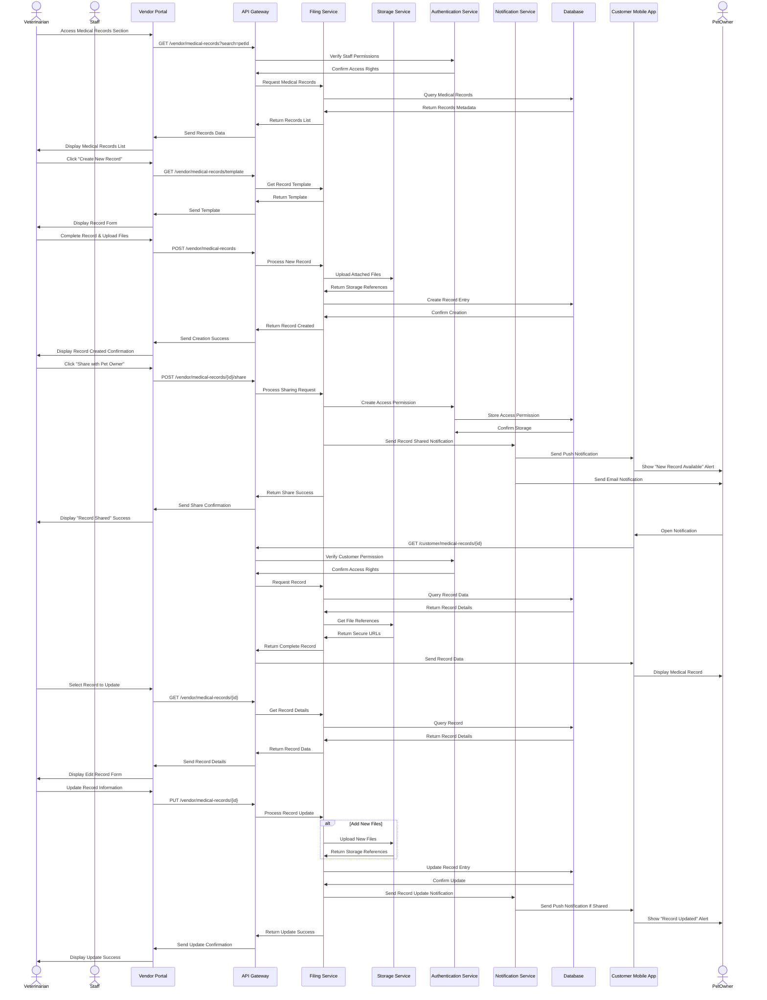
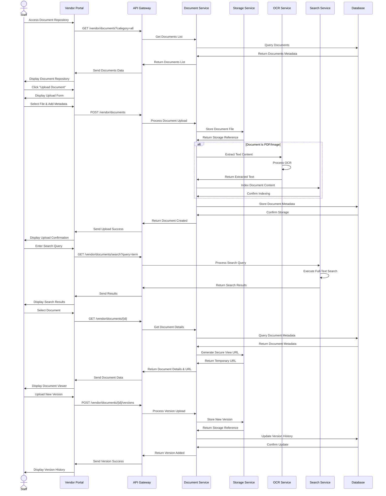
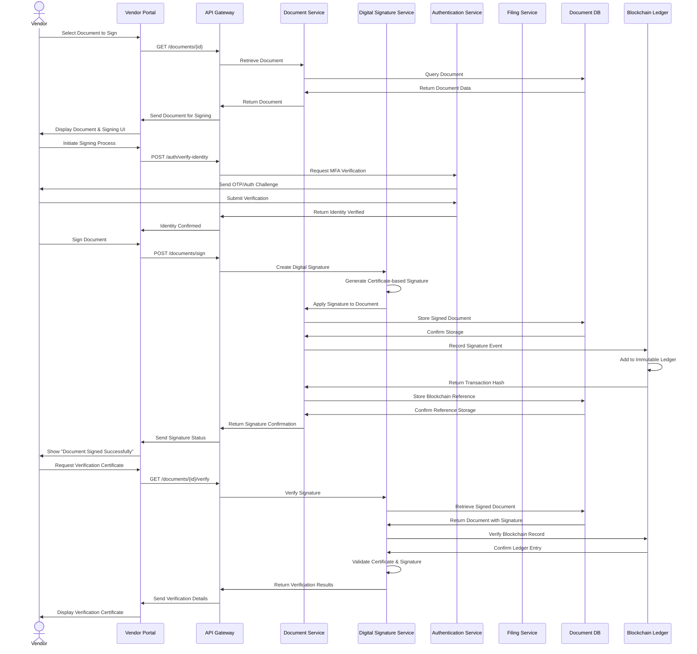

# Filing System Flow - Detailed Sequence Diagram (Level 2)

## Overview
This document provides a detailed Level 2 sequence diagram for the filing system in the PetPro platform. The diagram shows the step-by-step flow for document management, record keeping, and electronic filing across different user roles including veterinarians, clinic staff, and pet owners.

## 1. Medical Records Filing Flow

## 2. Document Management Flow with Digital Signatures

### 2.1 Basic Document Management

### 2.2 Digital Signature & Verification Flow

## 3. Regulatory Compliance Filing Flow

```mermaid
sequenceDiagram
    actor Admin
    actor Staff
    participant VendorPortal as Vendor Portal
    participant APIGateway as API Gateway
    participant ComplianceService as Compliance Service
    participant DocumentService as Document Service
    participant StorageService as Storage Service
    participant NotificationService as Notification Service
    participant DB as Database
    participant ExternalSystem as Regulatory System
    
    %% View Compliance Requirements
    Staff->>VendorPortal: Access Compliance Dashboard
    VendorPortal->>APIGateway: GET /vendor/compliance/requirements
    APIGateway->>ComplianceService: Get Compliance Requirements
    ComplianceService->>DB: Query Requirements
    DB->>ComplianceService: Return Requirements Data
    ComplianceService->>APIGateway: Return Requirements List
    APIGateway->>VendorPortal: Send Requirements Data
    VendorPortal->>Staff: Display Compliance Dashboard
    
    %% File Compliance Report
    Staff->>VendorPortal: Select "File New Report"
    VendorPortal->>APIGateway: GET /vendor/compliance/templates/{type}
    APIGateway->>ComplianceService: Get Report Template
    ComplianceService->>APIGateway: Return Template
    APIGateway->>VendorPortal: Send Template
    VendorPortal->>Staff: Display Report Form
    
    Staff->>VendorPortal: Complete Report & Upload Evidence
    VendorPortal->>APIGateway: POST /vendor/compliance/reports
    APIGateway->>ComplianceService: Process Report Submission
    
    ComplianceService->>StorageService: Store Evidence Files
    StorageService->>ComplianceService: Return Storage References
    
    ComplianceService->>DocumentService: Create Report Document
    DocumentService->>DB: Store Report Metadata
    DB->>DocumentService: Confirm Storage
    
    ComplianceService->>DB: Update Compliance Status
    DB->>ComplianceService: Confirm Update
    
    ComplianceService->>APIGateway: Return Report Filed
    APIGateway->>VendorPortal: Send Filing Success
    VendorPortal->>Staff: Display Filing Confirmation
    
    %% Admin Review
    Admin->>VendorPortal: Access Compliance Review
    VendorPortal->>APIGateway: GET /admin/compliance/pending
    APIGateway->>ComplianceService: Get Pending Reviews
    ComplianceService->>DB: Query Pending Reports
    DB->>ComplianceService: Return Pending Reports
    ComplianceService->>APIGateway: Return Reviews List
    APIGateway->>VendorPortal: Send Reviews Data
    VendorPortal->>Admin: Display Pending Reviews
    
    Admin->>VendorPortal: Select Report to Review
    VendorPortal->>APIGateway: GET /admin/compliance/reports/{id}
    APIGateway->>ComplianceService: Get Report Details
    ComplianceService->>DB: Query Report
    DB->>ComplianceService: Return Report Details
    
    ComplianceService->>StorageService: Get Evidence Files
    StorageService->>ComplianceService: Return File URLs
    
    ComplianceService->>APIGateway: Return Complete Report
    APIGateway->>VendorPortal: Send Report Data
    VendorPortal->>Admin: Display Report for Review
    
    Admin->>VendorPortal: Approve/Reject Report
    VendorPortal->>APIGateway: PUT /admin/compliance/reports/{id}/review
    APIGateway->>ComplianceService: Process Review Decision
    ComplianceService->>DB: Update Report Status
    DB->>ComplianceService: Confirm Update
    
    alt Report Approved
        ComplianceService->>ExternalSystem: Submit to Regulatory System
        ExternalSystem->>ComplianceService: Acknowledge Receipt
        ComplianceService->>NotificationService: Send Approval Notification
    else Report Rejected
        ComplianceService->>NotificationService: Send Rejection with Feedback
    end
    
    NotificationService->>Staff: Send Email Notification
    
    ArchiveService->>APIGateway: Return Archiving Status
    APIGateway->>VendorPortal: Send Archiving Status
    VendorPortal->>Staff: Display Archiving Status
    
    %% Configure Retention Policy
    Staff->>VendorPortal: Access Archive Settings
    VendorPortal->>APIGateway: GET /vendor/archive/policies
    APIGateway->>RetentionService: Get Retention Policies
    RetentionService->>DB: Query Policies
    DB->>RetentionService: Return Policies
    RetentionService->>APIGateway: Return Policies List
    APIGateway->>VendorPortal: Send Policies
    VendorPortal->>Staff: Display Retention Settings
    
    Staff->>VendorPortal: Update Retention Policy
    VendorPortal->>APIGateway: PUT /vendor/archive/policies/{categoryId}
    APIGateway->>RetentionService: Update Retention Policy
    RetentionService->>DB: Update Policy Record
    DB->>RetentionService: Confirm Update
    RetentionService->>APIGateway: Return Update Success
    APIGateway->>VendorPortal: Send Update Confirmation
    VendorPortal->>Staff: Show Update Success
    
    %% Archive Document/Record
    Staff->>VendorPortal: Select "Archive Document"
    VendorPortal->>APIGateway: POST /vendor/archive/documents
    APIGateway->>ArchiveService: Process Archive Request
    
    ArchiveService->>StorageService: Move to Archive Storage
    StorageService->>ArchiveService: Return Archive Reference
    
    ArchiveService->>DB: Update Document Status
    DB->>ArchiveService: Confirm Update
    
    ArchiveService->>APIGateway: Return Archive Success
    APIGateway->>VendorPortal: Send Archive Confirmation
    VendorPortal->>Staff: Display Archive Success
    
    %% Search Archives
    Staff->>VendorPortal: Access Archive Search
    VendorPortal->>APIGateway: GET /vendor/archive/search?query=term
    APIGateway->>ArchiveService: Process Archive Search
    ArchiveService->>DB: Execute Search Query
    DB->>ArchiveService: Return Search Results
    ArchiveService->>APIGateway: Return Search Results
    APIGateway->>VendorPortal: Send Search Results
    VendorPortal->>Staff: Display Archive Search Results
    
    %% Restore from Archive
    Staff->>VendorPortal: Select "Restore Document"
    VendorPortal->>APIGateway: POST /vendor/archive/{id}/restore
    APIGateway->>ArchiveService: Process Restore Request
    
    ArchiveService->>StorageService: Move to Active Storage
    StorageService->>ArchiveService: Return Active Reference
    
    ArchiveService->>DB: Update Document Status
    DB->>ArchiveService: Confirm Update
    
    ArchiveService->>APIGateway: Return Restore Success
    APIGateway->>VendorPortal: Send Restore Confirmation
    VendorPortal->>Staff: Display Restore Success
    
    %% Automatic Retention Processing
    RetentionService->>RetentionService: Scheduled Retention Check
    RetentionService->>DB: Query Expired Documents
    DB->>RetentionService: Return Expired Documents
    
    alt Auto-Delete Expired
        RetentionService->>ArchiveService: Request Deletion
        ArchiveService->>StorageService: Delete Files
        StorageService->>ArchiveService: Confirm Deletion
        ArchiveService->>DB: Update Records
        DB->>ArchiveService: Confirm Update
    else Auto-Archive Expired
        RetentionService->>ArchiveService: Request Archiving
        ArchiveService->>StorageService: Move to Long-term Archive
        StorageService->>ArchiveService: Return Archive Reference
        ArchiveService->>DB: Update Records
        DB->>ArchiveService: Confirm Update
    end
    
    RetentionService->>VendorPortal: Update Archive Status (if viewing)
```

## Error Handling Details

### Error Scenarios in Filing System

1. **Document Upload Failures**:
   - File size too large (exceeds limit)
   - Unsupported file format
   - Storage service unavailable
   - Response: 413 Payload Too Large or 400 Bad Request

2. **Access Permission Issues**:
   - Unauthorized access attempt to medical records
   - Missing role-based permissions
   - Expired access token
   - Response: 401 Unauthorized or 403 Forbidden

3. **Document Processing Errors**:
   - OCR failure for image documents
   - Corrupted document content
   - Virus/malware detected in upload
   - Response: 422 Unprocessable Entity with error details

4. **Compliance Filing Issues**:
   - Missing required fields in regulatory filing
   - Submission deadline expired
   - External regulatory system unavailable
   - Response: 400 Bad Request with validation errors

5. **Archive/Retention Failures**:
   - Document locked by another operation
   - Archive storage unavailable
   - Retention policy conflict
   - Response: 409 Conflict with explanation

### Business Rules

1. **Medical Records Management**:
   - Medical records require veterinarian approval before finalization
   - Pet owners can view but not modify medical records
   - Deletions require admin approval and are soft deletes only
   - Records must be retained for minimum 7 years

2. **Document Management Rules**:
   - Maximum file size: 50MB per document
   - Supported formats: PDF, DOCX, JPG, PNG, TIFF, CSV, XLSX
   - Version history maintained for all documents
   - All document operations are audit-logged

3. **Compliance Filing Rules**:
   - Regulatory filings follow jurisdiction-specific templates
   - Submissions require review before external transmission
   - Compliance reports must be filed by deadline dates
   - Evidence documents must be retained with reports

4. **Retention Policy Rules**:
   - Different retention periods by document category
   - Critical documents never auto-deleted
   - Expired documents archived before deletion
   - Legal hold overrides standard retention policy

5. **Sharing and Access Rules**:
   - Role-based access control for all documents
   - Temporary access links expire after 24 hours
   - External sharing requires explicit approval
   - Sensitive documents require additional authentication

## Implementation Notes

1. **Storage Considerations**:
   - Tiered storage architecture (hot/warm/cold)
   - Document encryption at rest
   - Content delivery network for frequently accessed documents
   - Backup and disaster recovery procedures

2. **Performance Optimization**:
   - Document thumbnail generation for faster browsing
   - Progressive loading for large documents
   - Background processing for OCR and indexing
   - Caching for frequently accessed documents

3. **Compliance and Security**:
   - Digital signatures for document authenticity
   - Comprehensive audit trails for all actions
   - Data loss prevention for sensitive content
   - Geographic storage location control for regulatory compliance

## Japanese Translation / 日本語訳

### 概要
このドキュメントでは、PetProプラットフォームにおけるファイリングシステムの詳細なレベル2シーケンス図を提供します。この図は、獣医師、クリニックスタッフ、ペットの飼い主など、さまざまなユーザーロールにわたる文書管理、記録管理、電子ファイリングのステップバイステップのフローを示しています。

### エラー処理の詳細

#### ファイリングシステムのエラーシナリオ

1. **文書アップロードの失敗**:
   - ファイルサイズが大きすぎる（制限を超過）
   - サポートされていないファイル形式
   - ストレージサービスが利用不可
   - レスポンス: 413 Payload Too Largeまたは400 Bad Request

2. **アクセス権限の問題**:
   - 医療記録への不正アクセスの試み
   - ロールベースの権限の欠如
   - アクセストークンの有効期限切れ
   - レスポンス: 401 Unauthorizedまたは403 Forbidden

3. **文書処理エラー**:
   - 画像文書のOCR失敗
   - 破損した文書内容
   - アップロードでウイルス/マルウェアが検出された
   - レスポンス: エラー詳細を含む422 Unprocessable Entity

4. **コンプライアンス申請の問題**:
   - 規制申請に必要なフィールドの欠落
   - 提出期限切れ
   - 外部規制システムが利用不可
   - レスポンス: バリデーションエラーを含む400 Bad Request

5. **アーカイブ/保持の失敗**:
   - 別の操作によってロックされた文書
   - アーカイブストレージが利用不可
   - 保持ポリシーの競合
   - レスポンス: 説明を含む409 Conflict

#### ビジネスルール

1. **医療記録管理**:
   - 医療記録は確定前に獣医師の承認が必要
   - ペットの飼い主は医療記録を閲覧できるが変更はできない
   - 削除には管理者の承認が必要で、ソフト削除のみ
   - 記録は最低7年間保持する必要がある

2. **文書管理ルール**:
   - 最大ファイルサイズ: 文書あたり50MB
   - サポートされる形式: PDF、DOCX、JPG、PNG、TIFF、CSV、XLSX
   - すべての文書のバージョン履歴が維持される
   - すべての文書操作は監査ログに記録される

3. **コンプライアンス申請ルール**:
   - 規制申請は管轄固有のテンプレートに従う
   - 提出物は外部送信前に審査が必要
   - コンプライアンスレポートは期限日までに提出する必要がある
   - 証拠文書はレポートと一緒に保持する必要がある

4. **保持ポリシールール**:
   - 文書カテゴリ別の異なる保持期間
   - 重要文書は自動削除されない
   - 期限切れの文書は削除前にアーカイブされる
   - 法的保留は標準保持ポリシーを上書きする

5. **共有とアクセスルール**:
   - すべての文書に対するロールベースのアクセス制御
   - 一時アクセスリンクは24時間後に期限切れ
   - 外部共有には明示的な承認が必要
   - 機密文書には追加認証が必要

#### 実装メモ

1. **ストレージに関する考慮事項**:
   - 階層型ストレージアーキテクチャ（ホット/ウォーム/コールド）
   - 保存時の文書暗号化
   - 頻繁にアクセスされる文書のためのコンテンツ配信ネットワーク
   - バックアップと災害復旧手順

2. **パフォーマンス最適化**:
   - より高速なブラウジングのための文書サムネイル生成
   - 大型文書の段階的読み込み
   - OCRとインデックス作成のためのバックグラウンド処理
   - 頻繁にアクセスされる文書のためのキャッシング

3. **コンプライアンスとセキュリティ**:
   - 文書の信頼性のためのデジタル署名
   - すべてのアクションの包括的な監査証跡
   - 機密コンテンツのデータ損失防止
   - 規制遵守のための地理的ストレージ位置制御
