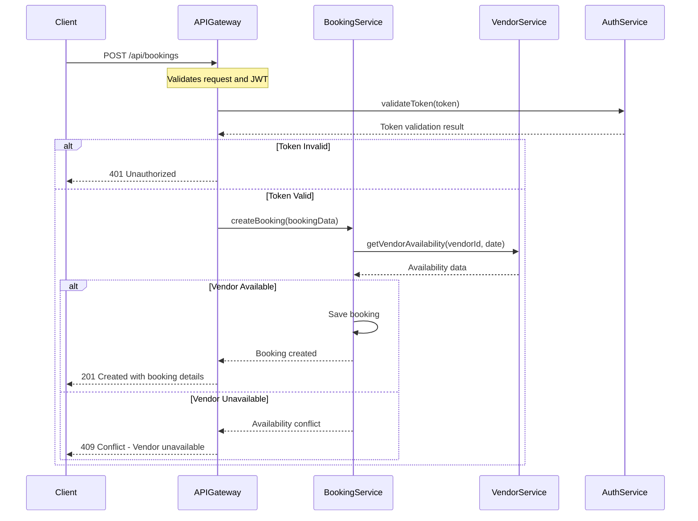
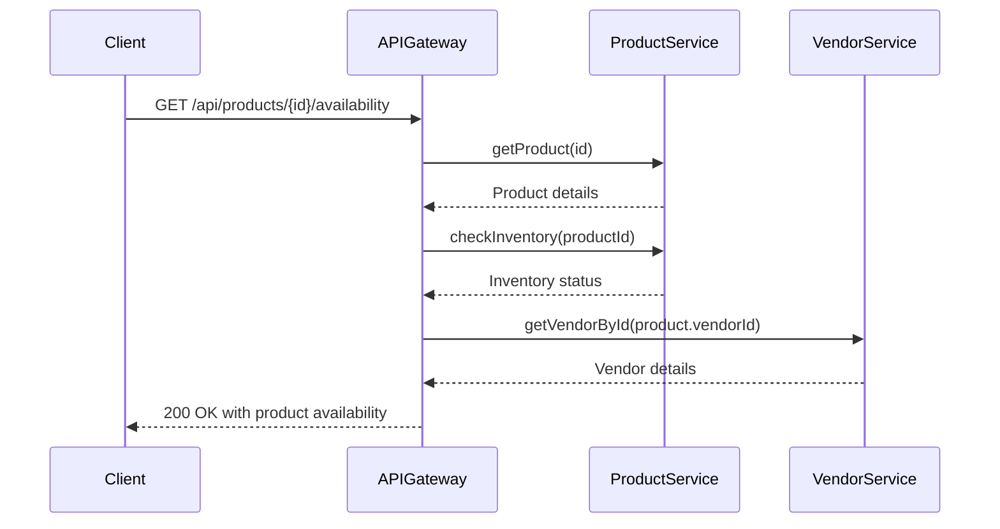
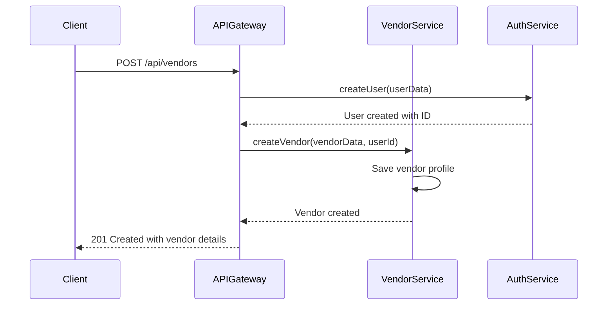

# Microservice TCP Communication Sequence Diagrams

## Overview

This document illustrates the TCP communication patterns between PetPro microservices. Each microservice communicates with others through NestJS's built-in TCP transport layer, providing reliable inter-service communication while maintaining service independence.

## Architecture Context

PetPro's microservice architecture consists of the following key services:
- API Gateway: Entry point for all client requests
- Auth Service: Handles authentication and authorization
- Booking Service: Manages pet service bookings and appointments
- Vendor Service: Manages vendor profiles and operations
- Product/Inventory Service: Handles product catalog and inventory management

All inter-service communication occurs through TCP transport, with the API Gateway acting as the client-facing interface.

## Sequence Diagrams

### 1. Booking Creation Flow



### 2. Product Inventory Check Flow



### 3. Vendor Service Registration Flow



## TCP Communication Implementation Details

### Message Pattern Types

PetPro microservices use three primary TCP message patterns:

1. **Request-Response Pattern**
   - Used for synchronous operations where an immediate response is needed
   - Example: `AuthService.validateToken()`

2. **Event-Based Pattern**
   - Used for asynchronous operations and notifications
   - Example: `BookingService.bookingCreated` event

3. **Request-Stream Pattern**
   - Used for operations returning multiple values over time
   - Example: `ProductService.watchInventoryChanges()`

### TCP Controller Implementation

Each microservice exposes a dedicated TCP controller for inter-service communication:

```typescript
// Example from BookingService
@Controller()
export class BookingMicroserviceController {
  constructor(private readonly bookingService: BookingService) {}

  @MessagePattern({ cmd: 'get-booking' })
  async getBooking(@Payload() data: { id: number }): Promise<BookingDto> {
    return this.bookingService.findById(data.id);
  }

  @MessagePattern({ cmd: 'create-booking' })
  async createBooking(@Payload() data: CreateBookingDto): Promise<BookingDto> {
    return this.bookingService.create(data);
  }

  @MessagePattern({ cmd: 'check-availability' })
  async checkAvailability(@Payload() data: CheckAvailabilityDto): Promise<AvailabilityResponseDto> {
    return this.bookingService.checkAvailability(data);
  }
}
```

### Client Implementation in API Gateway

The API Gateway connects to microservices using NestJS's ClientProxy:

```typescript
// Example from API Gateway
@Injectable()
export class BookingProxyService {
  constructor(
    @Inject('BOOKING_SERVICE') private readonly bookingClient: ClientProxy
  ) {}

  async getBooking(id: number): Promise<BookingDto> {
    return this.bookingClient.send<BookingDto>({ cmd: 'get-booking' }, { id }).toPromise();
  }

  async createBooking(data: CreateBookingDto): Promise<BookingDto> {
    return this.bookingClient.send<BookingDto>({ cmd: 'create-booking' }, data).toPromise();
  }
}
```

## Error Handling and Resilience

TCP communication between services implements the following error handling strategies:

1. **Circuit Breaker Pattern**
   - Prevents cascading failures by failing fast when a service is unavailable
   - Implements automatic retry with exponential backoff

2. **Request Timeout**
   - All TCP requests have configurable timeouts to prevent indefinite waiting
   - Default timeout: 5000ms

3. **Message Serialization**
   - All messages are serialized using JSON by default
   - Custom serializers can be implemented for specific use cases

## Security Considerations

1. **Service Authentication**
   - Services authenticate with each other using service-specific API keys
   - Communication occurs on a private network not exposed to the internet

2. **Data Validation**
   - All incoming messages are validated using DTOs and class-validator
   - Prevents malformed data from propagating through the system

3. **Sensitive Data Handling**
   - Sensitive data is encrypted before transmission
   - PII is handled according to data protection regulations

## Performance Considerations

1. **Connection Pooling**
   - TCP connections are pooled for efficient reuse
   - Prevents connection churn under high load

2. **Load Balancing**
   - Multiple instances of each service can be deployed
   - TCP clients use round-robin load balancing by default

3. **Message Compression**
   - Large payloads are compressed to reduce network bandwidth
   - Improves performance for data-intensive operations
