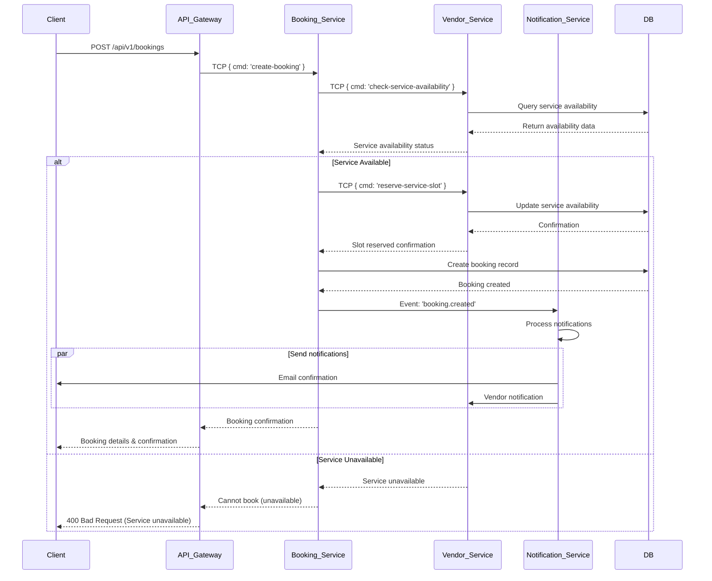

# Microservices Communication Sequence Diagrams

This document illustrates the key communication patterns between PetPro microservices using sequence diagrams.

## Table of Contents

1. [Authentication Flow](#authentication-flow)
2. [Booking Creation Flow](#booking-creation-flow)
3. [Product/Inventory Updates](#productinventory-updates)
4. [Vendor Registration and Approval](#vendor-registration-and-approval)
5. [Service Availability Check](#service-availability-check)

## Authentication Flow

## Booking Creation Flow

## Product/Inventory Updates

## Vendor Registration and Approval

## Service Availability Check

## Event-Based Communication

Beyond direct TCP communication, our microservices use an event-driven architecture for asynchronous communication. The diagram below illustrates how events propagate through the system:

## Service Discovery Pattern

All microservices register with a service registry for dynamic service discovery:

