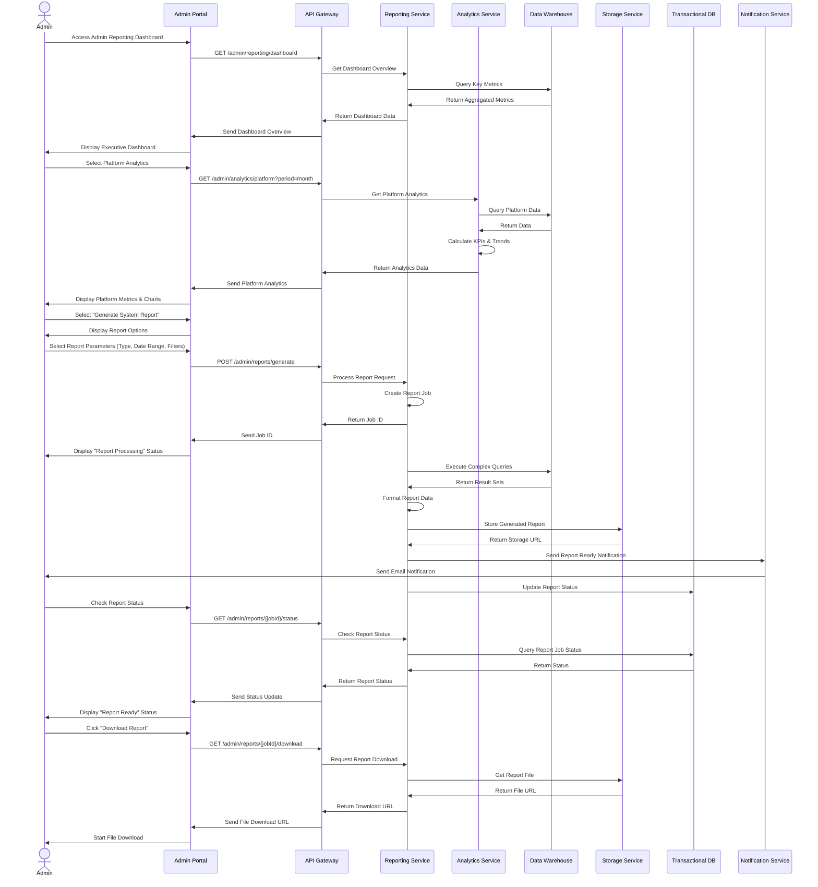
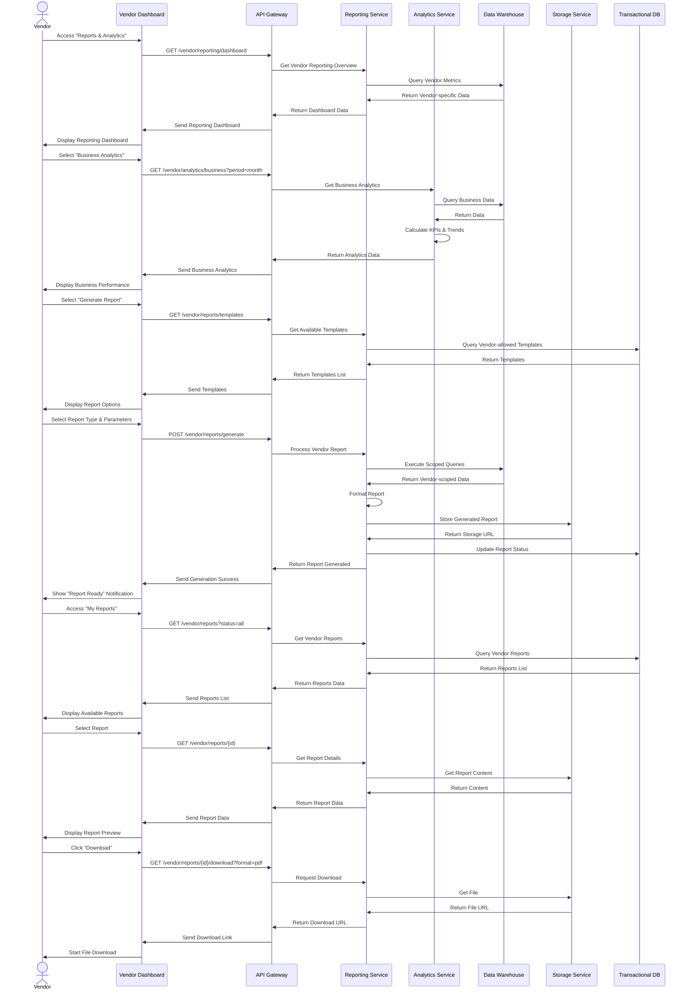
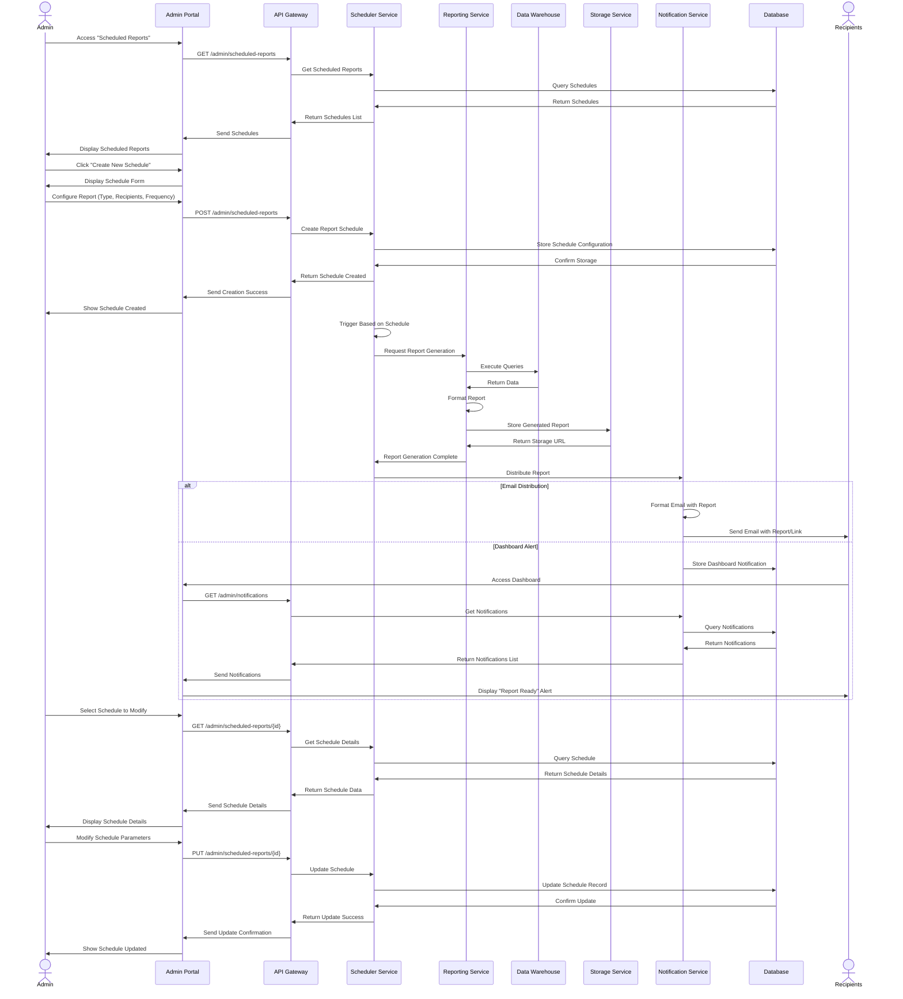
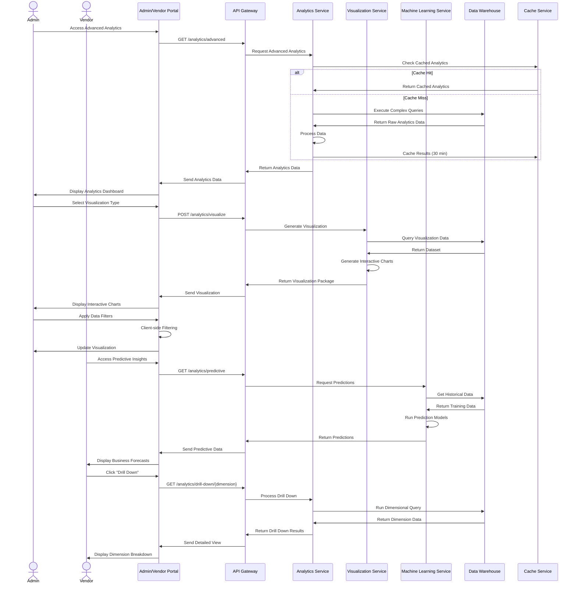
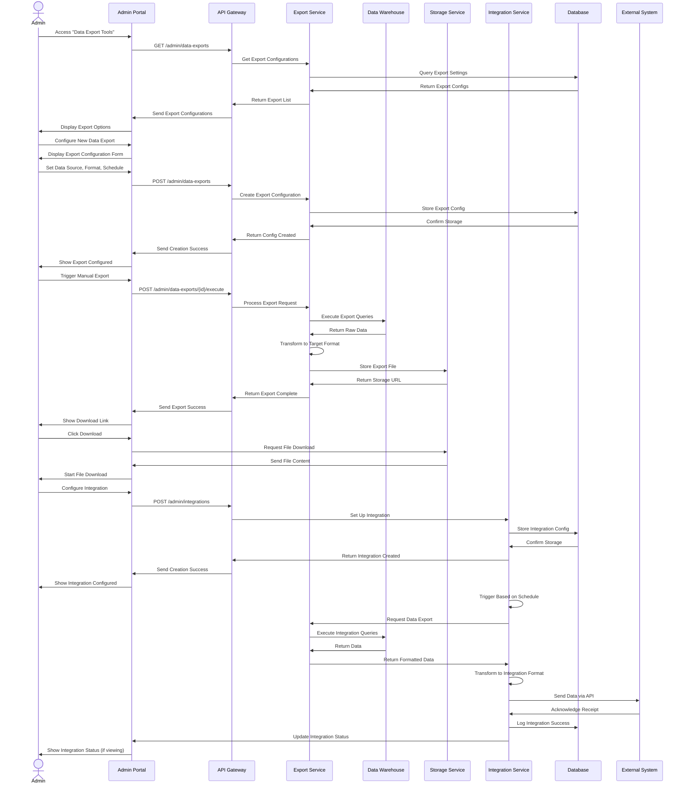

# Reporting System Flow - Detailed Sequence Diagram (Level 2)

## Overview
This document provides a detailed Level 2 sequence diagram for the reporting system in the PetPro platform. The diagram shows the step-by-step flow for generating reports, accessing analytics, and managing business intelligence across different user roles.

## 1. Admin Reporting Dashboard Flow

## 2. Vendor Reporting Flow

## 3. Scheduled & Automated Reporting Flow

## 4. Advanced Analytics & Data Visualization Flow

## 5. Data Export & Integration Flow

## Error Handling Details

### Error Scenarios in Reporting System

1. **Report Generation Failures**:
   - Data source unavailable
   - Query timeout due to complexity
   - Insufficient permissions for data access
   - Response: 500 Internal Error with specific failure reason

2. **Scheduled Report Issues**:
   - Schedule configuration invalid
   - Email delivery failure
   - Report size exceeds allowed limit
   - Response: Failed job status with error details

3. **Export/Integration Failures**:
   - External system unavailable
   - Authentication failure with external system
   - Data format incompatibility
   - Response: Integration error log with retry policy

4. **Performance Bottlenecks**:
   - Report query too resource-intensive
   - Too many concurrent report generations
   - Response: 503 Service Unavailable with retry after header

5. **Data Quality Issues**:
   - Missing required data fields
   - Data inconsistency between sources
   - Response: Warning in report metadata and partial results

### Business Rules

1. **Report Access Control**:
   - Admin has access to all platform reports
   - Vendors can only access their own data
   - Role-based access controls for specific report types
   - Sensitive data requires special permissions

2. **Scheduled Reporting Rules**:
   - Maximum frequency: Hourly for system reports
   - Maximum frequency: Daily for vendor reports
   - Maximum recipient list size: 20 emails
   - Reports larger than 10MB sent as download links

3. **Data Retention Policy**:
   - Generated reports stored for 90 days
   - Raw report data available for 30 days
   - Scheduled report configurations stored indefinitely
   - Report access logs kept for 1 year

4. **Export Format Support**:
   - Standard formats: CSV, PDF, Excel, JSON
   - Advanced formats: XML, SQL dump (admin only)
   - Maximum export size: 1GB for standard users
   - Maximum export size: 10GB for privileged users

5. **Integration Requirements**:
   - API authentication required for all integrations
   - Rate limiting: 1000 requests per hour
   - Payload size limit: 5MB per request
   - Webhook callbacks supported for async operations

## Implementation Notes

### Advanced Analytics Implementation

1. **Data Pipeline Architecture**:
   - Stream processing for real-time analytics using Apache Kafka
   - Lambda architecture combining batch and stream processing
   - Data lake implementation for raw data storage
   - ETL workflows for data transformation and loading
   - Dimensional data modeling in the data warehouse
   - Separate data warehouse from transactional database
   - Report generation as asynchronous jobs
   - Event-driven notifications for report completion
   - Caching for frequently accessed dashboard metrics

2. **Performance Optimization**:
   - Pre-aggregated data cubes for common analytics dimensions
   - Materialized views for frequently accessed reports
   - Query optimization for complex reports with query hints
   - Horizontal scaling for reporting services with load balancing
   - Background processing with job prioritization
   - Multi-level caching strategy for different data freshness needs
   - Pre-aggregated data for common reports
   - Query optimization for complex reports
   - Horizontal scaling for reporting services
   - Background processing with job queues

3. **Security Measures**:
   - Column-level encryption for sensitive data
   - Row-level security based on user roles
   - Audit logging for all report access with retention policies
   - Multi-factor authentication for sensitive reports and admin dashboards
   - Data masking for PII in standard reports
   - Signed URLs for secure report sharing
   - Data encryption for report storage
   - Audit logging for all report access
   - Multi-factor authentication for sensitive reports
   - Data masking for PII in standard reports

## Japanese Translation / 日本語訳

### 概要
このドキュメントでは、PetProプラットフォームにおけるレポーティングシステムの詳細なレベル2シーケンス図を提供します。この図は、レポート生成、分析へのアクセス、および異なるユーザーロール間のビジネスインテリジェンス管理のステップバイステップのフローを示しています。

### エラー処理の詳細

#### レポーティングシステムのエラーシナリオ

1. **レポート生成の失敗**:
   - データソースが利用不可
   - 複雑さによるクエリタイムアウト
   - データアクセスの権限不足
   - レスポンス: 特定の失敗理由を含む500 Internal Error

2. **スケジュールされたレポートの問題**:
   - スケジュール設定が無効
   - メール配信の失敗
   - レポートサイズが許容制限を超過
   - レスポンス: エラー詳細を含むジョブ失敗ステータス

3. **エクスポート/統合の失敗**:
   - 外部システムが利用不可
   - 外部システムとの認証失敗
   - データフォーマットの非互換性
   - レスポンス: 再試行ポリシーを含む統合エラーログ

4. **パフォーマンスのボトルネック**:
   - レポートクエリがリソースを大量消費
   - 同時レポート生成が多すぎる
   - レスポンス: retry-afterヘッダーを含む503 Service Unavailable

5. **データ品質の問題**:
   - 必須データフィールドの欠落
   - ソース間のデータ不整合
   - レスポンス: レポートメタデータの警告と部分的な結果

#### ビジネスルール

1. **レポートアクセス制御**:
   - 管理者はすべてのプラットフォームレポートにアクセス可能
   - ベンダーは自分のデータのみにアクセス可能
   - 特定のレポートタイプに対するロールベースのアクセス制御
   - 機密データには特別な権限が必要

2. **スケジュールされたレポーティングルール**:
   - 最大頻度: システムレポートは1時間ごと
   - 最大頻度: ベンダーレポートは1日ごと
   - 最大受信者リストサイズ: 20メール
   - 10MB以上のレポートはダウンロードリンクとして送信

3. **データ保持ポリシー**:
   - 生成されたレポートは90日間保存
   - 生のレポートデータは30日間利用可能
   - スケジュールされたレポート設定は無期限に保存
   - レポートアクセスログは1年間保持

4. **エクスポート形式サポート**:
   - 標準形式: CSV、PDF、Excel、JSON
   - 高度な形式: XML、SQLダンプ（管理者のみ）
   - 最大エクスポートサイズ: 標準ユーザーは1GB
   - 最大エクスポートサイズ: 特権ユーザーは10GB

5. **統合要件**:
   - すべての統合にAPIの認証が必要
   - レート制限: 1時間あたり1000リクエスト
   - ペイロードサイズ制限: リクエストあたり5MB
   - 非同期操作のためのWebhookコールバックをサポート

#### 実装メモ

1. **アーキテクチャに関する考慮事項**:
   - トランザクションデータベースとは別のデータウェアハウス
   - 非同期ジョブとしてのレポート生成
   - レポート完了のためのイベント駆動型通知
   - 頻繁にアクセスされるダッシュボードメトリックのキャッシング

2. **パフォーマンス最適化**:
   - 一般的なレポートのための事前集計データ
   - 複雑なレポートのためのクエリ最適化
   - レポーティングサービスの水平スケーリング
   - ジョブキューによるバックグラウンド処理

3. **セキュリティ対策**:
   - レポート保存のためのデータ暗号化
   - すべてのレポートアクセスの監査ログ
   - 機密性の高いレポートの多要素認証
   - 標準レポートでのPIIのデータマスキング
