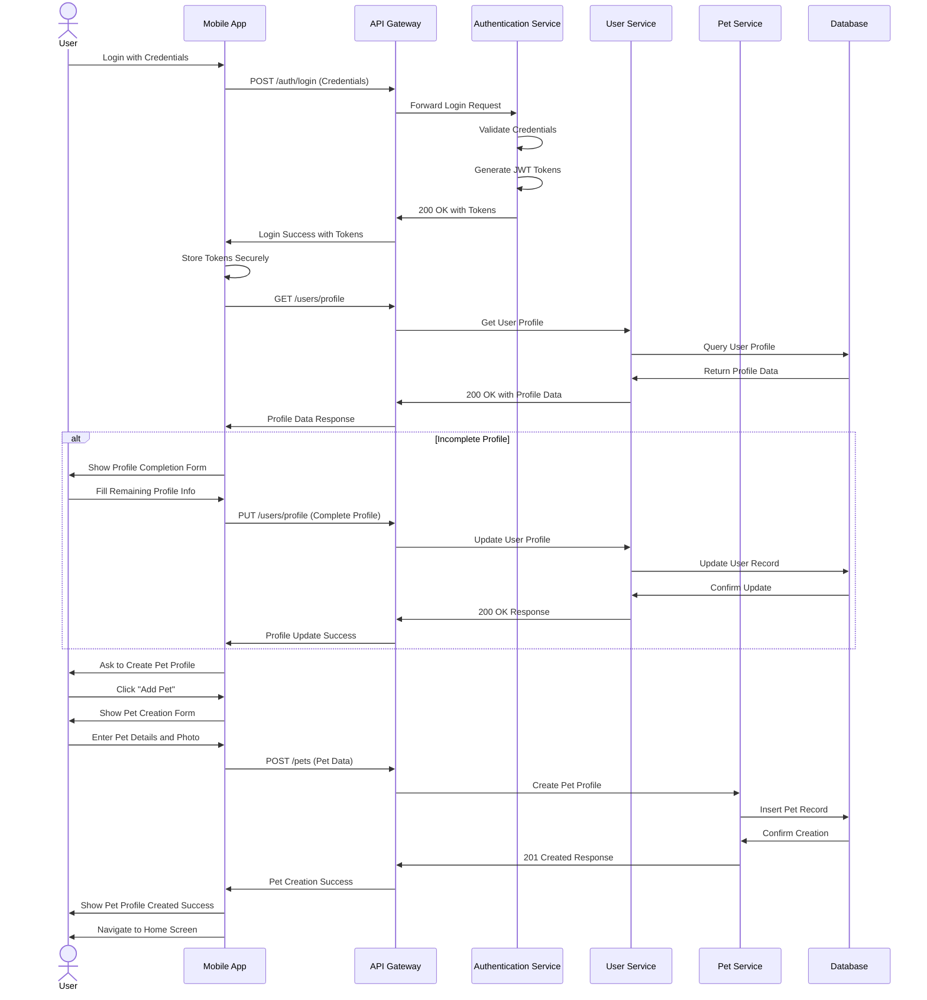

# User Registration Flow - Detailed Sequence Diagram (Level 2)

## Overview
This document provides a detailed Level 2 sequence diagram for the user registration process in the PetPro platform. The diagram shows the step-by-step flow between the user, mobile app, backend services, and external providers.

## 1. User Registration Flow

```mermaid
sequenceDiagram
    actor User
    participant MobileApp as Mobile App
    participant APIGateway as API Gateway
    participant AuthService as Authentication Service
    participant UserService as User Service
    participant EmailService as Email Service
    participant SMSService as SMS Service
    participant DB as Database
    participant SocialAuth as Social Auth Provider

    %% Standard Email/Phone Registration
    User->>MobileApp: Open Registration Screen
    MobileApp->>MobileApp: Display Registration Options
    
    alt Email Registration
        User->>MobileApp: Enter Email, Password, and Profile Info
        MobileApp->>MobileApp: Validate Input (Client-side)
        MobileApp->>APIGateway: POST /auth/register (Email Payload)
        APIGateway->>AuthService: Forward Registration Request
        AuthService->>AuthService: Validate Input (Server-side)
        AuthService->>UserService: Check If Email Already Exists
        UserService->>DB: Query User Table
        DB->>UserService: Return Result
        
        alt Email Already Exists
            UserService->>AuthService: Email Exists Response
            AuthService->>APIGateway: 409 Conflict Response
            APIGateway->>MobileApp: Email Already Exists Error
            MobileApp->>User: Show Error: "Email already registered"
        else Email Available
            UserService->>AuthService: Email Available Response
            AuthService->>AuthService: Hash Password
            AuthService->>UserService: Create User Account
            UserService->>DB: Insert User Record
            DB->>UserService: Confirm Creation
            UserService->>AuthService: User Created Successfully
            AuthService->>AuthService: Generate Verification Token
            AuthService->>EmailService: Send Verification Email
            EmailService->>User: Deliver Verification Email
            AuthService->>APIGateway: 201 Created Response
            APIGateway->>MobileApp: Registration Success Response
            MobileApp->>User: Show Success & Verification Instructions
        end
        
    else Phone Registration
        User->>MobileApp: Enter Phone Number and Profile Info
        MobileApp->>MobileApp: Validate Phone Format
        MobileApp->>APIGateway: POST /auth/register (Phone Payload)
        APIGateway->>AuthService: Forward Registration Request
        AuthService->>UserService: Check If Phone Already Exists
        UserService->>DB: Query User Table
        DB->>UserService: Return Result
        
        alt Phone Already Exists
            UserService->>AuthService: Phone Exists Response
            AuthService->>APIGateway: 409 Conflict Response
            APIGateway->>MobileApp: Phone Already Exists Error
            MobileApp->>User: Show Error: "Phone already registered"
        else Phone Available
            UserService->>AuthService: Phone Available Response
            AuthService->>UserService: Create User Account
            UserService->>DB: Insert User Record
            DB->>UserService: Confirm Creation
            UserService->>AuthService: User Created Successfully
            AuthService->>AuthService: Generate OTP Code
            AuthService->>SMSService: Send OTP SMS
            SMSService->>User: Deliver OTP SMS
            AuthService->>APIGateway: 201 Created Response
            APIGateway->>MobileApp: Registration Success & Await OTP
            MobileApp->>User: Show OTP Input Screen
        end
    end

    %% Social Login (Google/Apple) Registration
    alt Social Login (Google/Apple)
        User->>MobileApp: Click Social Login Button
        MobileApp->>SocialAuth: Request OAuth Authorization
        SocialAuth->>User: Display Permission Request
        User->>SocialAuth: Grant Permissions
        SocialAuth->>MobileApp: Return Auth Code
        MobileApp->>APIGateway: POST /auth/social-login (Auth Code)
        APIGateway->>AuthService: Forward Social Login Request
        AuthService->>SocialAuth: Verify Auth Code & Get User Info
        SocialAuth->>AuthService: Return User Information
        AuthService->>UserService: Check If User Exists
        UserService->>DB: Query User Table
        DB->>UserService: Return Result
        
        alt User Already Exists
            UserService->>AuthService: User Found
            AuthService->>AuthService: Link Social Account if New
            AuthService->>AuthService: Generate JWT Tokens
            AuthService->>APIGateway: 200 OK with Tokens
            APIGateway->>MobileApp: Login Success with Tokens
            MobileApp->>MobileApp: Store Tokens Securely
            MobileApp->>User: Navigate to Home Screen
        else New User
            UserService->>AuthService: User Not Found
            AuthService->>UserService: Create New User with Social Info
            UserService->>DB: Insert User Record
            DB->>UserService: Confirm Creation
            UserService->>AuthService: User Created Successfully
            AuthService->>AuthService: Generate JWT Tokens
            AuthService->>APIGateway: 200 OK with Tokens
            APIGateway->>MobileApp: Registration & Login Success
            MobileApp->>User: Request Additional Required Info
            User->>MobileApp: Provide Required Information
            MobileApp->>APIGateway: PUT /users/profile (Additional Info)
            APIGateway->>UserService: Update User Profile
            UserService->>DB: Update User Record
            DB->>UserService: Confirm Update
            UserService->>APIGateway: 200 OK Response
            APIGateway->>MobileApp: Profile Update Success
            MobileApp->>User: Navigate to Home Screen
        end
    end

    %% Verification Process
    alt Email Verification
        User->>User: Open Email & Click Verification Link
        User->>MobileApp: App Opens with Verification Token
        MobileApp->>APIGateway: GET /auth/verify/{token}
        APIGateway->>AuthService: Verify Email Token
        AuthService->>DB: Update Email Verified Status
        DB->>AuthService: Confirm Update
        AuthService->>APIGateway: 200 OK Response
        APIGateway->>MobileApp: Verification Success
        MobileApp->>User: Show Verification Success
    else Phone OTP Verification
        User->>MobileApp: Enter Received OTP
        MobileApp->>APIGateway: POST /auth/verify-otp (OTP Code)
        APIGateway->>AuthService: Verify OTP
        AuthService->>DB: Update Phone Verified Status
        DB->>AuthService: Confirm Update
        AuthService->>AuthService: Generate JWT Tokens
        AuthService->>APIGateway: 200 OK with Tokens
        APIGateway->>MobileApp: Verification Success with Tokens
        MobileApp->>MobileApp: Store Tokens Securely
        MobileApp->>User: Show Verification Success
    end
```

## 2. First Login After Registration

## Error Handling Details

### Error Scenarios During Registration

1. **Validation Errors**:
   - Email format invalid
   - Password too weak
   - Missing required fields
   - Response: 400 Bad Request with specific validation errors

2. **Account Already Exists**:
   - Email or phone already registered
   - Response: 409 Conflict with message indicating account exists

3. **Service Unavailable**:
   - Email or SMS service down
   - Response: 503 Service Unavailable

4. **OTP Verification Failures**:
   - Incorrect OTP entered
   - OTP expired (after 10 minutes)
   - Too many incorrect attempts (max 3)
   - Response: 400 Bad Request with specific error message

5. **Social Auth Failures**:
   - Authorization denied by user
   - Invalid/expired auth token
   - Response: 401 Unauthorized with error details

### Business Rules

1. **Password Requirements**:
   - Minimum 8 characters
   - At least one uppercase letter
   - At least one lowercase letter
   - At least one number
   - At least one special character

2. **OTP Rules**:
   - 6-digit numeric code
   - Valid for 10 minutes
   - Max 3 retry attempts

3. **Email Verification**:
   - Link valid for 24 hours
   - Resend option available after 1 minute

4. **Rate Limiting**:
   - Maximum 5 registration attempts per IP address per hour
   - Maximum 3 OTP requests per phone number per hour

5. **Required Profile Information**:
   - Full Name
   - Date of Birth
   - Default Address
   - Profile Picture (optional)

## Implementation Notes

1. **Security Considerations**:
   - Password hashed using bcrypt with salt
   - Tokens transmitted over HTTPS only
   - JWT tokens with 15 minute expiry + refresh token

2. **Performance**:
   - Registration API average response time < 500ms
   - OTP verification < 300ms

3. **Scalability**:
   - Authentication service horizontally scalable
   - SMS/Email services use queue-based architecture

## Japanese Translation / 日本語訳

### 概要
このドキュメントでは、PetProプラットフォームにおけるユーザー登録プロセスの詳細なレベル2シーケンス図を提供します。この図は、ユーザー、モバイルアプリ、バックエンドサービス、外部プロバイダー間のステップバイステップのフローを示しています。

### エラー処理の詳細

#### 登録中のエラーシナリオ

1. **バリデーションエラー**:
   - メールフォーマットが無効
   - パスワードが脆弱すぎる
   - 必須フィールドの欠落
   - レスポンス: 特定のバリデーションエラーを含む400 Bad Request

2. **アカウントがすでに存在する**:
   - メールまたは電話がすでに登録されている
   - レスポンス: アカウントが存在することを示すメッセージを含む409 Conflict

3. **サービス利用不可**:
   - メールまたはSMSサービスがダウン
   - レスポンス: 503 Service Unavailable

4. **OTP検証の失敗**:
   - 入力されたOTPが不正確
   - OTPの期限切れ（10分後）
   - 不正確な試行が多すぎる（最大3回）
   - レスポンス: 特定のエラーメッセージを含む400 Bad Request

5. **ソーシャル認証の失敗**:
   - ユーザーによる認証拒否
   - 無効/期限切れの認証トークン
   - レスポンス: エラー詳細を含む401 Unauthorized

#### ビジネスルール

1. **パスワード要件**:
   - 最低8文字
   - 少なくとも1つの大文字
   - 少なくとも1つの小文字
   - 少なくとも1つの数字
   - 少なくとも1つの特殊文字

2. **OTPルール**:
   - 6桁の数字コード
   - 10分間有効
   - 最大3回の再試行

3. **メール認証**:
   - リンクは24時間有効
   - 1分後に再送信オプション利用可能

4. **レート制限**:
   - IPアドレスごとに1時間あたり最大5回の登録試行
   - 電話番号ごとに1時間あたり最大3回のOTPリクエスト

5. **必須プロフィール情報**:
   - 氏名
   - 生年月日
   - デフォルト住所
   - プロフィール画像（任意）

#### 実装メモ

1. **セキュリティに関する考慮事項**:
   - パスワードはソルト付きbcryptを使用してハッシュ化
   - トークンはHTTPS経由でのみ送信
   - 15分の有効期限を持つJWTトークン + リフレッシュトークン

2. **パフォーマンス**:
   - 登録API平均応答時間 < 500ms
   - OTP検証 < 300ms

3. **スケーラビリティ**:
   - 認証サービスは水平方向にスケーラブル
   - SMS/Emailサービスはキューベースのアーキテクチャを使用
