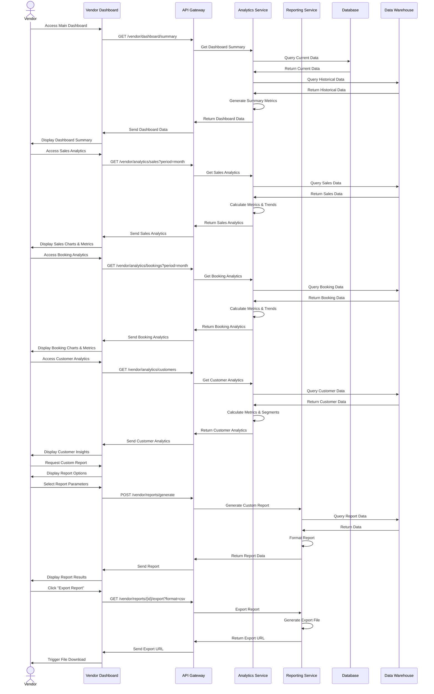

# Vendor Dashboard Operations Flow - Detailed Sequence Diagram (Level 2)

## Overview
This document provides a detailed Level 2 sequence diagram for the vendor dashboard operations in the PetPro platform. The diagram shows the step-by-step flow for managing bookings, orders, inventory, services, and analytics through the vendor dashboard.

## 1. Booking Management Flow

```mermaid
sequenceDiagram
    actor Vendor
    participant WebPortal as Vendor Dashboard
    participant APIGateway as API Gateway
    participant BookingService as Booking Service
    participant NotificationService as Notification Service
    participant CalendarService as Calendar Service
    participant DB as Database
    participant MobileApp as Customer Mobile App
    actor Customer

    %% View Bookings
    Vendor->>WebPortal: Access Booking Dashboard
    WebPortal->>APIGateway: GET /vendor/bookings?status=all
    APIGateway->>BookingService: Get Vendor Bookings
    BookingService->>DB: Query Bookings
    DB->>BookingService: Return Bookings Data
    BookingService->>APIGateway: Return Bookings List
    APIGateway->>WebPortal: Send Bookings Data
    WebPortal->>Vendor: Display Bookings Calendar/List
    
    %% Booking Calendar View
    Vendor->>WebPortal: Switch to Calendar View
    WebPortal->>APIGateway: GET /vendor/calendar?view=week&date=YYYY-MM-DD
    APIGateway->>CalendarService: Get Calendar Data
    CalendarService->>DB: Query Calendar Events
    DB->>CalendarService: Return Calendar Data
    CalendarService->>APIGateway: Return Calendar View
    APIGateway->>WebPortal: Send Calendar Data
    WebPortal->>Vendor: Display Interactive Calendar
    
    %% View Booking Details
    Vendor->>WebPortal: Select Booking
    WebPortal->>APIGateway: GET /vendor/bookings/{id}
    APIGateway->>BookingService: Get Booking Details
    BookingService->>DB: Query Booking Data
    DB->>BookingService: Return Booking Details
    BookingService->>APIGateway: Return Booking Data
    APIGateway->>WebPortal: Send Booking Details
    WebPortal->>Vendor: Display Booking Details
    
    %% Approve/Confirm Booking
    alt Approve Booking
        Vendor->>WebPortal: Click "Approve Booking"
        WebPortal->>APIGateway: PUT /vendor/bookings/{id}/approve
        APIGateway->>BookingService: Update Booking Status
        BookingService->>DB: Update Status to CONFIRMED
        DB->>BookingService: Confirm Update
        
        BookingService->>NotificationService: Send Confirmation Notification
        NotificationService->>MobileApp: Send Push Notification
        MobileApp->>Customer: Show Booking Confirmation
        NotificationService->>Customer: Send Email Confirmation
        
        BookingService->>APIGateway: Return Updated Status
        APIGateway->>WebPortal: Send Status Update
        WebPortal->>Vendor: Show Confirmation Success
    end
    
    %% Reschedule Booking
    alt Reschedule Booking
        Vendor->>WebPortal: Click "Reschedule"
        WebPortal->>APIGateway: GET /vendor/availability?date=YYYY-MM-DD
        APIGateway->>CalendarService: Get Available Slots
        CalendarService->>DB: Query Availability
        DB->>CalendarService: Return Available Slots
        CalendarService->>APIGateway: Return Availability
        APIGateway->>WebPortal: Send Available Slots
        WebPortal->>Vendor: Display Available Time Slots
        
        Vendor->>WebPortal: Select New Time Slot
        WebPortal->>APIGateway: PUT /vendor/bookings/{id}/reschedule
        APIGateway->>BookingService: Process Reschedule
        BookingService->>DB: Update Booking Time
        DB->>BookingService: Confirm Update
        
        BookingService->>NotificationService: Send Reschedule Notification
        NotificationService->>MobileApp: Send Push Notification
        MobileApp->>Customer: Show Booking Update
        NotificationService->>Customer: Send Email Notification
        
        BookingService->>APIGateway: Return Updated Booking
        APIGateway->>WebPortal: Send Updated Booking
        WebPortal->>Vendor: Show Reschedule Success
    end
    
    %% Cancel Booking
    alt Cancel Booking
        Vendor->>WebPortal: Click "Cancel Booking"
        WebPortal->>Vendor: Confirm Cancellation Reason
        Vendor->>WebPortal: Provide Cancellation Reason
        WebPortal->>APIGateway: PUT /vendor/bookings/{id}/cancel
        APIGateway->>BookingService: Process Cancellation
        BookingService->>DB: Update Status to CANCELLED_BY_VENDOR
        DB->>BookingService: Confirm Update
        
        BookingService->>NotificationService: Send Cancellation Notification
        NotificationService->>MobileApp: Send Push Notification
        MobileApp->>Customer: Show Booking Cancellation
        NotificationService->>Customer: Send Email Notification
        
        BookingService->>APIGateway: Return Updated Status
        APIGateway->>WebPortal: Send Status Update
        WebPortal->>Vendor: Show Cancellation Success
    end
    
    %% Check-in/Complete Booking
    alt Check-in Customer
        Vendor->>WebPortal: Click "Check-in Customer"
        WebPortal->>APIGateway: PUT /vendor/bookings/{id}/check-in
        APIGateway->>BookingService: Process Check-in
        BookingService->>DB: Update Status to IN_PROGRESS
        DB->>BookingService: Confirm Update
        BookingService->>APIGateway: Return Updated Status
        APIGateway->>WebPortal: Send Status Update
        WebPortal->>Vendor: Show Check-in Success
    end
    
    alt Complete Booking
        Vendor->>WebPortal: Click "Complete Service"
        WebPortal->>APIGateway: PUT /vendor/bookings/{id}/complete
        APIGateway->>BookingService: Process Completion
        BookingService->>DB: Update Status to COMPLETED
        DB->>BookingService: Confirm Update
        
        BookingService->>NotificationService: Send Completion Notification
        NotificationService->>MobileApp: Send Push Notification
        MobileApp->>Customer: Prompt for Review
        
        BookingService->>APIGateway: Return Updated Status
        APIGateway->>WebPortal: Send Status Update
        WebPortal->>Vendor: Show Completion Success
    end
```

## 2. Order Management Flow

```mermaid
sequenceDiagram
    actor Vendor
    participant WebPortal as Vendor Dashboard
    participant APIGateway as API Gateway
    participant OrderService as Order Service
    participant InventoryService as Inventory Service
    participant ShippingService as Shipping Service
    participant NotificationService as Notification Service
    participant DB as Database
    participant MobileApp as Customer Mobile App
    actor Customer

    %% View Orders
    Vendor->>WebPortal: Access Orders Dashboard
    WebPortal->>APIGateway: GET /vendor/orders?status=all
    APIGateway->>OrderService: Get Vendor Orders
    OrderService->>DB: Query Orders
    DB->>OrderService: Return Orders Data
    OrderService->>APIGateway: Return Orders List
    APIGateway->>WebPortal: Send Orders Data
    WebPortal->>Vendor: Display Orders List
    
    %% View Order Details
    Vendor->>WebPortal: Select Order
    WebPortal->>APIGateway: GET /vendor/orders/{id}
    APIGateway->>OrderService: Get Order Details
    OrderService->>DB: Query Order Data
    DB->>OrderService: Return Order Details
    OrderService->>APIGateway: Return Order Data
    APIGateway->>WebPortal: Send Order Details
    WebPortal->>Vendor: Display Order Details
    
    %% Process Order
    Vendor->>WebPortal: Click "Process Order"
    WebPortal->>APIGateway: PUT /vendor/orders/{id}/process
    APIGateway->>OrderService: Update Order Status
    OrderService->>DB: Update Status to PREPARING
    DB->>OrderService: Confirm Update
    
    OrderService->>InventoryService: Reserve Inventory
    InventoryService->>DB: Update Inventory
    DB->>InventoryService: Confirm Update
    
    OrderService->>NotificationService: Send Processing Notification
    NotificationService->>MobileApp: Send Push Notification
    MobileApp->>Customer: Show Order Status Update
    NotificationService->>Customer: Send Email Update
    
    OrderService->>APIGateway: Return Updated Status
    APIGateway->>WebPortal: Send Status Update
    WebPortal->>Vendor: Show Processing Started
    
    %% Ship Order
    Vendor->>WebPortal: Click "Ship Order"
    WebPortal->>Vendor: Request Shipping Information
    Vendor->>WebPortal: Enter Tracking Number & Carrier
    WebPortal->>APIGateway: PUT /vendor/orders/{id}/ship
    APIGateway->>OrderService: Update Order Status
    OrderService->>DB: Update Status to SHIPPED
    DB->>OrderService: Confirm Update
    
    OrderService->>ShippingService: Record Shipping Info
    ShippingService->>DB: Store Tracking Information
    DB->>ShippingService: Confirm Storage
    
    OrderService->>NotificationService: Send Shipping Notification
    NotificationService->>MobileApp: Send Push Notification
    MobileApp->>Customer: Show Shipping Update
    NotificationService->>Customer: Send Email with Tracking
    
    OrderService->>APIGateway: Return Updated Status
    APIGateway->>WebPortal: Send Status Update
    WebPortal->>Vendor: Show Shipping Success
    
    %% Cancel Order
    alt Cancel Order (if allowed)
        Vendor->>WebPortal: Click "Cancel Order"
        WebPortal->>Vendor: Confirm Cancellation Reason
        Vendor->>WebPortal: Provide Cancellation Reason
        WebPortal->>APIGateway: PUT /vendor/orders/{id}/cancel
        APIGateway->>OrderService: Process Cancellation
        OrderService->>DB: Update Status to CANCELLED_BY_VENDOR
        DB->>OrderService: Confirm Update
        
        OrderService->>InventoryService: Return Items to Inventory
        InventoryService->>DB: Update Inventory
        DB->>InventoryService: Confirm Update
        
        OrderService->>NotificationService: Send Cancellation Notification
        NotificationService->>MobileApp: Send Push Notification
        MobileApp->>Customer: Show Order Cancellation
        NotificationService->>Customer: Send Email Notification
        
        OrderService->>APIGateway: Return Updated Status
        APIGateway->>WebPortal: Send Status Update
        WebPortal->>Vendor: Show Cancellation Success
    end
    
    %% Process Return
    alt Process Return Request
        Vendor->>WebPortal: Access Return Request
        WebPortal->>APIGateway: GET /vendor/returns/{id}
        APIGateway->>OrderService: Get Return Details
        OrderService->>DB: Query Return Data
        DB->>OrderService: Return Return Details
        OrderService->>APIGateway: Return Return Data
        APIGateway->>WebPortal: Send Return Details
        WebPortal->>Vendor: Display Return Request
        
        Vendor->>WebPortal: Approve Return
        WebPortal->>APIGateway: PUT /vendor/returns/{id}/approve
        APIGateway->>OrderService: Process Return Approval
        OrderService->>DB: Update Return Status
        DB->>OrderService: Confirm Update
        
        OrderService->>NotificationService: Send Return Approval
        NotificationService->>MobileApp: Send Push Notification
        MobileApp->>Customer: Show Return Approval
        NotificationService->>Customer: Send Email with Return Instructions
        
        OrderService->>APIGateway: Return Updated Status
        APIGateway->>WebPortal: Send Status Update
        WebPortal->>Vendor: Show Return Approval Success
        
        %% Process Refund after Return Received
        Vendor->>WebPortal: Mark Return as Received
        WebPortal->>APIGateway: PUT /vendor/returns/{id}/received
        APIGateway->>OrderService: Process Return Receipt
        OrderService->>DB: Update Return Status
        DB->>OrderService: Confirm Update
        
        OrderService->>InventoryService: Return Items to Inventory
        InventoryService->>DB: Update Inventory
        DB->>InventoryService: Confirm Update
        
        OrderService->>NotificationService: Send Refund Processing
        NotificationService->>MobileApp: Send Push Notification
        MobileApp->>Customer: Show Refund Processing
        NotificationService->>Customer: Send Email Notification
        
        OrderService->>APIGateway: Return Updated Status
        APIGateway->>WebPortal: Send Status Update
        WebPortal->>Vendor: Show Return Completed
    end
```

## 3. Inventory & Service Management Flow

```mermaid
sequenceDiagram
    actor Vendor
    participant WebPortal as Vendor Dashboard
    participant APIGateway as API Gateway
    participant ProductService as Product Service
    participant InventoryService as Inventory Service
    participant ServiceCatalog as Service Catalog
    participant DB as Database
    participant Storage as File Storage

    %% Inventory Management
    Vendor->>WebPortal: Access Inventory Management
    WebPortal->>APIGateway: GET /vendor/products?page=1&limit=20
    APIGateway->>ProductService: Get Vendor Products
    ProductService->>DB: Query Products
    DB->>ProductService: Return Products Data
    ProductService->>APIGateway: Return Products List
    APIGateway->>WebPortal: Send Products Data
    WebPortal->>Vendor: Display Products Grid
    
    %% Add New Product
    Vendor->>WebPortal: Click "Add New Product"
    WebPortal->>Vendor: Display Product Form
    Vendor->>WebPortal: Enter Product Details & Upload Images
    WebPortal->>APIGateway: POST /vendor/products
    APIGateway->>ProductService: Process New Product
    
    ProductService->>Storage: Store Product Images
    Storage->>ProductService: Return Image URLs
    
    ProductService->>DB: Create Product Record
    DB->>ProductService: Confirm Creation
    
    ProductService->>InventoryService: Initialize Inventory
    InventoryService->>DB: Create Inventory Record
    DB->>InventoryService: Confirm Creation
    
    ProductService->>APIGateway: Return Product Created
    APIGateway->>WebPortal: Send Product Creation Success
    WebPortal->>Vendor: Show Product Added Confirmation
    
    %% Update Product
    Vendor->>WebPortal: Select Product to Edit
    WebPortal->>APIGateway: GET /vendor/products/{id}
    APIGateway->>ProductService: Get Product Details
    ProductService->>DB: Query Product
    DB->>ProductService: Return Product Details
    ProductService->>APIGateway: Return Product Data
    APIGateway->>WebPortal: Send Product Details
    WebPortal->>Vendor: Display Edit Product Form
    
    Vendor->>WebPortal: Update Product Information
    WebPortal->>APIGateway: PUT /vendor/products/{id}
    APIGateway->>ProductService: Process Product Update
    
    ProductService->>DB: Update Product Record
    DB->>ProductService: Confirm Update
    
    ProductService->>APIGateway: Return Product Updated
    APIGateway->>WebPortal: Send Update Success
    WebPortal->>Vendor: Show Update Confirmation
    
    %% Update Inventory
    Vendor->>WebPortal: Access Stock Management
    WebPortal->>APIGateway: GET /vendor/inventory
    APIGateway->>InventoryService: Get Inventory Status
    InventoryService->>DB: Query Inventory
    DB->>InventoryService: Return Inventory Data
    InventoryService->>APIGateway: Return Inventory List
    APIGateway->>WebPortal: Send Inventory Data
    WebPortal->>Vendor: Display Inventory Grid
    
    Vendor->>WebPortal: Update Stock Quantities
    WebPortal->>APIGateway: PUT /vendor/inventory/batch
    APIGateway->>InventoryService: Process Inventory Updates
    InventoryService->>DB: Update Inventory Records
    DB->>InventoryService: Confirm Updates
    InventoryService->>APIGateway: Return Update Success
    APIGateway->>WebPortal: Send Update Confirmation
    WebPortal->>Vendor: Show Inventory Updated
    
    %% Service Management
    Vendor->>WebPortal: Access Service Management
    WebPortal->>APIGateway: GET /vendor/services
    APIGateway->>ServiceCatalog: Get Vendor Services
    ServiceCatalog->>DB: Query Services
    DB->>ServiceCatalog: Return Services Data
    ServiceCatalog->>APIGateway: Return Services List
    APIGateway->>WebPortal: Send Services Data
    WebPortal->>Vendor: Display Services List
    
    %% Add New Service
    Vendor->>WebPortal: Click "Add New Service"
    WebPortal->>Vendor: Display Service Form
    Vendor->>WebPortal: Enter Service Details
    WebPortal->>APIGateway: POST /vendor/services
    APIGateway->>ServiceCatalog: Process New Service
    ServiceCatalog->>DB: Create Service Record
    DB->>ServiceCatalog: Confirm Creation
    ServiceCatalog->>APIGateway: Return Service Created
    APIGateway->>WebPortal: Send Service Creation Success
    WebPortal->>Vendor: Show Service Added Confirmation
    
    %% Update Service
    Vendor->>WebPortal: Select Service to Edit
    WebPortal->>APIGateway: GET /vendor/services/{id}
    APIGateway->>ServiceCatalog: Get Service Details
    ServiceCatalog->>DB: Query Service
    DB->>ServiceCatalog: Return Service Details
    ServiceCatalog->>APIGateway: Return Service Data
    APIGateway->>WebPortal: Send Service Details
    WebPortal->>Vendor: Display Edit Service Form
    
    Vendor->>WebPortal: Update Service Information
    WebPortal->>APIGateway: PUT /vendor/services/{id}
    APIGateway->>ServiceCatalog: Process Service Update
    ServiceCatalog->>DB: Update Service Record
    DB->>ServiceCatalog: Confirm Update
    ServiceCatalog->>APIGateway: Return Service Updated
    APIGateway->>WebPortal: Send Update Success
    WebPortal->>Vendor: Show Update Confirmation
```

## 4. Dashboard & Analytics Flow

## Error Handling Details

### Error Scenarios in Vendor Dashboard Operations

1. **Booking Management Issues**:
   - Double-booking attempt
   - Booking time outside business hours
   - Staff unavailable for service
   - Response: 400 Bad Request with specific reason

2. **Order Processing Failures**:
   - Product out of stock
   - Invalid shipping information
   - Order already processed
   - Response: 409 Conflict with explanation

3. **Inventory Management Issues**:
   - Negative stock values
   - Inventory count mismatch
   - Response: 400 Bad Request with validation errors

4. **Service Configuration Errors**:
   - Invalid service duration
   - Price outside allowed range
   - Duplicate service
   - Response: 400 Bad Request with validation details

5. **Analytics/Reporting Errors**:
   - Invalid date range
   - Missing required parameters
   - Data processing timeout
   - Response: 400 Bad Request or 408 Request Timeout

### Business Rules

1. **Booking Management Rules**:
   - Bookings must be confirmed within 24 hours
   - Vendor cancellations less than 24 hours before appointment incur penalty
   - Maximum concurrent bookings based on staff availability
   - Check-in allowed 15 minutes before appointment time

2. **Order Processing Rules**:
   - Orders must be processed within 48 hours
   - Shipping information required for physical products
   - Order status updates trigger customer notifications
   - Return approvals must be processed within 3 business days

3. **Inventory Rules**:
   - Low stock threshold configurable per product
   - Automatic notifications when stock below threshold
   - Inventory adjustments require reason documentation
   - Batch updates allowed for efficiency

4. **Service Management Rules**:
   - Service price changes take effect after 24 hours
   - Service availability tied to staff scheduling
   - Service duration must be in 15-minute increments
   - Maximum 20 active service categories per vendor

5. **Dashboard & Analytics Rules**:
   - Real-time data available for current day
   - Historical data aggregated nightly
   - Custom reports limited to 12-month lookback
   - Export formats include CSV, PDF, and Excel

## Implementation Notes

1. **User Experience**:
   - Calendar interface with drag-and-drop functionality
   - Real-time notifications of new bookings/orders
   - Mobile-responsive dashboard design
   - Role-based access control for staff members

2. **Performance**:
   - Dashboard summary data cached for 15 minutes
   - Pagination for large data sets (orders/inventory)
   - Analytics queries optimized for speed
   - Background processing for report generation

3. **Scalability**:
   - Vendor dashboard services horizontally scalable
   - Analytics using separate data warehouse
   - Report generation via worker pools
   - Batch processing for inventory updates

## Japanese Translation / 日本語訳

### 概要
このドキュメントでは、PetProプラットフォームにおけるベンダーダッシュボード操作の詳細なレベル2シーケンス図を提供します。この図は、予約管理、注文管理、在庫管理、サービス管理、および分析のステップバイステップのフローを示しています。

### エラー処理の詳細

#### ベンダーダッシュボード操作におけるエラーシナリオ

1. **予約管理の問題**:
   - 二重予約の試み
   - 営業時間外の予約時間
   - スタッフがサービスに利用できない
   - レスポンス: 特定の理由を含む400 Bad Request

2. **注文処理の失敗**:
   - 商品の在庫切れ
   - 無効な配送情報
   - すでに処理された注文
   - レスポンス: 説明を含む409 Conflict

3. **在庫管理の問題**:
   - 負の在庫値
   - 在庫数の不一致
   - レスポンス: バリデーションエラーを含む400 Bad Request

4. **サービス設定エラー**:
   - 無効なサービス時間
   - 許可範囲外の価格
   - サービスの重複
   - レスポンス: バリデーションの詳細を含む400 Bad Request

5. **分析/レポートのエラー**:
   - 無効な日付範囲
   - 必要なパラメータの欠落
   - データ処理タイムアウト
   - レスポンス: 400 Bad Requestまたは408 Request Timeout

#### ビジネスルール

1. **予約管理ルール**:
   - 予約は24時間以内に確認する必要がある
   - 予約の24時間未満前のベンダーによるキャンセルはペナルティが発生する
   - スタッフの可用性に基づく最大同時予約数
   - チェックインは予約時間の15分前から許可される

2. **注文処理ルール**:
   - 注文は48時間以内に処理する必要がある
   - 物理的な商品には配送情報が必要
   - 注文ステータスの更新は顧客通知をトリガーする
   - 返品承認は3営業日以内に処理する必要がある

3. **在庫ルール**:
   - 商品ごとに設定可能な在庫不足しきい値
   - しきい値を下回った場合の自動通知
   - 在庫調整には理由の文書化が必要
   - 効率性のためのバッチ更新が許可される

4. **サービス管理ルール**:
   - サービス価格の変更は24時間後に有効になる
   - サービスの利用可能性はスタッフのスケジュールに関連している
   - サービス時間は15分単位である必要がある
   - ベンダーごとに最大20のアクティブなサービスカテゴリ

5. **ダッシュボードと分析のルール**:
   - 当日のリアルタイムデータが利用可能
   - 履歴データは毎晩集計される
   - カスタムレポートは12ヶ月のルックバックに制限される
   - エクスポート形式にはCSV、PDF、およびExcelが含まれる

#### 実装メモ

1. **ユーザーエクスペリエンス**:
   - ドラッグアンドドロップ機能を備えたカレンダーインターフェース
   - 新規予約/注文のリアルタイム通知
   - モバイル対応のダッシュボードデザイン
   - スタッフメンバー向けのロールベースアクセス制御

2. **パフォーマンス**:
   - ダッシュボードの概要データは15分間キャッシュされる
   - 大規模なデータセット（注文/在庫）のページネーション
   - 速度に最適化された分析クエリ
   - レポート生成のためのバックグラウンド処理

3. **スケーラビリティ**:
   - 水平方向にスケーラブルなベンダーダッシュボードサービス
   - 個別のデータウェアハウスを使用した分析
   - ワーカープールによるレポート生成
   - 在庫更新のためのバッチ処理
