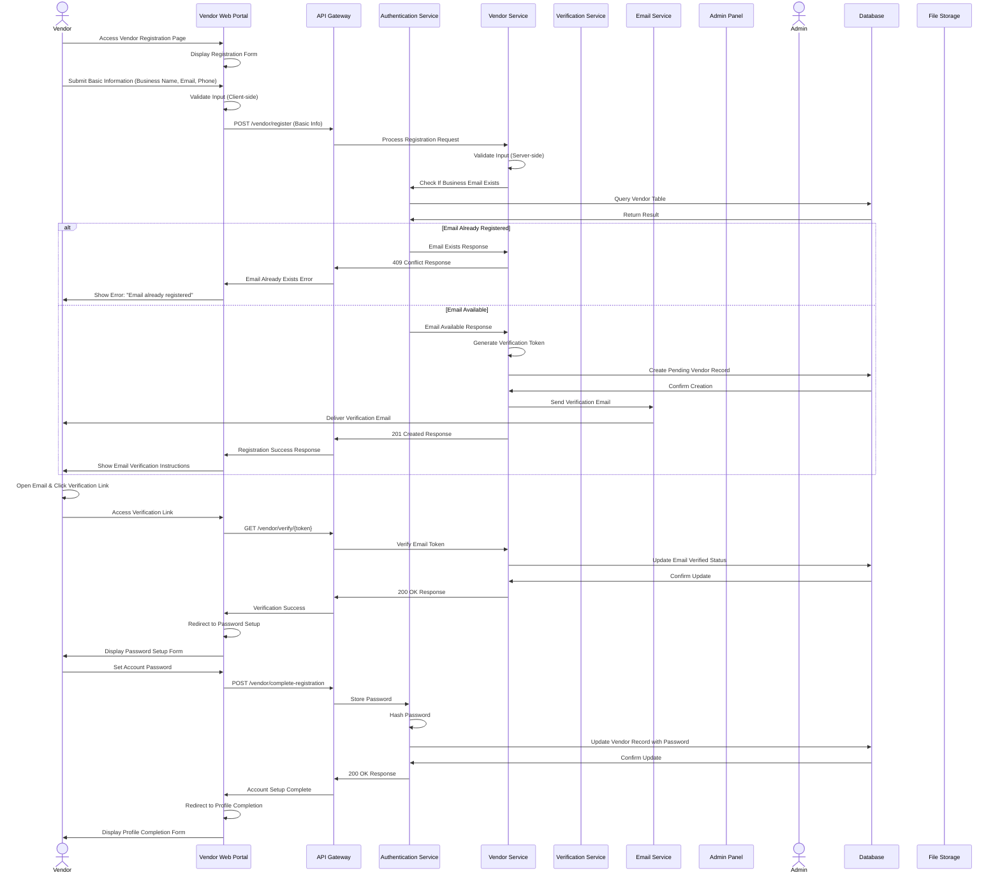
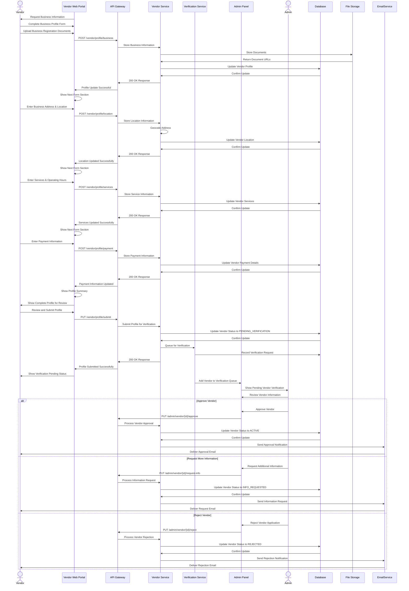
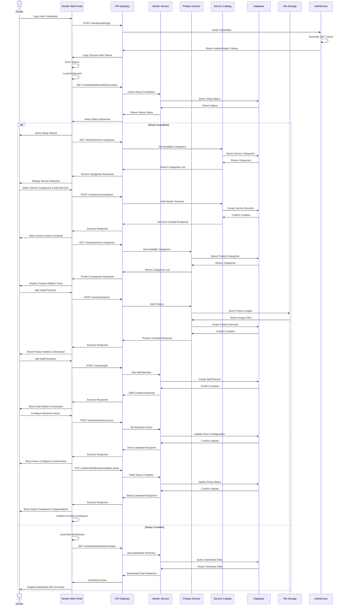

# Vendor Registration & Onboarding Flow - Detailed Sequence Diagram (Level 2)

## Overview
This document provides a detailed Level 2 sequence diagram for the vendor registration and onboarding process in the PetPro platform. The diagram shows the step-by-step flow between the vendor, web portal, backend services, and administrative systems.

## 1. Vendor Registration Flow

## 2. Business Profile & Verification Flow

## 3. Vendor Dashboard Initial Setup

## Error Handling Details

### Error Scenarios During Vendor Registration

1. **Validation Errors**:
   - Business email format invalid
   - Required business information missing
   - Response: 400 Bad Request with specific validation errors

2. **Verification Failures**:
   - Invalid or expired verification token
   - Business already registered
   - Response: 409 Conflict or 400 Bad Request with specific message

3. **Document Upload Issues**:
   - File too large
   - Invalid file format
   - Upload failed
   - Response: 413 Payload Too Large or 400 Bad Request

4. **Business Verification Failures**:
   - Business information cannot be verified
   - Business license expired or invalid
   - Response: Application moves to VERIFICATION_FAILED status

5. **Address Validation Issues**:
   - Address cannot be geocoded
   - Address not found
   - Response: 400 Bad Request with address validation error

### Business Rules

1. **Registration Requirements**:
   - Valid business email required
   - Business registration documents required
   - Physical address verification required
   - At least one service category must be offered

2. **Verification Process**:
   - Email verification mandatory
   - Business document verification required
   - Address verification required
   - Admin approval required before activation

3. **Password Policy**:
   - Minimum 10 characters
   - At least one uppercase letter
   - At least one lowercase letter
   - At least one number
   - At least one special character

4. **Service Catalog Rules**:
   - Minimum 1 service required
   - Maximum 50 services per vendor
   - Service pricing must be within platform guidelines
   - Service duration must be in 15-minute increments

5. **Operating Hours**:
   - At least 3 business days per week required
   - Minimum 4 operating hours per business day
   - Buffer time between appointments configurable (default: 15 minutes)

## Implementation Notes

1. **Security Considerations**:
   - Business documents stored with encryption at rest
   - Secure document viewing for admin verification
   - Role-based access control for staff accounts
   - Audit log of all profile changes

2. **Performance**:
   - Registration form multi-step process with state preservation
   - Document upload with compression and optimization
   - Asynchronous verification process

3. **Scalability**:
   - Vendor verification queues distributed by region
   - Document storage with CDN for optimized retrieval
   - Separate scaling for vendor authentication service

## Japanese Translation / 日本語訳

### 概要
このドキュメントでは、PetProプラットフォームにおけるベンダー登録とオンボーディングプロセスの詳細なレベル2シーケンス図を提供します。この図は、ベンダー、Webポータル、バックエンドサービス、管理システム間のステップバイステップのフローを示しています。

### エラー処理の詳細

#### ベンダー登録中のエラーシナリオ

1. **バリデーションエラー**:
   - ビジネスメールの形式が無効
   - 必要なビジネス情報の欠落
   - レスポンス: 特定のバリデーションエラーを含む400 Bad Request

2. **検証の失敗**:
   - 無効または期限切れの検証トークン
   - ビジネスがすでに登録されている
   - レスポンス: 特定のメッセージを含む409 Conflictまたは400 Bad Request

3. **ドキュメントアップロードの問題**:
   - ファイルサイズが大きすぎる
   - 無効なファイル形式
   - アップロード失敗
   - レスポンス: 413 Payload Too Largeまたは400 Bad Request

4. **ビジネス検証の失敗**:
   - ビジネス情報を検証できない
   - ビジネスライセンスの期限切れまたは無効
   - レスポンス: アプリケーションはVERIFICATION_FAILEDステータスに移行

5. **住所検証の問題**:
   - 住所をジオコーディングできない
   - 住所が見つからない
   - レスポンス: 住所検証エラーを含む400 Bad Request

#### ビジネスルール

1. **登録要件**:
   - 有効なビジネスメールが必要
   - ビジネス登録書類が必要
   - 物理的な住所検証が必要
   - 少なくとも1つのサービスカテゴリを提供する必要がある

2. **検証プロセス**:
   - メール検証は必須
   - ビジネス書類の検証が必要
   - 住所検証が必要
   - 有効化前に管理者の承認が必要

3. **パスワードポリシー**:
   - 最低10文字
   - 少なくとも1つの大文字
   - 少なくとも1つの小文字
   - 少なくとも1つの数字
   - 少なくとも1つの特殊文字

4. **サービスカタログのルール**:
   - 最低1つのサービスが必要
   - ベンダーごとに最大50のサービス
   - サービス価格はプラットフォームのガイドライン内である必要がある
   - サービス時間は15分単位である必要がある

5. **営業時間**:
   - 週に少なくとも3営業日が必要
   - 営業日あたり最低4時間の営業時間
   - 予約間のバッファ時間は設定可能（デフォルト：15分）

#### 実装メモ

1. **セキュリティに関する考慮事項**:
   - ビジネス書類は保存時に暗号化
   - 管理者検証のための安全な書類閲覧
   - スタッフアカウントのロールベースアクセス制御
   - すべてのプロファイル変更の監査ログ

2. **パフォーマンス**:
   - 状態保存を伴う多段階の登録フォームプロセス
   - 圧縮と最適化を伴うドキュメントアップロード
   - 非同期検証プロセス

3. **スケーラビリティ**:
   - 地域ごとに分散されたベンダー検証キュー
   - 最適化された取得のためのCDNを備えたドキュメントストレージ
   - ベンダー認証サービスの個別スケーリング
