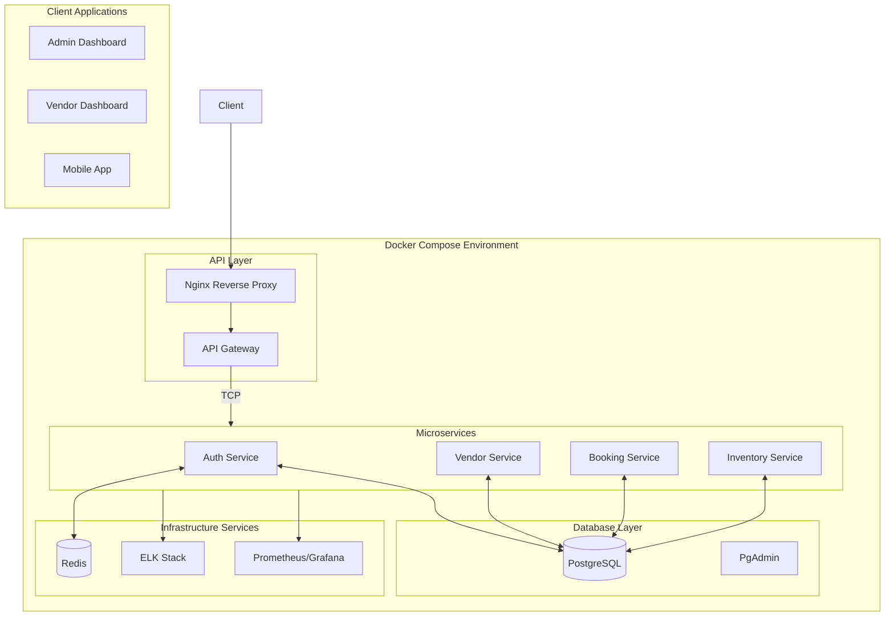

# PetPro Microservices Architecture (NestJS & Sequelize)

## Architecture Overview

The PetPro platform has been implemented as a true microservices architecture using NestJS as the framework and Sequelize for database operations. Each service is independently deployable, with its own database schema managed by Sequelize.

```mermaid
flowchart TB
    subgraph Client
        Mobile[Mobile App]
        WebVendor[Vendor Dashboard]
        WebAdmin[Admin Dashboard]
    end

    Gateway[API Gateway (NestJS)]
    
    subgraph Microservices
        AuthSvc[Auth Service\nNestJS + Sequelize]
        VendorSvc[Vendor Service\nNestJS + Sequelize]
        BookingSvc[Booking Service\nNestJS + Sequelize]
        InventorySvc[Inventory/Product Service\nNestJS + Sequelize]
        PaymentSvc[Payment Service\nNestJS + Sequelize (Planned)]
    end
    
    subgraph Infrastructure
        Postgres[(PostgreSQL)]
        Redis[(Redis)]
        Elasticsearch[(Elasticsearch)]
        Prometheus[(Prometheus\nGrafana)]
    end
    
    Client -- HTTP/REST --> Gateway
    Gateway -- TCP --> Microservices
    
    AuthSvc <--> Postgres
    VendorSvc <--> Postgres
    BookingSvc <--> Postgres
    BookingSvc <--> Redis
    InventorySvc <--> Postgres
    PaymentSvc <-- Planned --> Postgres
    
    BookingSvc -- Events --> VendorSvc
    BookingSvc -- Events --> InventorySvc
    VendorSvc -- Events --> BookingSvc
    
    Microservices --> Elasticsearch
    Microservices --> Prometheus
```

## Microservices Breakdown

Each microservice has detailed API documentation available in the `/docs/api/` directory:
- [Booking Service API](../api/booking-service-api.md)
- [Vendor Service API](../api/vendor-service-api.md)
- [Inventory Service API](../api/inventory-service-api.md)

### 1. API Gateway (NestJS)
- **Responsibilities**: Routes API requests to appropriate microservices, handles authentication via JWT, and manages client communication
- **Key Components**:
  - Route configuration for all microservices
  - Authentication middleware (JWT validation)
  - Role-based access control
  - Request logging
  - TCP client communication with microservices
- **Technologies**: NestJS, Express.js
- **Implementation Status**: ✅ Completed

### 2. Auth Service (NestJS + Sequelize)
- **Responsibilities**: User authentication, authorization, token management
- **Database Tables**:
  - users
  - roles
  - permissions
  - refresh_tokens
- **APIs**:
  - POST /auth/register
  - POST /auth/login
  - POST /auth/refresh-token
  - POST /auth/logout
  - GET /auth/me
- **Message Patterns** (TCP):
  - auth.validate
  - auth.register
  - auth.login
  - auth.logout
  - user.findOne
- **Events Published**:
  - UserRegistered
  - UserLoggedIn
  - PasswordChanged
- **Implementation Status**: ✅ Completed

### 3. Vendor Service (NestJS + Sequelize)
- **Responsibilities**: Vendor and clinic management, service catalog
- **Database Tables**:
  - vendors
  - clinics
  - clinic_services
  - staff
  - operating_hours
- **APIs**:
  - CRUD for vendors/clinics
  - CRUD for clinic services
  - Staff management
  - Operating hours management
- **Message Patterns** (TCP):
  - vendor.findAll
  - vendor.findOne
  - vendor.create
  - vendor.update
  - vendor.remove
  - service.findAll
  - service.findOne
  - staff.findAll
  - staff.findOne
- **Events Published**:
  - VendorRegistered
  - VendorUpdated
  - ClinicServicesUpdated
  - StaffAdded/Updated/Removed
- **Implementation Status**: ✅ Completed

### 4. Booking Service (NestJS + Sequelize)
- **Responsibilities**: Appointment scheduling, availability management
- **Database Tables**:
  - bookings
  - services
  - pets
  - service_availability
- **APIs**:
  - GET /bookings - List bookings with filters
  - GET /bookings/:id - Get booking details
  - POST /bookings - Create new booking
  - PUT /bookings/:id - Update booking
  - DELETE /bookings/:id - Cancel booking
  - GET /bookings/services - List available services
  - GET /bookings/availability - Check service availability
- **Message Patterns** (TCP):
  - booking.findAll
  - booking.findOne
  - booking.create
  - booking.update
  - booking.cancel
  - booking.confirm
  - service.findAll
  - service.findOne
  - availability.findAll
- **Events Published**:
  - BookingCreated
  - BookingUpdated
  - BookingCancelled
  - BookingConfirmed
- **Special Features**: Role-based access control for booking operations
- **Implementation Status**: ✅ Completed

### 5. Inventory/Product Service (NestJS + Sequelize)
- **Responsibilities**: Product catalog, inventory management
- **Database Tables**:
  - products
  - product_categories
  - inventory
  - product_images
- **APIs**:
  - GET /products - List products with filters
  - GET /products/:id - Get product details
  - POST /products - Create product
  - PUT /products/:id - Update product
  - DELETE /products/:id - Delete product
  - GET /categories - List product categories
  - GET /inventory - Check inventory levels
  - PUT /inventory/:id - Update inventory
- **Message Patterns** (TCP):
  - product.findAll
  - product.findOne
  - product.create
  - product.update
  - product.remove
  - category.findAll
  - category.findOne
  - inventory.findAll
  - inventory.update
- **Events Published**:
  - ProductCreated
  - ProductUpdated
  - InventoryChanged
  - CategoryUpdated
- **Implementation Status**: ✅ Completed

### 6. Payment Service (NestJS + Sequelize) - Planned
- **Responsibilities**: Payment processing, integration with payment gateways
- **Database Tables**:
  - payments
  - payment_methods
  - payment_transactions
- **APIs**:
  - Process payment
  - Payment status check
  - Refund processing
- **Message Patterns** (TCP) - Planned:
  - payment.process
  - payment.status
  - payment.refund
  - payment.methods
- **Events Published** - Planned:
  - PaymentProcessed
  - PaymentFailed
  - RefundProcessed
- **Implementation Status**: 🔄 Planned

## Database Design with Sequelize

Each microservice has its own database schema managed by Sequelize. This ensures data isolation and independence. For each service:

1. **Sequelize Models**: Define models for each entity
2. **Migrations**: Use Sequelize migrations for schema changes
3. **Seeds**: Provide seed data for development environments
   - Development seeders for comprehensive test data
   - Test seeders for minimal data required for automated testing
   - Production seeders for essential reference data
   - See detailed [database seeding documentation](./detailed-architecture/database-seeding.md)
4. **Repositories**: Implement repository pattern for data access

Example model structure for User Service:

```javascript
// User model
module.exports = (sequelize, DataTypes) => {
  const User = sequelize.define('User', {
    id: {
      type: DataTypes.UUID,
      defaultValue: DataTypes.UUIDV4,
      primaryKey: true
    },
    email: {
      type: DataTypes.STRING,
      allowNull: false,
      unique: true,
      validate: {
        isEmail: true
      }
    },
    passwordHash: {
      type: DataTypes.STRING,
      allowNull: false
    },
    firstName: DataTypes.STRING,
    lastName: DataTypes.STRING,
    phoneNumber: DataTypes.STRING,
    status: {
      type: DataTypes.ENUM('active', 'inactive', 'suspended'),
      defaultValue: 'active'
    },
    createdAt: DataTypes.DATE,
    updatedAt: DataTypes.DATE
  });
  
  User.associate = (models) => {
    User.hasMany(models.Pet, { foreignKey: 'userId' });
    User.hasMany(models.Address, { foreignKey: 'userId' });
  };
  
  return User;
};
```

## Communication Patterns

### 1. Synchronous Communication
- **REST APIs**: Primary communication method between clients and the API Gateway
- **TCP Microservices**: NestJS TCP transport for internal service-to-service communication
  - Utilizes a message pattern-based request/response model
  - Structured payloads for type safety
  - Consistent message pattern format: `{ cmd: 'command-name' }`
  - Detailed sequence diagrams available in [microservices-communication.md](./detailed-sequence-diagrams/microservices-communication.md)

### 2. Asynchronous Communication
- **Event-Based Communication**: Using NestJS event emitters for service-internal events
- **Event Handlers**: Services listen for specific events from other services
- **Event Naming Convention**: Domain-based event naming (e.g., `booking.created`, `product.updated`)
- **Event Payload Structure**: Standard event payload with metadata and domain-specific data

### 3. Message Formats
- **REST APIs**: Standard JSON payloads with DTOs for validation
- **TCP Messages**: Structured objects with specific message patterns
- **Events**: Typed event objects with standardized formats

### 4. Service Discovery
- **Static Service Registry**: Service connection details configured in environment variables
- **Health Checks**: Regular health check mechanism to ensure service availability
- **Connection Pooling**: Optimized TCP connections between services

### 5. Communication Sequence Diagrams

Detailed sequence diagrams illustrating key communication flows between microservices are available in the [detailed sequence diagrams](./detailed-sequence-diagrams/microservices-communication.md) documentation, including:

- Authentication flows
- Booking creation process
- Product/Inventory updates
- Vendor registration and approval
- Service availability checks
- Event-driven communication patterns

## Infrastructure Implementation

### 1. Databases
- **PostgreSQL**: Separate database schema for each service with secure connection pooling
  - Optimized for performance with proper memory allocation and connection limits
  - Custom configuration with `postgresql.conf` and `pg_hba.conf` for security
  - Role-based access control with dedicated service users
  - Automated backup system with retention policies

### 2. Caching & State Management
- **Redis**: Used for session storage and caching

### 3. Monitoring & Logging
- **ELK Stack**: Centralized logging with security features:
  - X-Pack security with role-based access
  - Transport layer security with SSL certificates
  - Automated initialization with secure credentials
- **Prometheus & Grafana**: Metrics collection and visualization

### 4. CI/CD
- **GitHub Actions**: Automated workflows for testing and deployment
- **Docker**: Containerized services with optimized configurations
  - Multi-stage builds
  - Health checks
  - Resource management
  - Security hardening

## Development Workflow

1. **Local Development**:
   - Docker Compose for local environment setup
   - Service-specific development workflows

2. **Testing Strategy**:
   - Unit tests for business logic
   - Integration tests for service interactions
   - Contract tests for service boundaries
   - End-to-end tests for critical flows

3. **Deployment Strategy**:
   - Blue-green deployment
   - Canary releases for critical services
   - Automated rollback capabilities

## Current Implementation Status

### Completed Services
1. **API Gateway**
   - Routes API requests to microservices via TCP
   - Handles authentication and authorization
   - Manages client-facing REST endpoints

2. **Auth Service**
   - User authentication and authorization
   - JWT token management
   - User registration and profile management

3. **Vendor Service**
   - Vendor/clinic management
   - Service catalog and staff management
   - Operating hours and availability

4. **Booking Service**
   - Appointment scheduling and management
   - Service availability handling
   - Booking lifecycle (creation, updates, cancellation, confirmation)

5. **Inventory/Product Service**
   - Product catalog management
   - Inventory tracking
   - Category management

### Planned Services
1. **Payment Service**
   - Payment processing with gateway integration
   - Multiple payment methods support
   - Transaction history and refund processing

### Future Considerations
1. **Notification Service**
   - Email, SMS, and push notifications
   - Notification templates and delivery tracking

2. **Analytics Service**
   - Business intelligence reporting
   - User behavior analysis
   - Performance metrics

## Current Deployment Architecture



## Resilience Patterns

1. **Circuit Breaker**: Prevent cascading failures
2. **Retry with Backoff**: Handle transient failures
3. **Bulkhead**: Isolate failures to specific components
4. **Timeout Management**: Prevent hanging requests
5. **Fallback Mechanisms**: Provide degraded functionality when dependencies fail
6. **Health Checks**: Continuous service health monitoring
7. **Cache Management**: Reduce database load and improve resilience

## Security Considerations

1. **API Security**:
   - API Gateway authentication
   - Rate limiting
   - Input validation

2. **Service-to-Service Security**:
   - Mutual TLS authentication
   - Service-specific credentials

3. **Data Security**:
   - Encryption at rest and in transit
   - Data minimization between services

4. **Monitoring & Alerts**:
   - Security event monitoring
   - Anomaly detection
