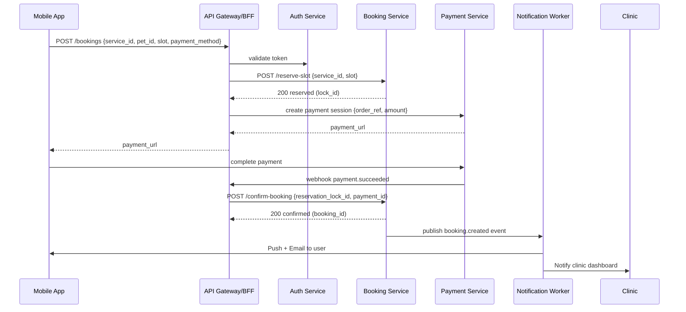

# Sequence Diagrams - PetPro Platform

This document contains sequence diagrams for key processes in the PetPro platform, illustrating the interactions between different components.

## Booking Flow

### Booking Flow Description

1. **Initiate Booking**: 
   - Mobile app sends booking request with service, pet, time slot, and payment method.
   - API Gateway validates user authentication token.

2. **Slot Reservation**:
   - Booking Service temporarily reserves the slot and returns a lock ID.
   - This prevents double-booking while payment is being processed.

3. **Payment Processing**:
   - Payment Service creates a payment session and returns a payment URL.
   - User completes payment through the payment gateway interface.

4. **Booking Confirmation**:
   - Payment gateway sends a webhook notification of successful payment.
   - Booking Service confirms the reservation using the lock ID.
   - Booking Service publishes a booking created event.

5. **Notifications**:
   - Notification Worker sends push notification and email to user.
   - Notification Worker notifies the clinic dashboard about the new booking.
