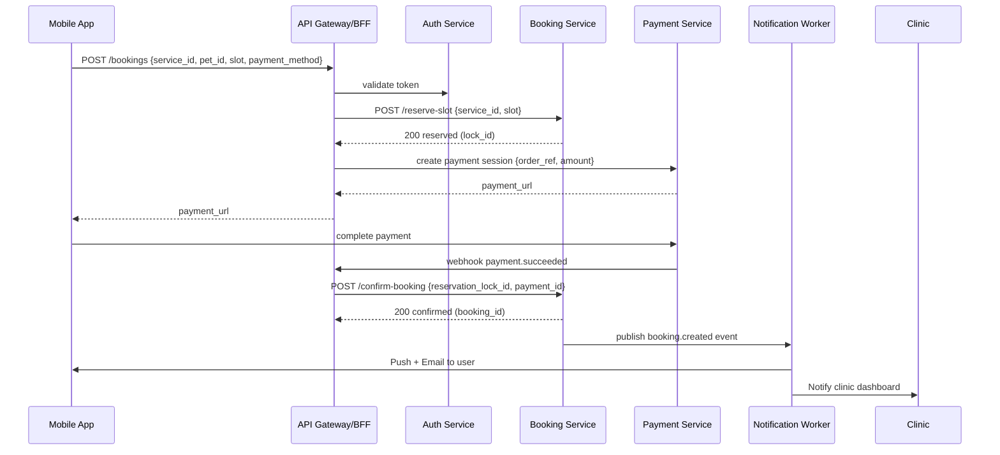
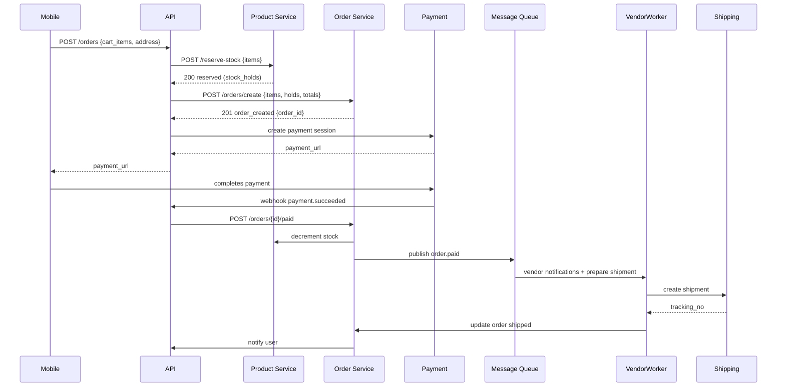
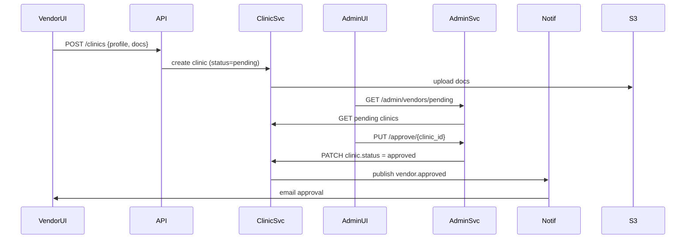

# Sequence Diagrams - PetPro Platform

This document contains sequence diagrams for key processes in the PetPro platform, illustrating the interactions between different components.

## Booking Flow

### Booking Flow Description

1. **Initiate Booking**: 
   - Mobile app sends booking request with service, pet, time slot, and payment method.
   - API Gateway validates user authentication token.

2. **Slot Reservation**:
   - Booking Service temporarily reserves the slot and returns a lock ID.
   - This prevents double-booking while payment is being processed.

3. **Payment Processing**:
   - Payment Service creates a payment session and returns a payment URL.
   - User completes payment through the payment gateway interface.

4. **Booking Confirmation**:
   - Payment gateway sends a webhook notification of successful payment.
   - Booking Service confirms the reservation using the lock ID.
   - Booking Service publishes a booking created event.

5. **Notifications**:
   - Notification Worker sends push notification and email to user.
   - Notification Worker notifies the clinic dashboard about the new booking.

## Order / Checkout Flow

### Order / Checkout Flow Description

1. **Initiate Order**:
   - Mobile app submits order with cart items and shipping address.
   - Product Service temporarily reserves inventory for the items.

2. **Order Creation**:
   - Order Service creates an order record with all details.
   - Payment Service generates a payment session URL.

3. **Payment Processing**:
   - User completes payment through the payment gateway.
   - Payment gateway sends webhook notification of successful payment.

4. **Inventory & Fulfillment**:
   - Order Service confirms the stock deduction.
   - Order Service publishes a payment confirmation event.

5. **Shipping & Notifications**:
   - Vendor Worker receives the order notification.
   - Shipping Service creates shipment and returns tracking number.
   - Order status is updated with shipping details.
   - User is notified about the order shipment.

## Vendor Onboarding Flow

### Vendor Onboarding Flow Description

1. **Registration Submission**:
   - Vendor submits clinic profile and documentation through vendor UI.
   - Clinic Service creates a new clinic record with pending status.
   - Documents are uploaded to S3 storage.

2. **Admin Review**:
   - Admin accesses the pending vendors list through the admin dashboard.
   - Admin Service retrieves pending clinic registrations from Clinic Service.

3. **Approval Process**:
   - Admin reviews vendor information and approves the clinic.
   - Admin Service updates the clinic status to approved via the Clinic Service.

4. **Notification**:
   - Clinic Service publishes a vendor approval event.
   - Notification Service sends an email confirmation to the vendor.
   - Vendor can now access the full clinic dashboard functionality.
